# STM32介绍和环境配置

## 1. STM32简介

STM32 是 ST（意法半导体）公司基于 ARM Cortex-M 内核开发的 32 位微控制器（MCU）系列。

### 主要特点
- **高性能**：采用 ARM Cortex-M 系列内核，指令执行效率高。
- **低功耗**：多种低功耗模式，适用于电池供电场景。
- **丰富片上资源**：集成多种外设，减少外部元件需求。
- **性价比高**：功能强大、开发资料丰富、生态完善。
- **广泛应用领域**：智能车、无人机、机器人、无线通信、物联网、工业控制、娱乐电子产品等。

### STM32 系列分类（按性能和定位）

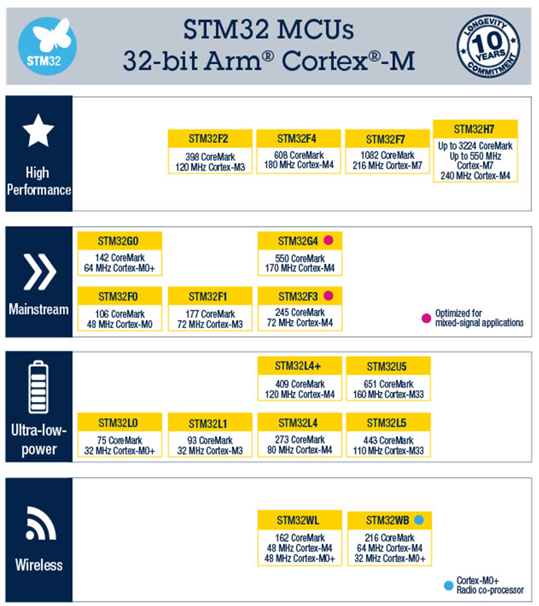

| 类别             | 典型系列            | 内核                 | 主频范围    | 典型特点                         |
| ---------------- | ------------------- | -------------------- | ----------- | -------------------------------- |
| High Performance | STM32F2、F4、F7、H7 | Cortex-M3/M4/M7      | 120–550 MHz | 高性能，适用于复杂计算和图形处理 |
| Mainstream       | STM32F0、F1、F3     | Cortex-M0/M3/M4      | 48–180 MHz  | 主流应用，性价比高               |
| Ultra-low-power  | STM32L0、L1、L4、L5 | Cortex-M0+/M3/M4/M33 | 32–160 MHz  | 超低功耗，适合电池长期供电场景   |
| Wireless         | STM32WL、STM32WB    | Cortex-M0+/M4        | 48–64 MHz   | 集成无线通信（LoRa、BLE 等）     |

（注：STM32F1 系列为早期主流系列，基于 Cortex-M3，至今仍广泛使用）

## 2. 常见片上资源/外设

STM32 系列（特别是 F1 系列）集成了丰富的片上外设，以下为常见外设缩写及其含义：

| 英文缩写 | 中文名称           | 英文缩写 | 中文名称           |
| -------- | ------------------ | -------- | ------------------ |
| NVIC     | 嵌套向量中断控制器 | CAN      | CAN通信            |
| SysTick  | 系统滴答定时器     | USB      | USB通信            |
| RCC      | 复位和时钟控制     | RTC      | 实时时钟           |
| GPIO     | 通用IO口           | CRC      | CRC校验            |
| AFIO     | 复用IO口           | PWR      | 电源控制           |
| EXTI     | 外部中断           | BKP      | 备份寄存器         |
| TIM      | 定时器             | IWDG     | 独立看门狗         |
| ADC      | 模数转换器         | WWDG     | 窗口看门狗         |
| DMA      | 直接内存访问       | DAC      | 数模转换器         |
| USART    | 同步/异步串口通信  | SDIO     | SD卡接口           |
| I2C      | I2C通信            | FSMC     | 可变静态存储控制器 |
| SPI      | SPI通信            | USB OTG  | USB主机接口        |

## 3. STM32F103C8T6 规格（典型入门芯片）

- **系列**：主流系列 STM32F1
- **内核**：ARM Cortex-M3
- **最高主频**：72 MHz
- **RAM**：20 KB（SRAM）
- **Flash**：64 KB
- **工作电压**：2.0–3.6 V（标准 3.3 V）
- **封装**：LQFP48
- **常见开发板**：蓝 Pill（Blue Pill）开发板

该芯片外设资源丰富，性价比极高，是学习 STM32 的经典入门选择。

## 4. STM32 命名规则

STM32 器件型号命名具有固定规则，以 STM32F103C8T6 为例进行说明：

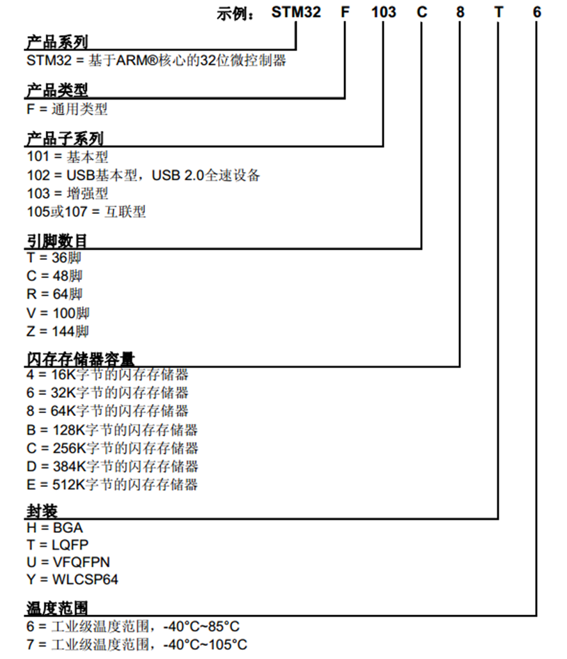

## 5. 系统结构（STM32F1 系列）

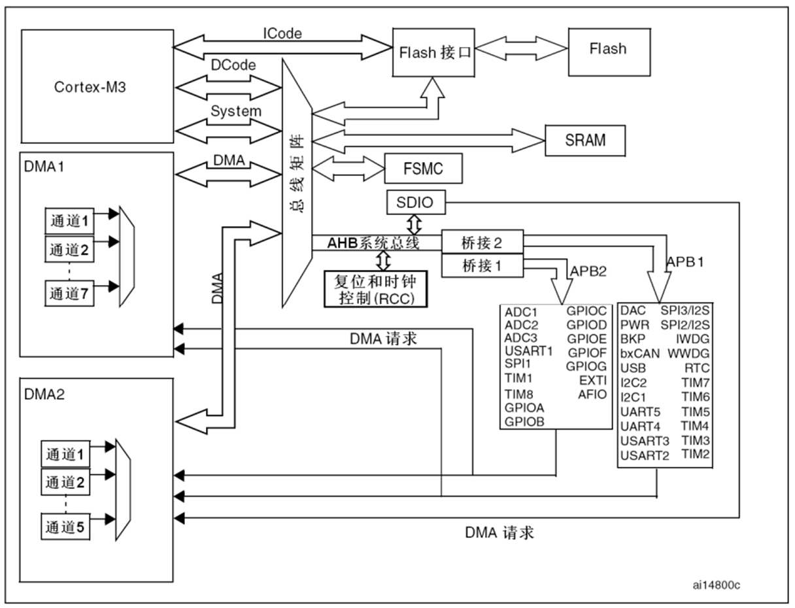

STM32F1 系列基于 Cortex-M3 内核，采用 Harvard 结构（指令与数据总线分离），主要总线包括：

- **ICode**：指令取指总线（连接 Flash）
- **DCode**：数据总线（连接 Flash）
- **System**：系统总线
- **DMA**：直接存储器访问总线（DMA1 和 DMA2）
- **AHB**：高速总线，连接高速外设（如 FSMC）
- **APB1 / APB2**：低速外设总线（APB1 最高 36 MHz，APB2 最高 72 MHz）

主要模块连接关系：

- Cortex-M3 内核通过 AHB 连接到 RCC（复位和时钟控制）、Flash、SRAM、FSMC。
- DMA1（7 通道）和 DMA2（5 通道）分别服务不同外设。
- APB2（高速）挂载：GPIOA~GPIOE、USART1、SPI1、TIM1、ADC1~ADC3 等。
- APB1（低速）挂载：USART2~USART5、I2C1~I2C2、SPI2、TIM2~TIM7、CAN、USB、BKP、PWR、DAC 等。

## 6. STM32F103C8T6 引脚定义（LQFP48 封装）

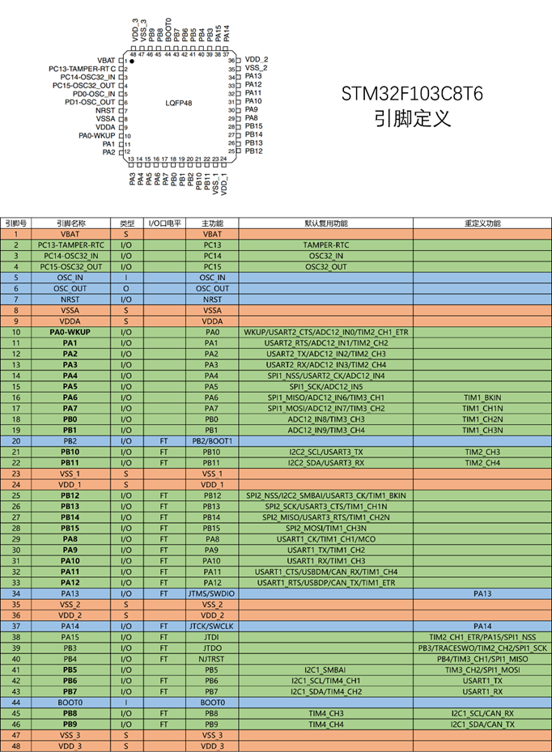

| **引脚号** | **引脚名称**    | **类型** | **I/O口电平** | **主功能** | **默认复用功能**                        | **重定义功能**                 |
| ---------- | --------------- | -------- | ------------- | ---------- | --------------------------------------- | ------------------------------ |
| 1          | VBAT            | S        |               | VBAT       |                                         |                                |
| 2          | PC13-TAMPER-RTC | I/O      |               | PC13       | TAMPER-RTC                              |                                |
| 3          | PC14-OSC32_IN   | I/O      |               | PC14       | OSC32_IN                                |                                |
| 4          | PC15-OSC32_OUT  | I/O      |               | PC15       | OSC32_OUT                               |                                |
| 5          | OSC IN          | I        |               | OSC IN     |                                         |                                |
| 6          | OSC OUT         | O        |               | OSC OUT    |                                         |                                |
| 7          | NRST            | I/O      |               | NRST       |                                         |                                |
| 8          | VSSA            | S        |               | VSSA       |                                         |                                |
| 9          | VDDA            | S        |               | VDDA       |                                         |                                |
| 10         | PA0-WKUP        | I/O      |               | PA0        | WKUP/USART2_CTS/ADC12_IN0/TIM2_CH1_ETR  |                                |
| 11         | PA1             | I/O      |               | PA1        | USART2_RTS/ADC12_IN1/TIM2_CH2           |                                |
| 12         | PA2             | I/O      |               | PA2        | USART2_TX/ADC12_IN2/TIM2_CH3            |                                |
| 13         | PA3             | I/O      |               | PA3        | USART2_RX/ADC12_IN3/TIM2_CH4            |                                |
| 14         | PA4             | I/O      |               | PA4        | SPI1_NSS/USART2_CK/ADC12_IN4            |                                |
| 15         | PA5             | I/O      |               | PA5        | SPI1_SCK/ADC12_IN5                      |                                |
| 16         | PA6             | I/O      |               | PA6        | SPI1_MISO/ADC12_IN6/TIM3_CH1            | TIM1_BKIN                      |
| 17         | PA7             | I/O      |               | PA7        | SPI1_MOSI/ADC12_IN7/TIM3_CH2            | TIM1_CH1N                      |
| 18         | PB0             | I/O      |               | PB0        | ADC12_IN8/TIM3_CH3                      | TIM1_CH2N                      |
| 19         | PB1             | I/O      |               | PB1        | ADC12_IN9/TIM3_CH4                      | TIM1_CH3N                      |
| 20         | PB2             | I/O      | FT            | PB2/BOOT1  |                                         |                                |
| 21         | PB10            | I/O      | FT            | PB10       | I2C2_SCL/USART3_TX                      | TIM2_CH3                       |
| 22         | PB11            | I/O      | FT            | PB11       | I2C2_SDA/USART3_RX                      | TIM2_CH4                       |
| 23         | VSS 1           | S        |               | VSS 1      |                                         |                                |
| 24         | VDD 1           | S        |               | VDD 1      |                                         |                                |
| 25         | PB12            | I/O      | FT            | PB12       | SPI2_NSS/I2C2_SMBAI/USART3_CK/TIM1_BKIN |                                |
| 26         | PB13            | I/O      | FT            | PB13       | SPI2_SCK/USART3_CTS/TIM1_CH1N           |                                |
| 27         | PB14            | I/O      | FT            | PB14       | SPI2_MISO/USART3_RTS/TIM1_CH2N          |                                |
| 28         | PB15            | I/O      | FT            | PB15       | SPI2_MOSI/TIM1_CH3N                     |                                |
| 29         | PA8             | I/O      | FT            | PA8        | USART1_CK/TIM1_CH1/MCO                  |                                |
| 30         | PA9             | I/O      | FT            | PA9        | USART1_TX/TIM1_CH2                      |                                |
| 31         | PA10            | I/O      | FT            | PA10       | USART1_RX/TIM1_CH3                      |                                |
| 32         | PA11            | I/O      | FT            | PA11       | USART1_CTS/USBDM/CAN_RX/TIM1_CH4        |                                |
| 33         | PA12            | I/O      | FT            | PA12       | USART1_RTS/USBDP/CAN_TX/TIM1_ETR        |                                |
| 34         | PA13            | I/O      | FT            | JTMS/SWDIO |                                         | PA13                           |
| 35         | VSS_2           | S        |               | VSS_2      |                                         |                                |
| 36         | VDD_2           | S        |               | VDD_2      |                                         |                                |
| 37         | PA14            | I/O      | FT            | JTCK/SWCLK |                                         | PA14                           |
| 38         | PA15            | I/O      | FT            | JTDI       |                                         | TIM2_CH1_ETR/PA15/SPI1_NSS     |
| 39         | PB3             | I/O      | FT            | JTDO       |                                         | PB3/TRACESWO/TIM2_CH2/SPI1_SCK |
| 40         | PB4             | I/O      | FT            | NJTRST     |                                         | PB4/TIM3_CH1/SPI1_MISO         |
| 41         | PB5             | I/O      |               | PB5        | I2C1_SMBAI                              | TIM3_CH2/SPI1_MOSI             |
| 42         | PB6             | I/O      | FT            | PB6        | I2C1_SCL/TIM4_CH1                       | USART1_TX                      |
| 43         | PB7             | I/O      | FT            | PB7        | I2C1_SDA/TIM4_CH2                       | USART1_RX                      |
| 44         | BOOT0           | I        |               | BOOT0      |                                         |                                |
| 45         | PB8             | I/O      | FT            | PB8        | TIM4_CH3                                | I2C1_SCL/CAN_RX                |
| 46         | PB9             | I/O      | FT            | PB9        | TIM4_CH4                                | I2C1_SDA/CAN_TX                |
| 47         | VSS 3           | S        |               | VSS 3      |                                         |                                |
| 48         | VDD 3           | S        |               | VDD 3      |                                         |                                |

**备注：**

- **S:** 电源 (Supply)
- **I:** 输入 (Input)
- **O:** 输出 (Output)
- **I/O:** 输入/输出 (Input/Output)
- **FT:** 5V 容忍 (Five Volt Tolerant)
- 引脚支持复用功能和重映射（通过 AFIO 寄存器配置）。

## 7. 启动配置

STM32F103系列支持通过BOOT0和BOOT1引脚在复位后选择三种不同的启动模式。复位后，在系统时钟（SYSCLK）的第4个上升沿，BOOT引脚的状态将被锁存，从而确定程序从哪个存储区域启动。

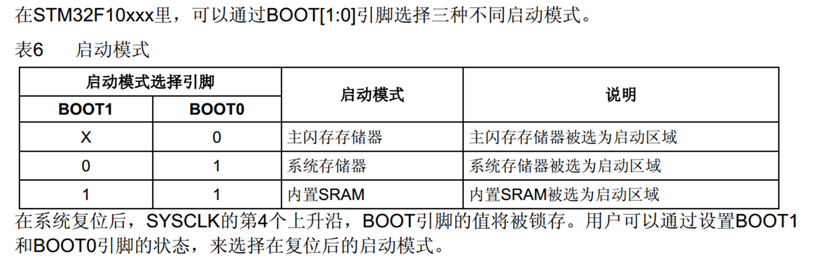

**实际应用建议**：
- 正常程序运行：BOOT0 = 0（可通过下拉电阻接地），BOOT1 可任意（通常也下拉接地）。
- 串口下载固件：BOOT0 = 1，BOOT1 = 0（通过跳线帽或开关控制BOOT0）。

## 8. 最小系统电路

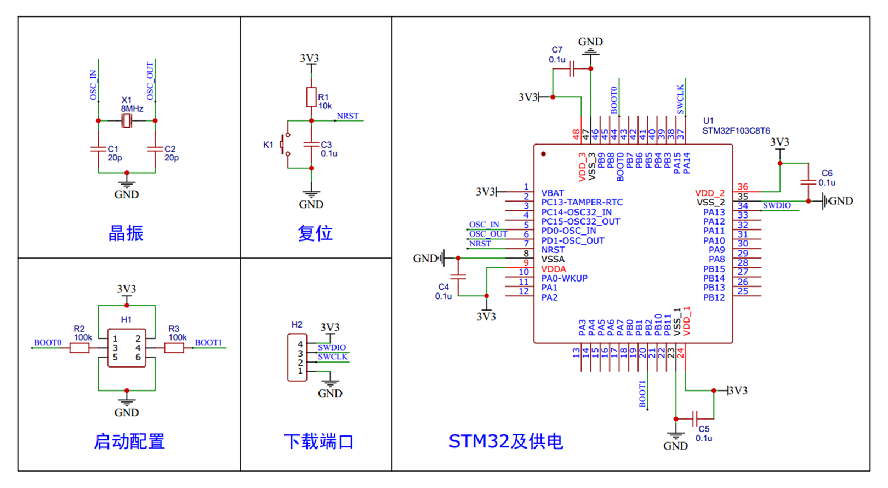

STM32F103C8T6正常工作所需的最小外围电路包括时钟源、复位电路、启动模式配置、下载调试接口以及电源去耦。

### 主要组成部分

1. **晶振电路（外部高速时钟HSE）**  
   - 在OSC_IN（引脚5）和OSC_OUT（引脚6）之间连接8 MHz石英晶振。  
   - 每个引脚对地并联20 pF负载电容（可根据晶振规格微调）。

2. **复位电路（NRST）**  
   - NRST（引脚7）通过10 kΩ上拉电阻连接至VDD。  
   - NRST对地并联0.1 μF去耦电容，确保可靠复位。

3. **启动配置电路（BOOT0/BOOT1）**  
   - BOOT0（引脚44）和BOOT1（引脚20，复用PB2）通常通过100 kΩ电阻下拉至GND。  
   - BOOT0需外接跳线帽或开关，便于切换至VDD以进入系统存储器模式（串口烧录）。

4. **下载调试接口（SWD）**  
   - PA13（JTMS/SWDIO）  
   - PA14（JTCK/SWCLK）  
   - 建议保留4针SWD接口（VDD、SWDIO、SWCLK、GND），兼容ST-Link、J-Link等调试器。

5. **电源与去耦**  
   - 所有VDD引脚（VDD_1、VDD_2、VDD_3、VDDA）连接3.3 V电源。  
   - 所有VSS引脚（VSS_1、VSS_2、VSS_3、VSSA）接地。  
   - 每个VDD/VSS对附近并联0.1 μF陶瓷电容去耦。  
   - VDDA与VDD之间建议加0.1 μF电容，VBAT可接电池或与VDD相连。

**注意事项**：
- 最小系统电路布局时，应尽量缩短晶振连线并远离高频信号。
- 电源去耦电容应靠近芯片引脚放置，以降低噪声干扰。

# STM32环境安装

## keil5_MDK安装

双击`MDK524a.EXE`安装MDK环境，可以安装在之前keil5_c51一样的根目录下

初始直接**Next**,然后`Core`切换为keil5_c51一样的根目录下，`Pack`会自动变化，然后**Next**

个人信息随便填，这里默认每行填写`GY`,然后Next开始安装

安装完成后会提示安装Ulink，是keil公司开发的调试器，点安装即可

 最后安装完成

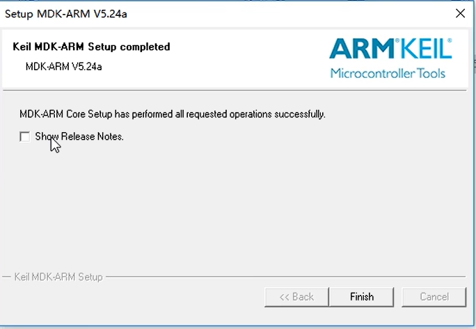

然后会跳出`Pack Installer`,先不着急，点×

## 安装器件支持包(keil5需要安装)

若不安装则没有stm32的型号支持

### 1.离线安装

**江协**的课程需要安装`Keil.STM32F1xx.pack`离线安装包，双击会自动选择Keil mdk的安装目录，点Next

安装好后，重新在keil mdk中创建项目则有**STM32F103C8**的型号

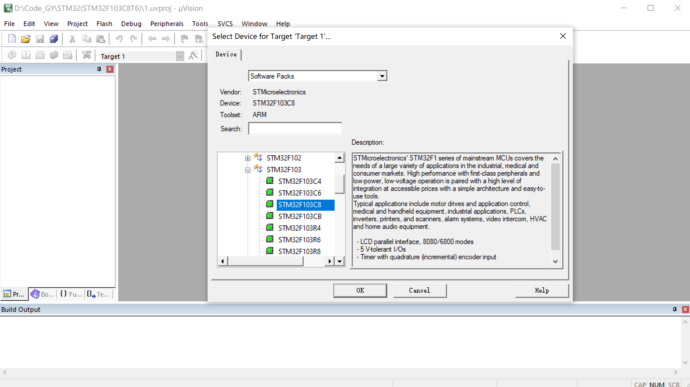

### 2.在线安装

关闭所有`Pack Installer`页面，在keil mdk中点击

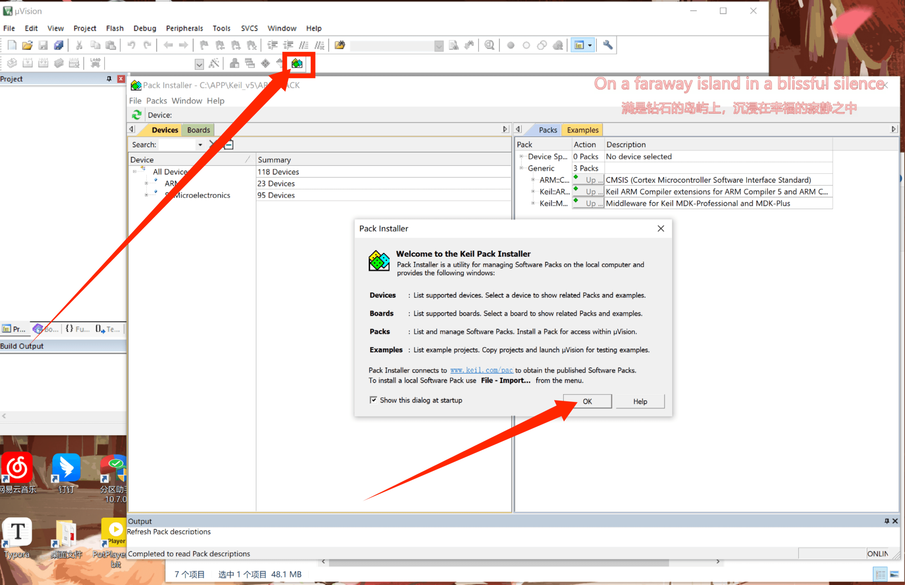

点击左上角刷新，等待最下方的进度条就可以从keil官网下载所有使用keil5开发的器件型号

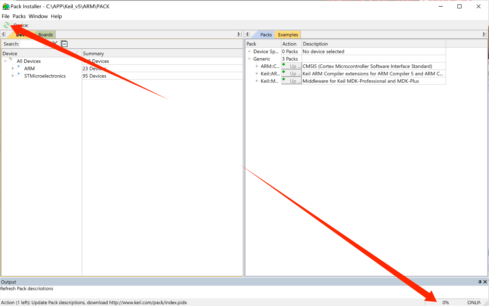

等进度条100%下载完成后，左侧选择STM32F1系列->STM32F103系列->STM32F103C8型号，右侧找到.DFP后缀的**器件支持包**，点击**Install**（因为这里安装过了，所以是**Update**）

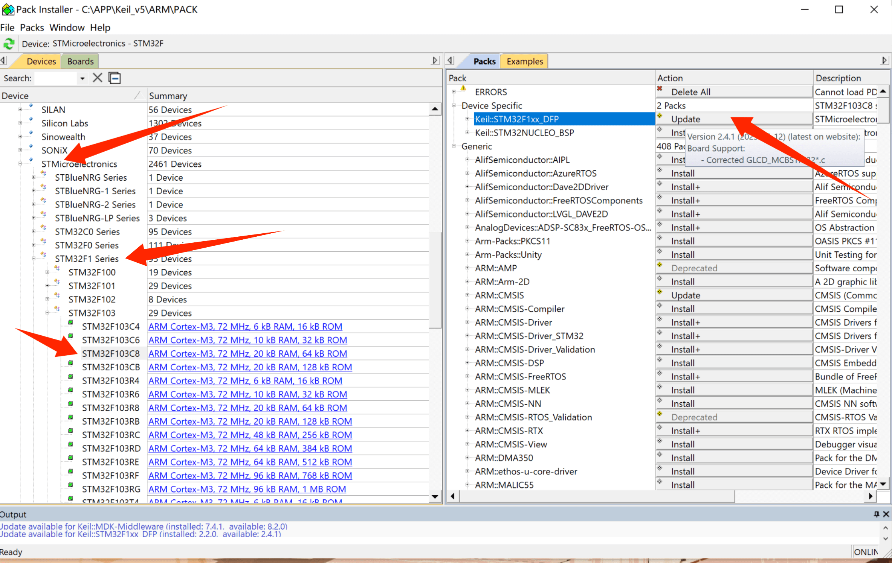

## Keil5软件注册

- 一管理员身份运行keil5 MDK
- 点击左上角FILE->License Management

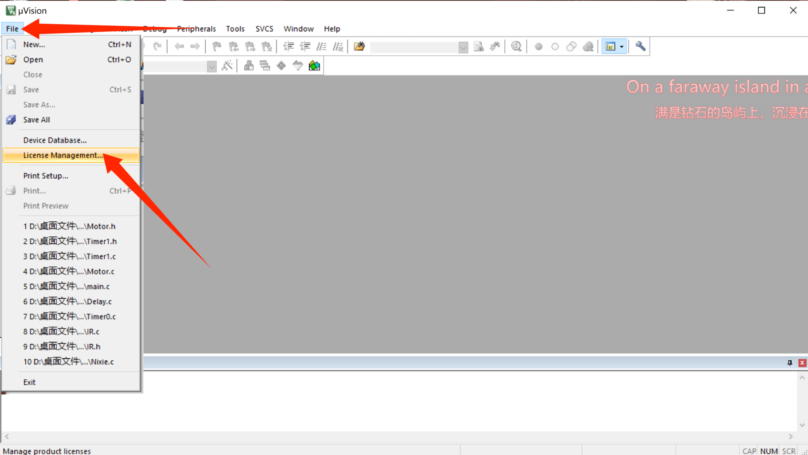

- 复制Computer ID->打开keygen_new2032->将Computer ID粘贴到CID->Target选择ARM->点击Generate获取注册码

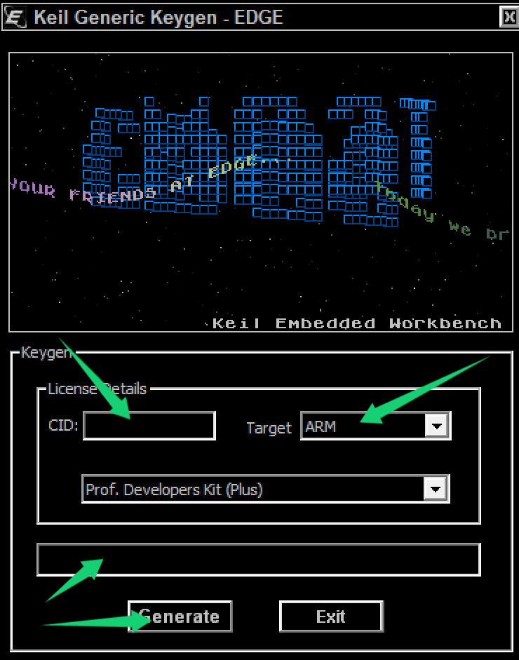

- 复制注册码粘贴到keil5的New License ID Code中后点击Add Llc->下面提示Llc添加成功并支持到2032年

  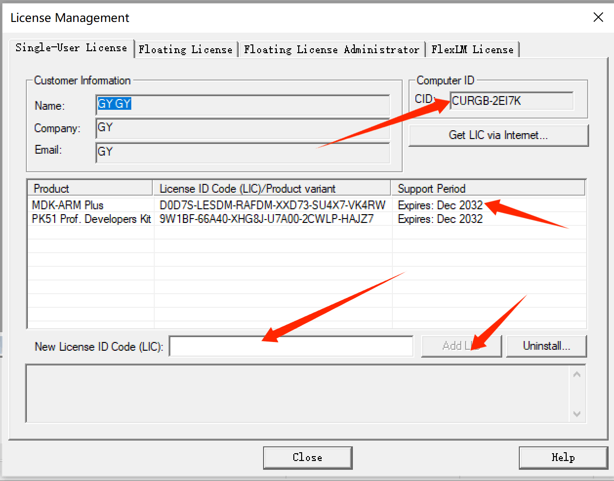

## 安装STLINK驱动

keil5自带驱动，在`C:\APP\Keil_v5\ARM\STLink\USBDriver\dpinst_amd64.exe`路径下，双击安装 

若想安装JLINK驱动，则是在路径`C:\APP\Keil_v5\ARM\Segger\JLink.exe`

## 安装USB转串口驱动

USB转串口芯片是CH340,和51单片机一样 

> 至此，stm32介绍和环境配置完成
