# STM32 入门教程

> 本教程基于 STM32F103C8T6 最小系统板与面包板硬件平台，以“程序纯手打、手把手教学”的方式，系统讲解 STM32 的片上资源、工程模板、GPIO 外设、C 语言基础、OLED 调试、中断系统、定时器、ADC、DMA、各类通信接口（USART / I2C / SPI）、姿态传感器 MPU6050、Flash 存储器 W25Q64，以及实时时钟 RTC、电源管理 PWR 与看门狗 WDG 等内容。

## 目录

- 第1章 课程与开发环境准备
  - 1.1 课程简介与学习平台
  - 1.2 硬件设备与套件
  - 1.3 软件环境与 Keil5 MDK
  - 1.4 套件整体外观
  - 1.5 STM32 与 ARM 基础
  - 1.6 片上资源与外设概览
  - 1.7 芯片命名规则、系统结构与引脚
  - 1.8 启动配置与最小系统电路
  - 1.9 软件安装
  - 1.10 型号分类及缩写
  - 1.11 工程建立与工程架构
- 第2章 GPIO 与常见外围器件
  - 2.1 GPIO 简介
  - 2.2 GPIO 基本结构与位结构
  - 2.3 GPIO 的 8 种工作模式
  - 2.4 LED 与蜂鸣器
  - 2.5 LED / 蜂鸣器硬件驱动电路
  - 2.6 面包板
  - 2.7 按键
  - 2.8 传感器模块
- 第3章 C 语言基础
  - 3.1 数据类型
  - 3.2 宏定义
  - 3.3 typedef
  - 3.4 结构体
  - 3.5 枚举
- 第4章 OLED 显示与程序调试
  - 4.1 调试方式概览
  - 4.2 OLED 简介
  - 4.3 OLED 硬件电路
  - 4.4 OLED 驱动函数
- 第5章 中断系统与 EXTI
  - 5.1 中断系统
  - 5.2 中断执行流程
  - 5.3 STM32 中断与 NVIC
  - 5.4 NVIC 优先级分组
  - 5.5 EXTI 外部中断
  - 5.6 EXTI 基本结构
  - 5.7 AFIO 复用 IO 口
  - 5.8 EXTI 框图
  - 5.9 旋转编码器
- 第6章 定时器
  - 6.1 TIM 定时器简介
  - 6.2 定时器类型
  - 6.3 定时器结构
  - 6.4 时基单元与时钟
  - 6.5 预分频器与计数器时序
  - 6.6 RCC 时钟树
  - 6.7 输出比较与 PWM
  - 6.8 输出比较通道与模式
  - 6.9 PWM 参数计算
  - 6.10 舵机控制
  - 6.11 直流电机与 TB6612 驱动
  - 6.12 输入捕获
  - 6.13 主从触发模式
  - 6.14 编码器接口
- 第7章 ADC 模数转换器
  - 7.1 ADC 简介
  - 7.2 逐次逼近型 ADC 与 ADC 框图
  - 7.3 ADC 基本结构
  - 7.4 输入通道
  - 7.5 转换模式
  - 7.6 触发控制
  - 7.7 数据对齐
  - 7.8 转换时间与校准
  - 7.9 硬件电路
- 第8章 DMA 直接存储器存取
  - 8.1 DMA 简介
  - 8.2 存储器映像
  - 8.3 DMA 框图与基本结构
  - 8.4 DMA 请求
  - 8.5 数据宽度与对齐
  - 8.6 数据转运与 ADC 扫描模式
- 第9章 通信接口总览与串口通信
  - 9.1 通信接口总览
  - 9.2 串口通信
  - 9.3 硬件电路与电平标准
  - 9.4 串口参数及时序
  - 9.5 USART 简介
  - 9.6 USART 框图与基本结构
  - 9.7 数据帧、起始位侦测与数据采样
  - 9.8 波特率发生器
  - 9.9 数据模式与数据包
- 第10章 I2C 通信与 MPU6050
  - 10.1 I2C 通信
  - 10.2 I2C 硬件电路
  - 10.3 I2C 时序基本单元
  - 10.4 I2C 指定地址读写时序
  - 10.5 MPU6050 姿态传感器
  - 10.6 MPU6050 硬件电路与框图
  - 10.7 I2C 外设与框图
  - 10.8 I2C 主机收发时序
  - 10.9 软件 / 硬件波形对比
- 第11章 SPI 通信与 W25Q64
  - 11.1 SPI 通信
  - 11.2 SPI 硬件电路
  - 11.3 SPI 移位与基本时序
  - 11.4 SPI 时序
  - 11.5 W25Q64 存储器
  - 11.6 W25Q64 硬件电路与框图
  - 11.7 Flash 操作注意事项
  - 11.8 SPI 外设与框图
  - 11.9 SPI 主模式传输
  - 11.10 软件 / 硬件波形对比
- 第12章 时间戳、BKP 与 RTC
  - 12.1 Unix 时间戳
  - 12.2 UTC / GMT
  - 12.3 时间戳转换
  - 12.4 BKP 备份寄存器
  - 12.5 RTC 实时时钟
  - 12.6 RTC 框图与基本结构
  - 12.7 RTC 硬件电路
  - 12.8 RTC 操作注意事项
- 第13章 PWR 电源控制与看门狗 WDG
  - 13.1 PWR 电源控制
  - 13.2 电源框图
  - 13.3 上电 / 掉电复位
  - 13.4 可编程电压监测器
  - 13.5 低功耗模式
  - 13.6 模式选择
  - 13.7 WDG 看门狗
  - 13.8 IWDG 独立看门狗
  - 13.9 WWDG 窗口看门狗
  - 13.10 IWDG 与 WWDG 对比
- 第14章 FLASH 闪存编程
  - 14.1 FLASH 简介
  - 14.2 闪存模块组织
  - 14.3 FLASH 基本结构
  - 14.4 FLASH 解锁
  - 14.5 使用指针访问存储器
  - 14.6 程序存储器编程与擦除
  - 14.7 选项字节
  - 14.8 选项字节编程与擦除
  - 14.9 器件电子签名

# 第1章 课程与开发环境准备

## 1.1 课程简介与学习平台

本课程以“程序纯手打、手把手教学”的方式进行，采用 **STM32 最小系统板 + 面包板** 的硬件平台，带领初学者从零开始学习 STM32 单片机开发。

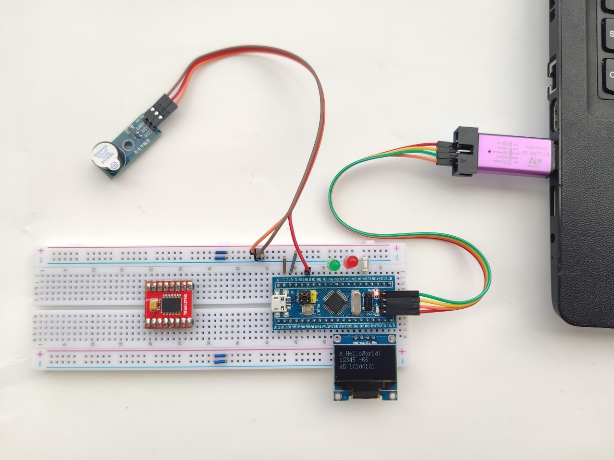

> **图 1-1 开发板与面包板**

## 1.2 硬件设备与套件

进行 STM32 开发需要准备以下硬件设备：

- STM32 面包板入门套件；
- Windows 电脑；
- 万用表、示波器、镊子、剪刀等常用工具。

下图展示了套件中的主要元件以及 USB 示波器等调试工具。

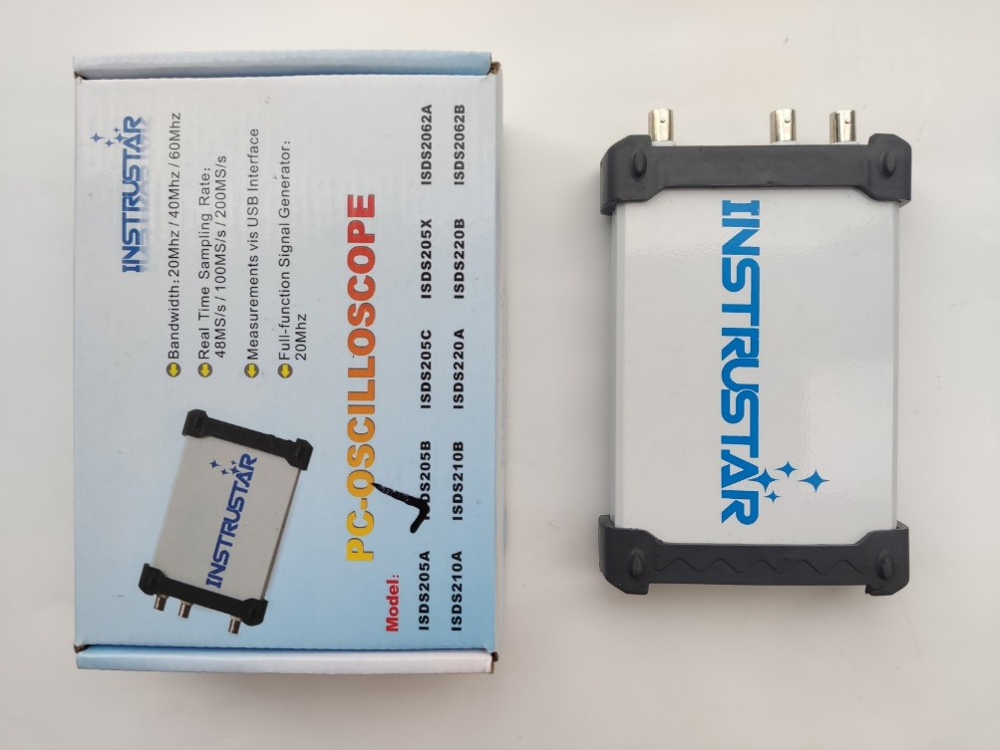

> **图 1-2 USB示波器**


> **图 1-3 套件元件总览**


> **图 1-4 Windows系统标志**

## 1.3 软件环境与 Keil5 MDK

软件开发环境使用 **Keil5 MDK**（Microcontroller Development Kit），它是 STM32 开发中最常用的集成开发环境之一。


> **图 1-5 Keil5MDK软件**

## 1.4 套件整体外观

下图展示套件元件的整体布局（全景），便于建立对硬件平台的直观认识。

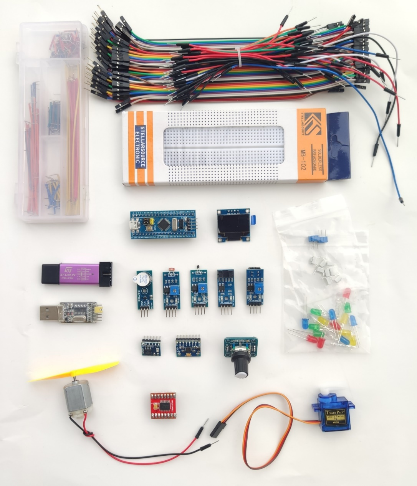

> **图 1-6 套件元件全景**

## 1.5 STM32 与 ARM 基础

### 1.5.1 STM32 简介

STM32 是 ST 公司基于 **ARM Cortex-M** 内核开发的 32 位微控制器。它常应用于嵌入式领域，如智能车、无人机、机器人、无线通信、物联网、工业控制、娱乐电子产品等。STM32 功能强大、性能优异、片上资源丰富、功耗低，是一款经典的嵌入式微控制器。

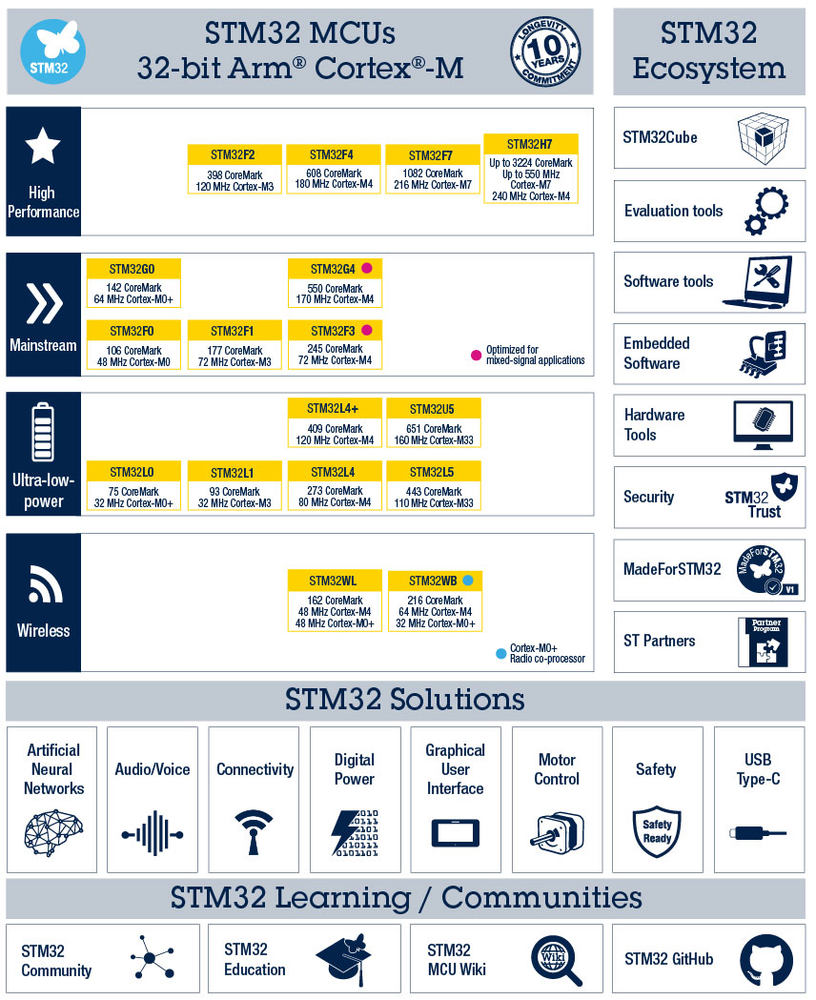

> **图 1-7 STM32应用领域**

### 1.5.2 ARM 与 STM32F103C8T6

**ARM** 既指 ARM 公司，也指 ARM 处理器内核。ARM 公司是全球领先的半导体知识产权（IP）提供商，全世界超过 95% 的智能手机和平板电脑都采用 ARM 架构。ARM 公司设计 ARM 内核，半导体厂商完善内核周边电路并生产芯片。

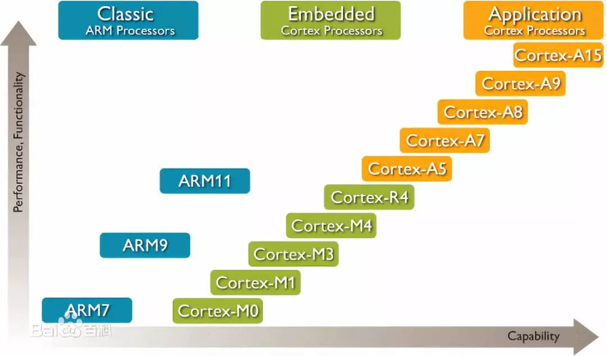

> **图 1-8 ARM处理器系列**

本教程使用的 **STM32F103C8T6** 主要参数如下：

- 系列：主流系列 STM32F1；
- 内核：ARM Cortex-M3；
- 主频：72 MHz；
- RAM：20 K（SRAM）；
- ROM：64 K（Flash）；
- 供电：2.0 ~ 3.6 V（标准 3.3 V）；
- 封装：LQFP48。

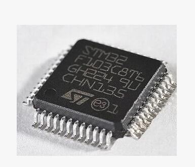

> **图 1-9 STM32F103C8T6芯片**

## 1.6 片上资源与外设概览

STM32F103C8T6 内部集成了丰富的片上资源与外设，下表列出其主要缩写与名称。

| 英文缩写 | 名称 | 英文缩写 | 名称 |
| --- | --- | --- | --- |
| NVIC | 嵌套向量中断控制器 | CAN | CAN 通信 |
| SysTick | 系统滴答定时器 | USB | USB 通信 |
| RCC | 复位和时钟控制 | RTC | 实时时钟 |
| GPIO | 通用 IO 口 | CRC | CRC 校验 |
| AFIO | 复用 IO 口 | PWR | 电源控制 |
| EXTI | 外部中断 | BKP | 备份寄存器 |
| TIM | 定时器 | IWDG | 独立看门狗 |
| ADC | 模数转换器 | WWDG | 窗口看门狗 |
| DMA | 直接内存访问 | DAC | 数模转换器 |
| USART | 同步 / 异步串口通信 | SDIO | SD 卡接口 |
| I2C | I2C 通信 | FSMC | 可变静态存储控制器 |
| SPI | SPI 通信 | USB OTG | USB 主机接口 |

## 1.7 芯片命名规则、系统结构与引脚

了解 STM32 的命名规则，有助于根据型号快速判断芯片容量与封装。

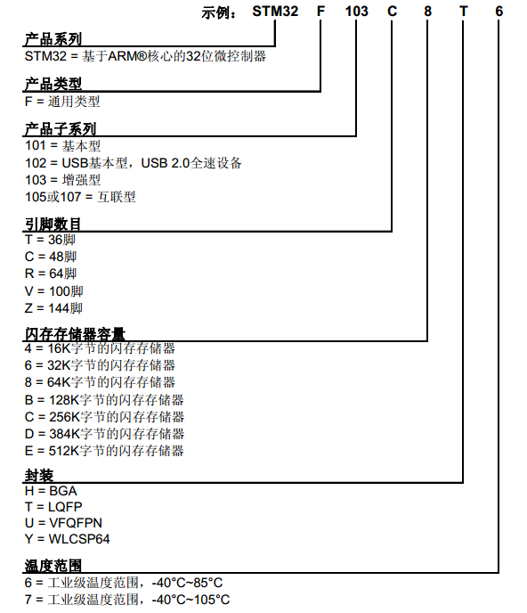

> **图 1-10 STM32命名规则**

STM32 的内部系统结构反映了内核、总线与各个外设之间的关系。

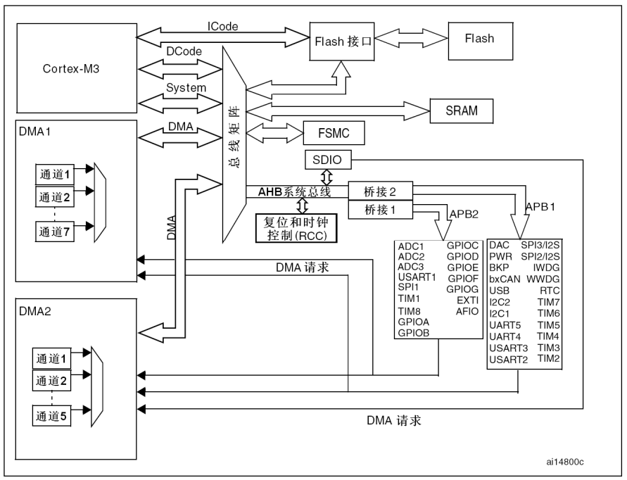

> **图 1-11 STM32系统结构**

引脚定义图给出了每个引脚的功能分配，是硬件设计的重要参考。

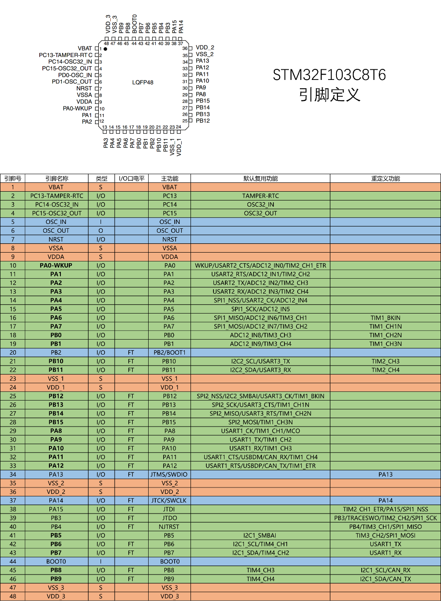

> **图 1-12 STM32引脚定义**

## 1.8 启动配置与最小系统电路

STM32 的启动配置通过 BOOT 引脚选择不同的启动方式；最小系统电路则是保证芯片能够正常工作的必要外围电路。

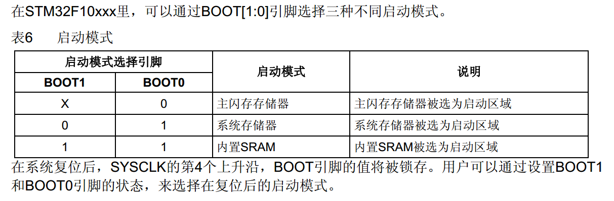

> **图 1-13 STM32启动配置**

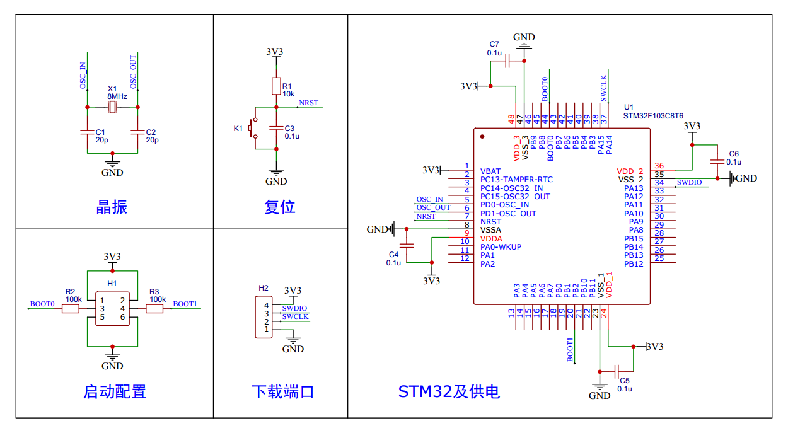

> **图 1-14 最小系统电路**

## 1.9 软件安装

搭建开发环境需要依次完成以下步骤：

1. 安装 Keil5 MDK；
2. 安装器件支持包；
3. 软件注册；
4. 安装 ST-LINK 驱动；
5. 安装 USB 转串口驱动。

## 1.10 型号分类及缩写

STM32F1 系列根据 Flash 容量与特性分为多种型号缩写，对应关系如下。

| 缩写 | 释义 | Flash 容量 | 型号 |
| --- | --- | --- | --- |
| LD_VL | 小容量产品超值系列 | 16~32 K | STM32F100 |
| MD_VL | 中容量产品超值系列 | 64~128 K | STM32F100 |
| HD_VL | 大容量产品超值系列 | 256~512 K | STM32F100 |
| LD | 小容量产品 | 16~32 K | STM32F101/102/103 |
| MD | 中容量产品 | 64~128 K | STM32F101/102/103 |
| HD | 大容量产品 | 256~512 K | STM32F101/102/103 |
| XL | 加大容量产品 | 大于 512 K | STM32F101/102/103 |
| CL | 互联型产品 | - | STM32F105/107 |

## 1.11 工程建立与工程架构

### 1.11.1 新建工程步骤

在 Keil 中新建 STM32 工程的典型步骤如下：

1. 建立工程文件夹，在 Keil 中新建工程并选择型号；
2. 在工程文件夹里建立 Start、Library、User 等文件夹，复制固件库里面的文件到工程文件夹；
3. 在工程里对应建立 Start、Library、User 等同名称的分组，然后将文件夹内的文件添加到工程分组里；
4. 在工程选项的 C/C++、Include Paths 内声明所有包含头文件的文件夹；
5. 在工程选项的 C/C++、Define 内定义 `USE_STDPERIPH_DRIVER`；
6. 在工程选项的 Debug 中，从下拉列表选择对应调试器，在 Settings、Flash Download 里勾选 Reset and Run。

### 1.11.2 工程架构

一个标准 STM32 工程包含以下关键文件与结构：

- `startup_xx.s`：启动文件，上电后首先执行复位中断，调用 `SystemInit`，再调用 `main`，其他中断则调用对应的中断处理函数；
- `system_xx.c / .h`：定义 `SystemInit`；
- `main.c`：定义 `main`；
- `stm32f10x_it.c / .h`：定义中断处理函数；
- `stm32f10x.h`：外设寄存器描述；
- `core_cm3.c / .h`：内核寄存器描述；
- 其他用户文件；
- 库函数相关：`misc.c / .h`、`stm32f10x_adc.c / .h` 等；
- `stm32f10x_conf.h`：库函数配置。

# 第2章 GPIO 与常见外围器件

## 2.1 GPIO 简介

GPIO（General Purpose Input Output，通用输入输出口）可配置为 8 种输入输出模式。引脚电平范围为 0 V ~ 3.3 V，部分引脚可容忍 5 V。

- 输出模式下可控制端口输出高低电平，用以驱动 LED、控制蜂鸣器、模拟通信协议输出时序等；
- 输入模式下可读取端口的高低电平或电压，用于读取按键输入、外接模块电平信号输入、ADC 电压采集、模拟通信协议接收数据等。

## 2.2 GPIO 基本结构与位结构

STM32 每个 GPIO 端口（如 GPIOA、GPIOB 等）都包含一组寄存器与驱动器，每个端口有 16 个引脚（PA0~PA15 等）。所有 GPIO 通过 APB2 总线与内核相连。下图展示了单个 GPIO 位的内部结构。

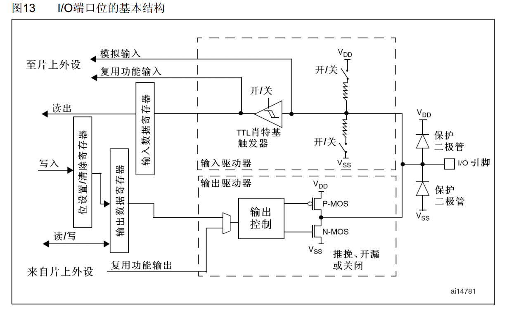

> **图 2-1 GPIO位结构**

## 2.3 GPIO 的 8 种工作模式

通过配置 GPIO 的端口配置寄存器，端口可以配置成以下 8 种模式：

| 模式名称 | 性质 | 特征 |
| --- | --- | --- |
| 浮空输入 | 数字输入 | 可读取引脚电平，若引脚悬空，则电平不确定 |
| 上拉输入 | 数字输入 | 可读取引脚电平，内部连接上拉电阻，悬空时默认高电平 |
| 下拉输入 | 数字输入 | 可读取引脚电平，内部连接下拉电阻，悬空时默认低电平 |
| 模拟输入 | 模拟输入 | GPIO 无效，引脚直接接入内部 ADC |
| 开漏输出 | 数字输出 | 可输出引脚电平，高电平为高阻态，低电平接 VSS |
| 推挽输出 | 数字输出 | 可输出引脚电平，高电平接 VDD，低电平接 VSS |
| 复用开漏输出 | 数字输出 | 由片上外设控制，高电平为高阻态，低电平接 VSS |
| 复用推挽输出 | 数字输出 | 由片上外设控制，高电平接 VDD，低电平接 VSS |

下图分别给出输入模式与输出模式对应的内部电路结构。

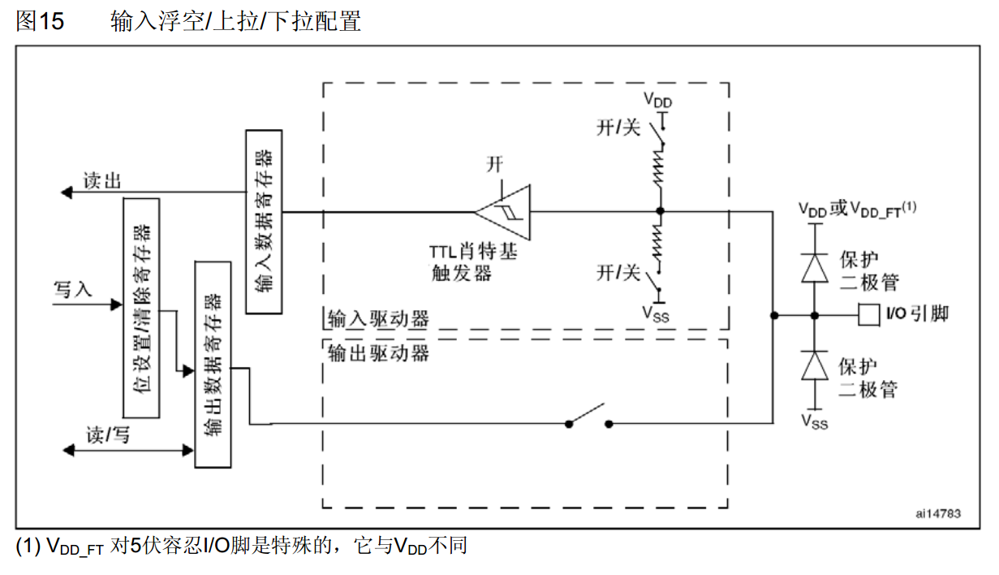

> **图 2-2 GPIO输入模式电路**

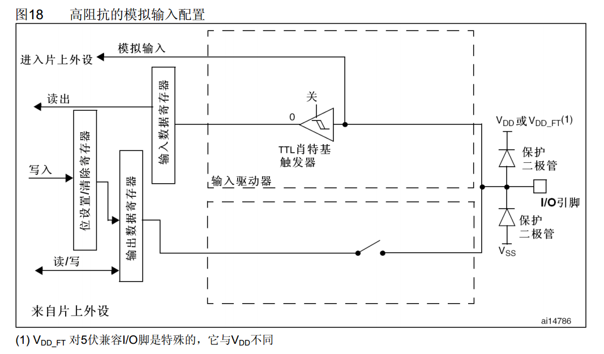

> **图 2-3 GPIO模拟输入电路**

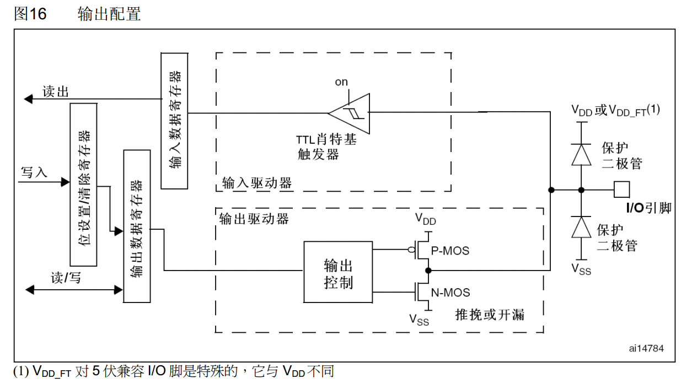

> **图 2-4 GPIO输出模式电路**

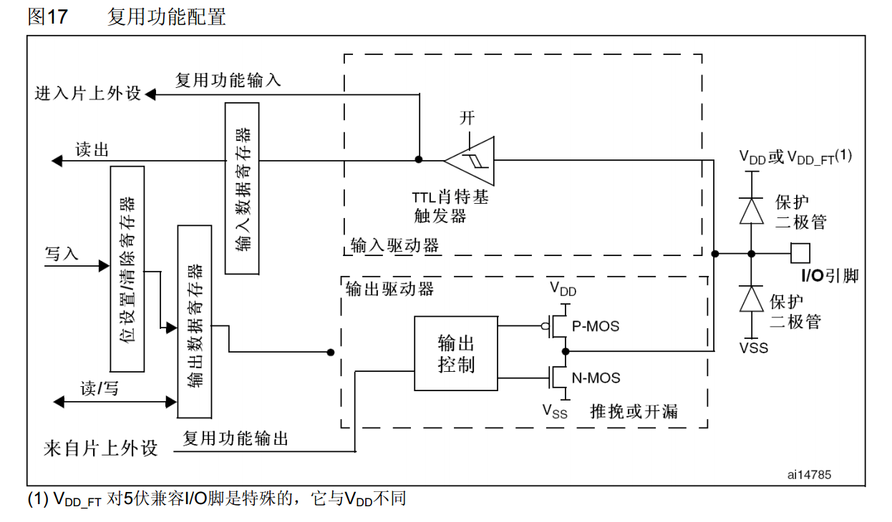

> **图 2-5 GPIO复用输出模式电路**

## 2.4 LED 与蜂鸣器

**LED**：发光二极管，正向通电点亮，反向通电不亮。

**有源蜂鸣器**：内部自带振荡源，将正负极接上直流电压即可持续发声，频率固定。

**无源蜂鸣器**：内部不带振荡源，需要控制器提供振荡脉冲才可发声，调整提供振荡脉冲的频率，可发出不同频率的声音。

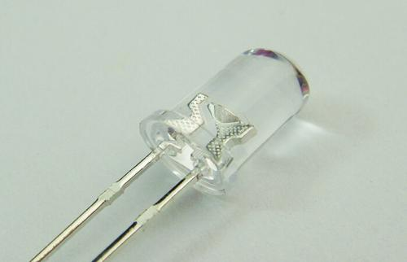

> **图 2-6 LED实物**

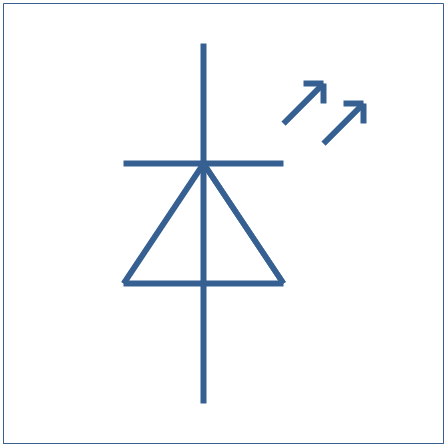

> **图 2-7 LED电路符号**

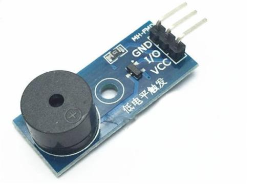

> **图 2-8 有源蜂鸣器模块**

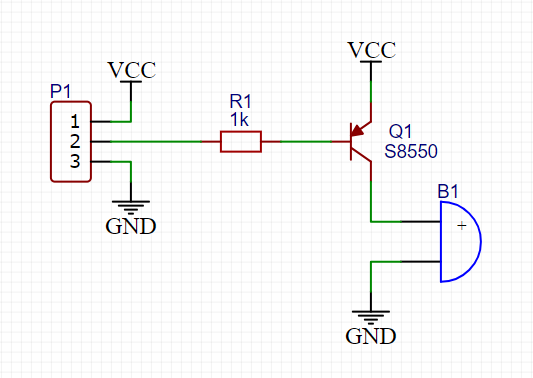

> **图 2-9 蜂鸣器驱动电路**

## 2.5 LED / 蜂鸣器硬件驱动电路

由于 GPIO 的驱动能力有限，LED 与蜂鸣器通常需要配合限流电阻与驱动电路。下图展示高 / 低电平驱动两种接法。

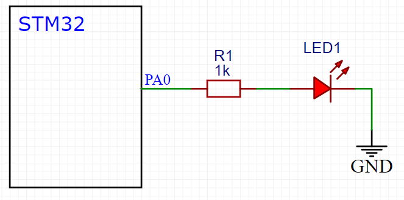

> **图 2-10 LED高电平驱动电路**

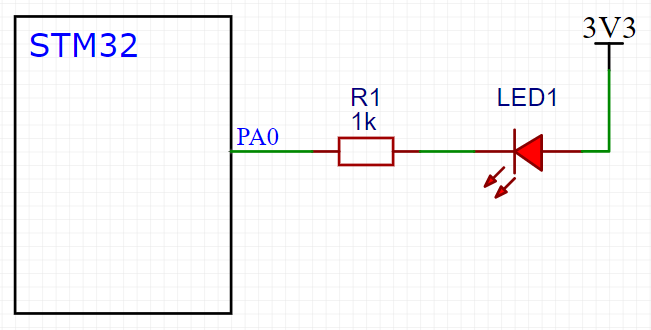

> **图 2-11 LED低电平驱动电路**

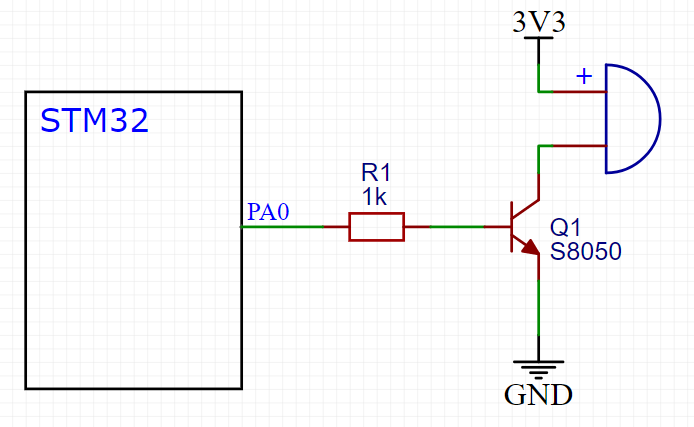

> **图 2-12 蜂鸣器高电平驱动电路**

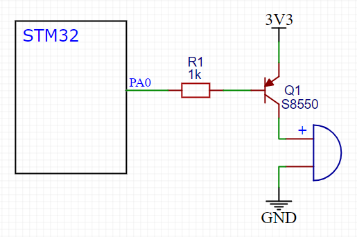

> **图 2-13 蜂鸣器低电平驱动电路**

## 2.6 面包板

面包板用于快速搭建电路原型，无需焊接。其内部结构由金属夹片连接，正面插孔按行 / 列导通。

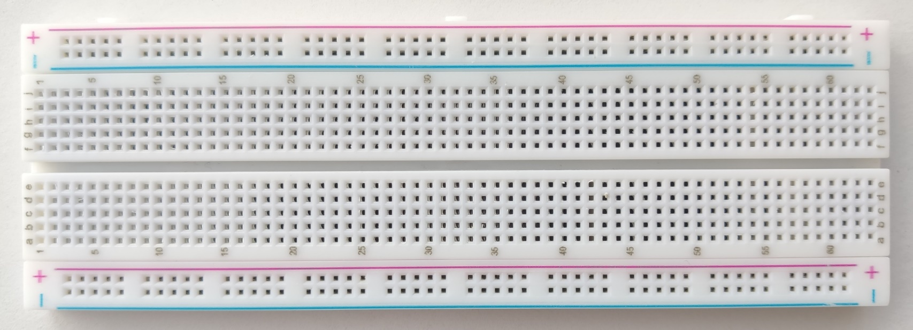

> **图 2-14 面包板实物**

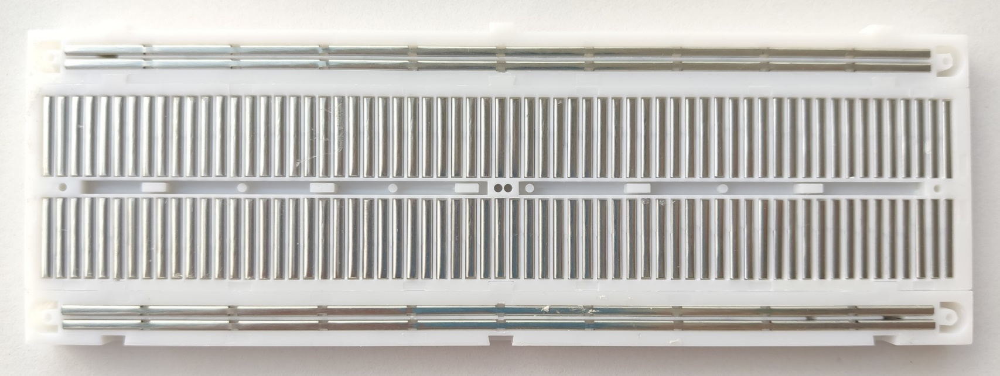

> **图 2-15 面包板内部结构**

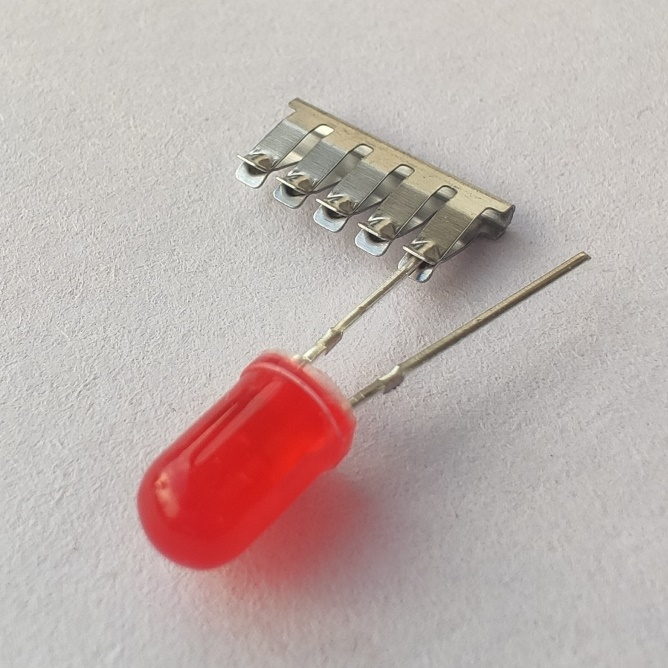

> **图 2-16 面包板夹片与LED**

## 2.7 按键

按键是常见的输入设备，按下导通，松手断开。**按键抖动**：由于按键内部使用机械式弹簧片进行通断，在按下和松手的瞬间会伴随一连串的抖动，软件或硬件通常需要做消抖处理。

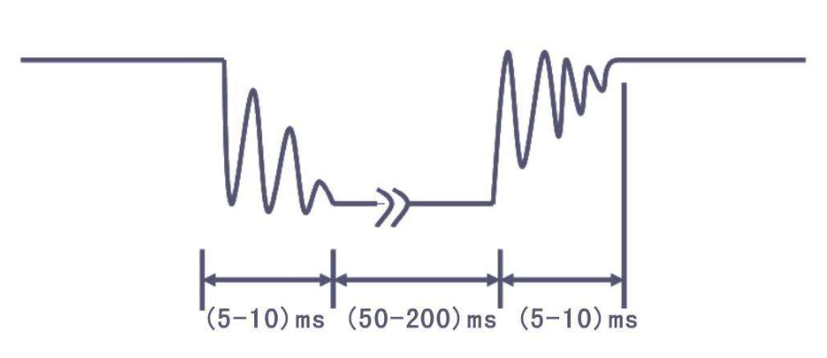

> **图 2-17 轻触开关实物**

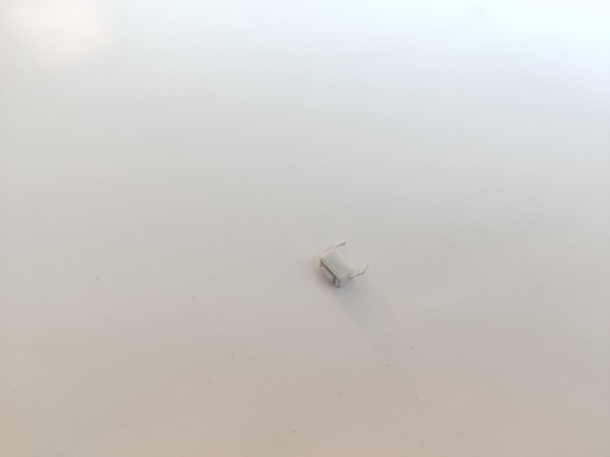

> **图 2-18 按键抖动波形**

## 2.8 传感器模块

传感器模块：传感器元件（光敏电阻 / 热敏电阻 / 红外接收管等）的电阻会随外界模拟量的变化而变化，通过与定值电阻分压即可得到模拟电压输出，再通过电压比较器进行二值化即可得到数字电压输出。

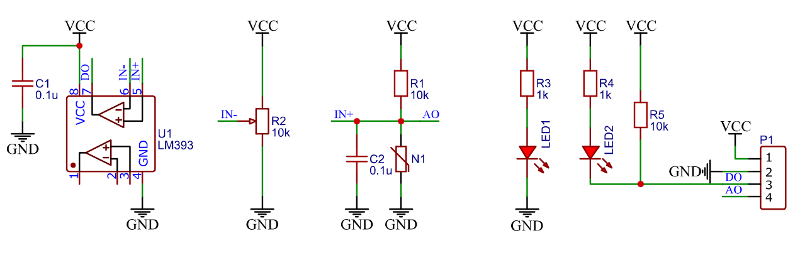

> **图 2-19 传感器模块内部电路**

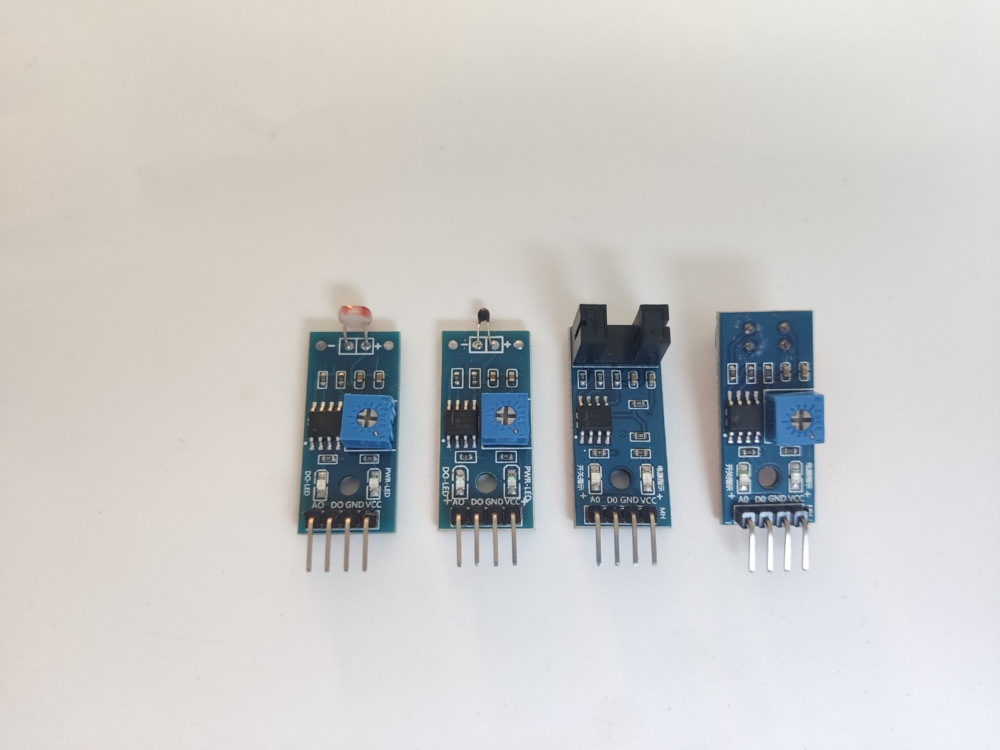

> **图 2-20 传感器模块实物**

传感器模块的硬件电路与接线方式如下。按键类输入则对应下拉、上拉以及直接接地 / 接 3.3 V 的不同接法。

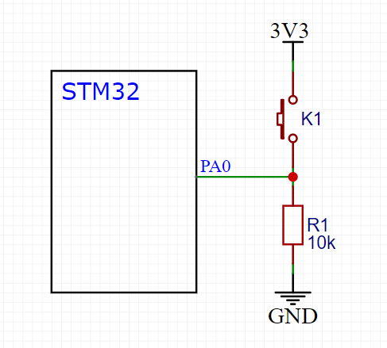

> **图 2-21 按键下拉输入电路**

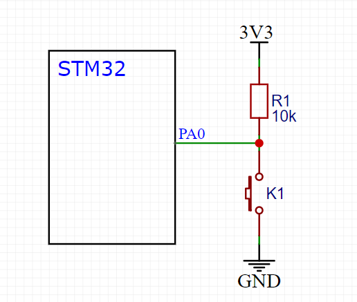

> **图 2-22 按键上拉输入电路**

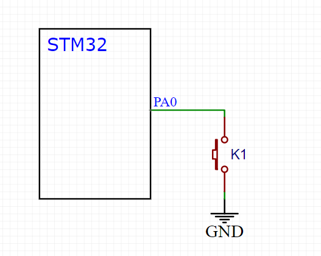

> **图 2-23 按键接地电路**

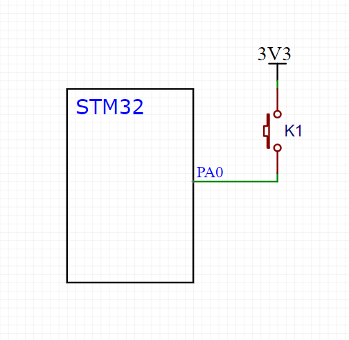

> **图 2-24 按键接3V3电路**

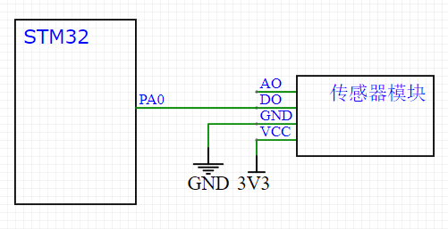

> **图 2-25 传感器模块接线图**

# 第3章 C 语言基础

STM32 开发以 C 语言为主，本节补充教程中涉及的 C 语言基础知识。

## 3.1 数据类型

C 语言中常用数据类型及其位数、表示范围如下；右侧给出 `stdint.h` 与 STM32 标准库中的等价关键字。

| 关键字 | 位数 | 表示范围 | stdint 关键字 | ST 关键字 |
| --- | --- | --- | --- | --- |
| char | 8 | -128 ~ 127 | int8_t | s8 |
| unsigned char | 8 | 0 ~ 255 | uint8_t | u8 |
| short | 16 | -32768 ~ 32767 | int16_t | s16 |
| unsigned short | 16 | 0 ~ 65535 | uint16_t | u16 |
| int | 32 | -2147483648 ~ 2147483647 | int32_t | s32 |
| unsigned int | 32 | 0 ~ 4294967295 | uint32_t | u32 |
| long | 32 | -2147483648 ~ 2147483647 |  |  |
| unsigned long | 32 | 0 ~ 4294967295 |  |  |
| long long | 64 | -(2^64)/2 ~ (2^64)/2-1 | int64_t |  |
| unsigned long long | 64 | 0 ~ (2^64)-1 | uint64_t |  |
| float | 32 | -3.4e38 ~ 3.4e38 |  |  |
| double | 64 | -1.7e308 ~ 1.7e308 |  |  |

## 3.2 宏定义

**关键字**：`#define`

**用途**：用一个字符串代替一个数字，便于理解、防止出错；提取程序中经常出现的参数，便于快速修改。

定义宏定义：

```c
#define ABC 12345
```
引用宏定义：

```c
int a = ABC;    // 等效于 int a = 12345;
```
## 3.3 typedef

**关键字**：`typedef`

**用途**：将一个比较长的变量类型名换个名字，便于使用。

```c
typedef unsigned char uint8_t;
uint8_t a;    // 等效于 unsigned char a;
```
## 3.4 结构体

**关键字**：`struct`

**用途**：数据打包，不同类型变量的集合。

```c
struct { char x; int y; float z; } StructName;
```
因为结构体变量类型较长，所以通常用 `typedef` 更改变量类型名。引用结构体成员：

```c
StructName.x = 'A';
StructName.y = 66;
StructName.z = 1.23;
```
或通过指针引用：

```c
pStructName->x = 'A';    // pStructName 为结构体的地址
pStructName->y = 66;
pStructName->z = 1.23;
```
## 3.5 枚举

**关键字**：`enum`

**用途**：定义一个取值受限制的整型变量，用于限制变量取值范围，相当于宏定义的集合。

```c
enum { FALSE = 0, TRUE = 1 } EnumName;
```
因为枚举变量类型较长，所以通常用 `typedef` 更改变量类型名。引用枚举成员：

```c
EnumName = FALSE;
EnumName = TRUE;
```
# 第4章 OLED 显示与程序调试

## 4.1 调试方式概览

STM32 程序常用的调试方式有：

- **串口调试**：通过串口通信，将调试信息发送到电脑端，电脑使用串口助手显示调试信息；
- **显示屏调试**：直接将显示屏连接到单片机，将调试信息打印在显示屏上；
- **Keil 调试模式**：借助 Keil 软件的调试模式，可使用单步运行、设置断点、查看寄存器及变量等功能。

## 4.2 OLED 简介

OLED（Organic Light Emitting Diode，有机发光二极管）是一种性能优异的新型显示屏，具有功耗低、响应速度快、宽视角、轻薄柔韧等特点。**0.96 寸 OLED 模块**小巧玲珑、占用接口少、简单易用，是电子设计中非常常见的显示屏模块。其主要参数：供电 3 ~ 5.5 V，通信协议 I2C / SPI，分辨率 128×64。

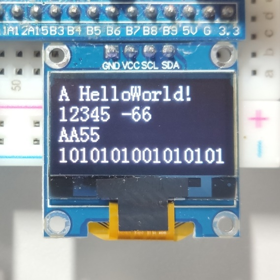

> **图 4-1 OLED模块I2C接口**

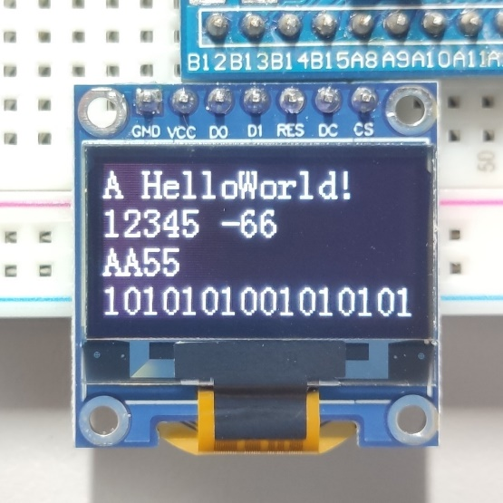

> **图 4-2 OLED模块SPI接口**

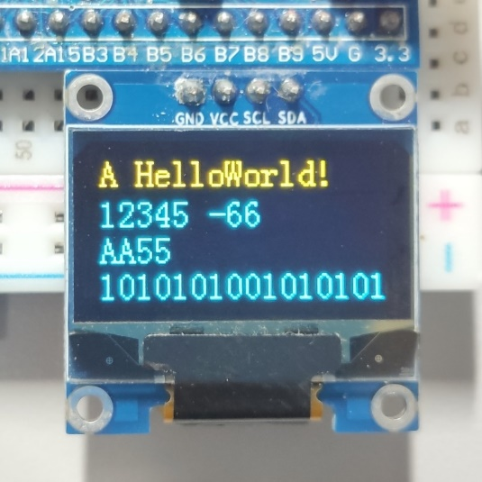

> **图 4-3 OLED双色显示效果**

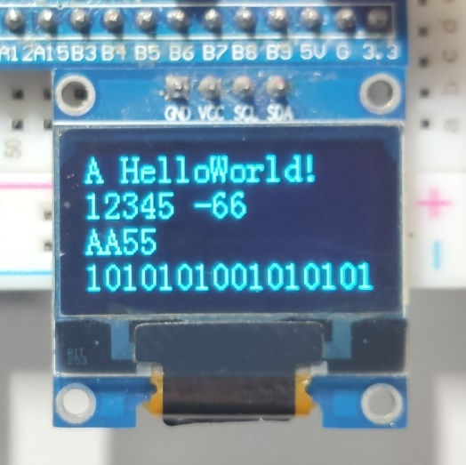

> **图 4-4 OLED显示效果**

## 4.3 OLED 硬件电路

OLED 模块常见有 I2C 四针接口与 SPI 七针接口两种，接线方式如下。

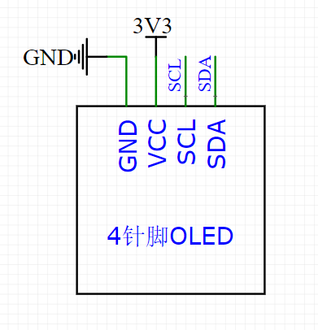

> **图 4-5 OLED四针I2C接线图**

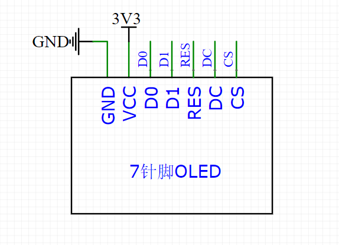

> **图 4-6 OLED七针SPI接线图**

## 4.4 OLED 驱动函数

OLED 驱动模块提供一组常用的显示函数，便于在程序中输出调试信息：

| 函数 | 作用 |
| --- | --- |
| `OLED_Init();` | 初始化 |
| `OLED_Clear();` | 清屏 |
| `OLED_ShowChar(1, 1, 'A');` | 显示一个字符 |
| `OLED_ShowString(1, 3, "HelloWorld!");` | 显示字符串 |
| `OLED_ShowNum(2, 1, 12345, 5);` | 显示十进制数字 |
| `OLED_ShowSignedNum(2, 7, -66, 2);` | 显示有符号十进制数字 |
| `OLED_ShowHexNum(3, 1, 0xAA55, 4);` | 显示十六进制数字 |
| `OLED_ShowBinNum(4, 1, 0xAA55, 16);` | 显示二进制数字 |

# 第5章 中断系统与 EXTI

## 5.1 中断系统

**中断**：在主程序运行过程中，出现了特定的中断触发条件（中断源），使得 CPU 暂停当前正在运行的程序，转而去处理中断程序，处理完成后又返回原来被暂停的位置继续运行。

**中断优先级**：当有多个中断源同时申请中断时，CPU 会根据中断源的轻重缓急进行裁决，优先响应更加紧急的中断源。

**中断嵌套**：当一个中断程序正在运行时，又有新的更高优先级的中断源申请中断，CPU 再次暂停当前中断程序，转而去处理新的中断程序，处理完成后依次进行返回。

## 5.2 中断执行流程

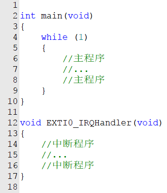

> **图 5-1 中断执行流程**

## 5.3 STM32 中断与 NVIC

STM32 提供 68 个可屏蔽中断通道，包含 EXTI、TIM、ADC、USART、SPI、I2C、RTC 等多个外设。使用 **NVIC**（嵌套向量中断控制器）统一管理中断，每个中断通道都拥有 16 个可编程的优先等级，可对优先级进行分组，进一步设置抢占优先级和响应优先级。

NVIC 的基本结构：所有中断源（EXTI、TIM、ADC、USART 等）都连接到 NVIC，由 NVIC 统一裁决后发送给 CPU；每个中断源可配置优先级 0 ~ 15。

下图给出 STM32 的中断向量表，列出了各中断通道的入口地址。

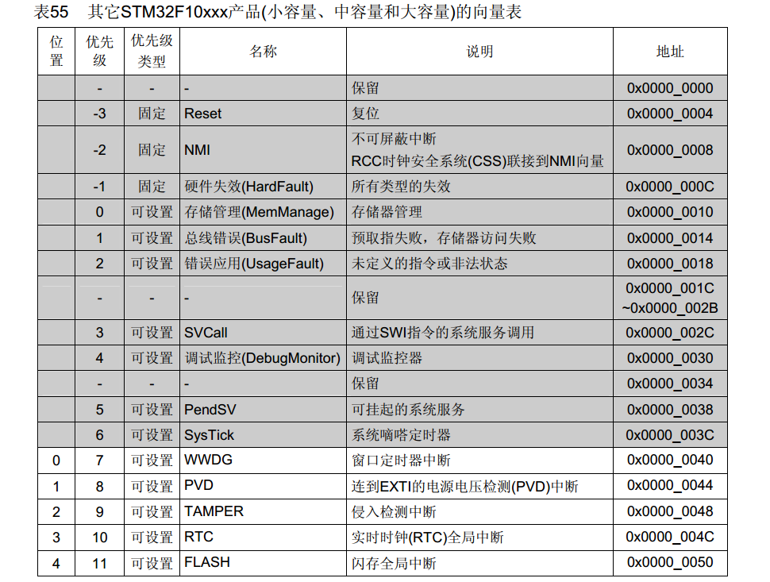

> **图 5-2 中断向量表一**

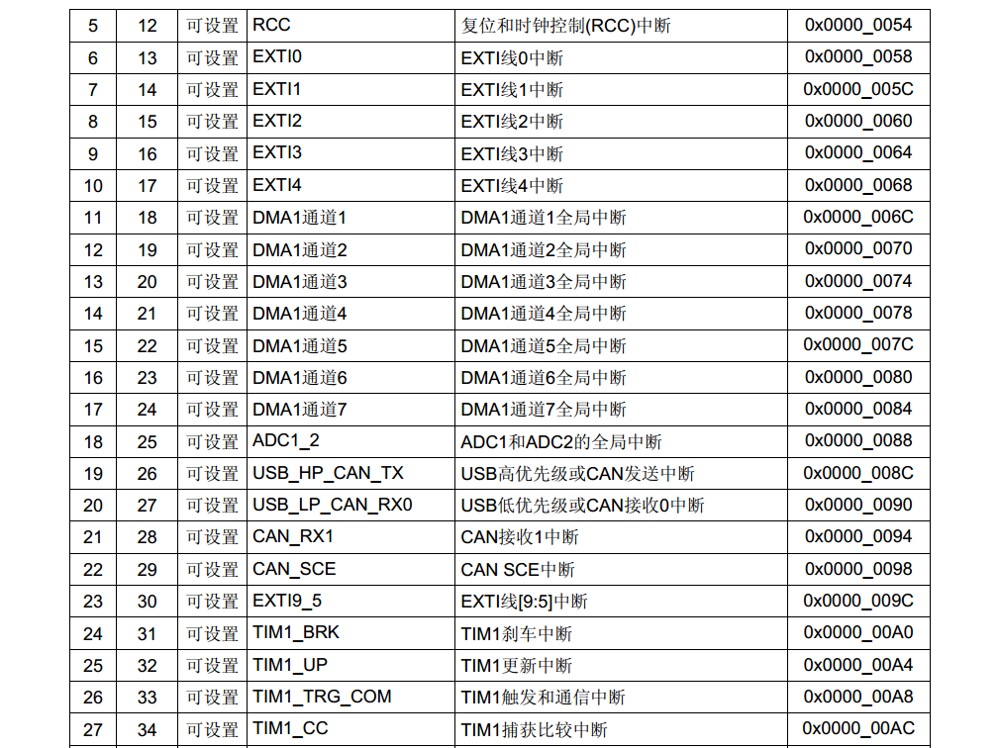

> **图 5-3 中断向量表二**

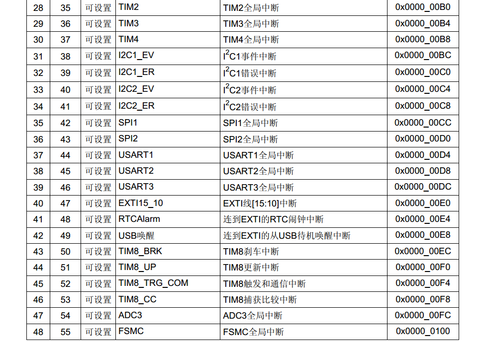

> **图 5-4 中断向量表三**

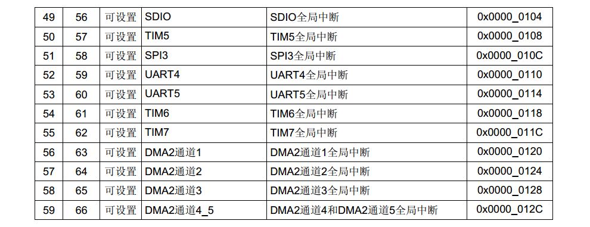

> **图 5-5 中断向量表四**

## 5.4 NVIC 优先级分组

NVIC 的中断优先级由优先级寄存器的 4 位（0 ~ 15）决定，这 4 位可以进行切分，分为高 n 位的抢占优先级和低 4-n 位的响应优先级：

- 抢占优先级高的可以中断嵌套；
- 响应优先级高的可以优先排队；
- 抢占优先级和响应优先级均相同的，按中断号排队。

| 分组方式 | 抢占优先级 | 响应优先级 |
| --- | --- | --- |
| 分组0 | 0 位，取值为 0 | 4 位，取值为 0~15 |
| 分组1 | 1 位，取值为 0~1 | 3 位，取值为 0~7 |
| 分组2 | 2 位，取值为 0~3 | 2 位，取值为 0~3 |
| 分组3 | 3 位，取值为 0~7 | 1 位，取值为 0~1 |
| 分组4 | 4 位，取值为 0~15 | 0 位，取值为 0 |

## 5.5 EXTI 外部中断

**EXTI**（Extern Interrupt，外部中断）可以监测指定 GPIO 口的电平信号，当其指定的 GPIO 口产生电平变化时，EXTI 将立即向 NVIC 发出中断申请，经过 NVIC 裁决后即可中断 CPU 主程序，使 CPU 执行 EXTI 对应的中断程序。

- 支持的触发方式：上升沿 / 下降沿 / 双边沿 / 软件触发；
- 支持的 GPIO 口：所有 GPIO 口，但相同的 Pin 不能同时触发中断；
- 通道数：16 个 GPIO_Pin，外加 PVD 输出、RTC 闹钟、USB 唤醒、以太网唤醒；
- 触发响应方式：中断响应 / 事件响应。

## 5.6 EXTI 基本结构

EXTI 的基本结构：GPIO（GPIOA、GPIOB、GPIOC 等，每个端口 16 个引脚）经过 **AFIO** 中断引脚选择后接入 EXTI 线（EXTI0~EXTI4、EXTI9_5、EXTI15_10），同时 PVD、RTC、USB、ETH 等外设也可作为中断 / 事件源；最终通过 NVIC 向 CPU 申请中断。

## 5.7 AFIO 复用 IO 口

**AFIO** 主要用于引脚复用功能的选择和重定义。在 STM32 中，AFIO 主要完成两个任务：复用功能引脚重映射、中断引脚选择。

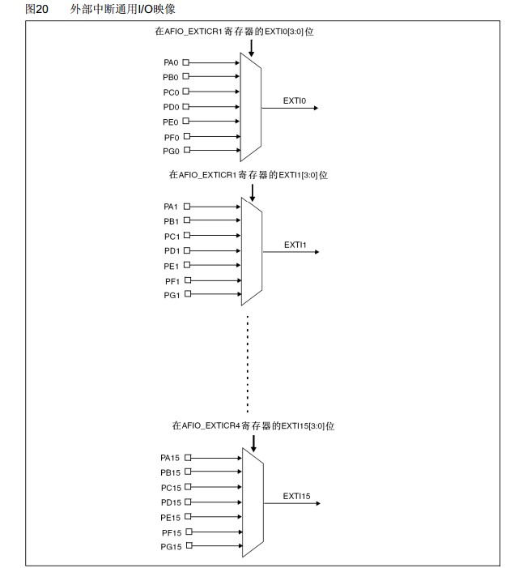

> **图 5-6 AFIO中断引脚选择**

## 5.8 EXTI 框图

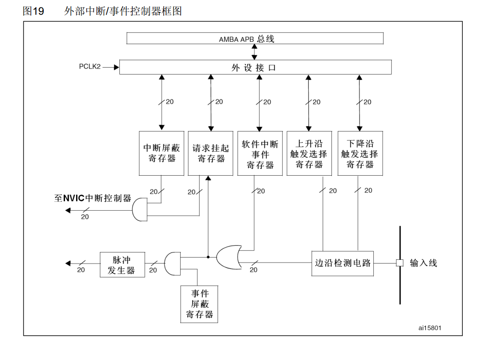

> **图 5-7 EXTI框图**

## 5.9 旋转编码器

**旋转编码器**：用来测量位置、速度或旋转方向的装置，当其旋转轴旋转时，其输出端可以输出与旋转速度和方向对应的方波信号，读取方波信号的频率和相位信息即可得知旋转轴的速度和方向。类型：机械触点式 / 霍尔传感器式 / 光栅式。

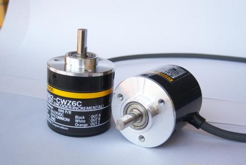

> **图 5-8 工业旋转编码器**

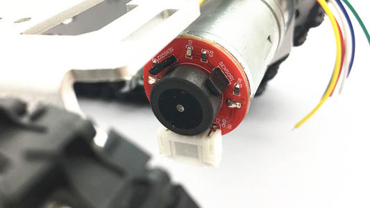

> **图 5-9 电机编码器**

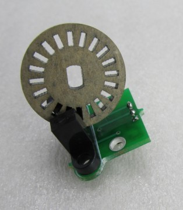

> **图 5-10 光栅编码器码盘**

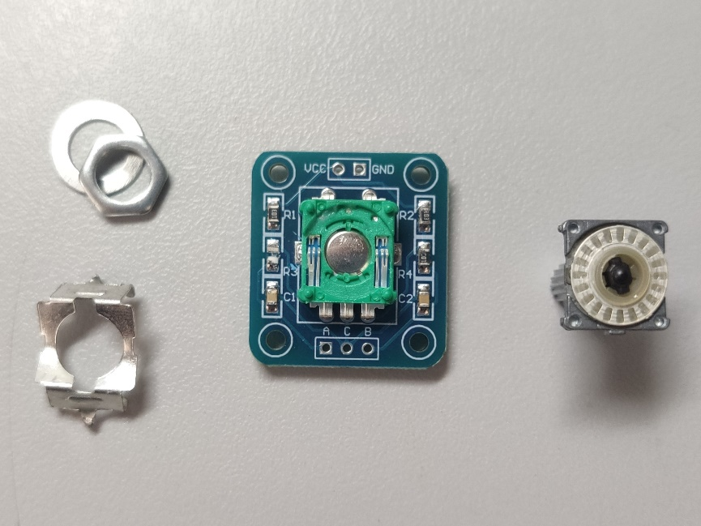

> **图 5-11 触点式编码器内部**

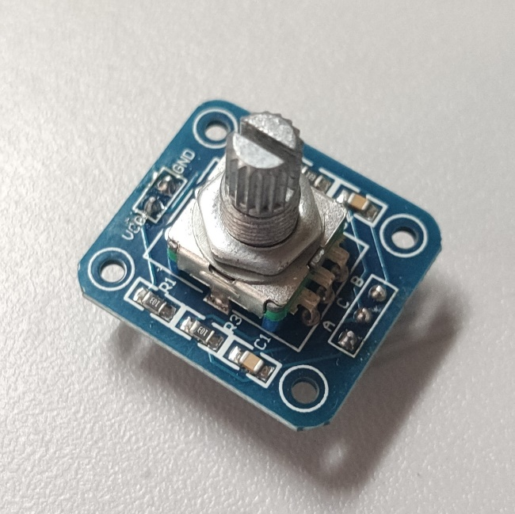

> **图 5-12 EC11旋转编码器模块**

旋转编码器的硬件电路与内部电路示意如下。

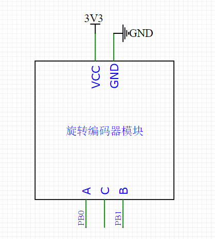

> **图 5-13 旋转编码器模块接线图**

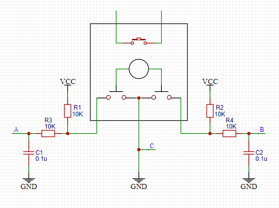

> **图 5-14 旋转编码器内部电路**

# 第6章 定时器

## 6.1 TIM 定时器简介

**TIM**（Timer，定时器）可以对输入的时钟进行计数，并在计数值达到设定值时触发中断。其 16 位计数器、预分频器、自动重装寄存器组成的时基单元，在 72 MHz 计数时钟下可以实现最大 59.65 s 的定时。

定时器不仅具备基本的定时中断功能，而且还包含内外时钟源选择、输入捕获、输出比较、编码器接口、主从触发模式等多种功能。根据复杂度和应用场景，分为高级定时器、通用定时器、基本定时器三种类型。

## 6.2 定时器类型

STM32F103C8T6 定时器资源：TIM1、TIM2、TIM3、TIM4。

| 类型 | 编号 | 总线 | 功能 |
| --- | --- | --- | --- |
| 高级定时器 | TIM1、TIM8 | APB2 | 拥有通用定时器全部功能，并额外具有重复计数器、死区生成、互补输出、刹车输入等功能 |
| 通用定时器 | TIM2、TIM3、TIM4、TIM5 | APB1 | 拥有基本定时器全部功能，并额外具有内外时钟源选择、输入捕获、输出比较、编码器接口、主从触发模式等功能 |
| 基本定时器 | TIM6、TIM7 | APB1 | 拥有定时中断、主模式触发 DAC 的功能 |

## 6.3 定时器结构

三种定时器的内部结构如下图所示。

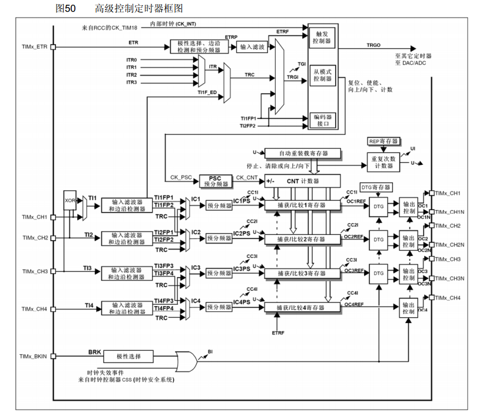

> **图 6-1 高级定时器结构**

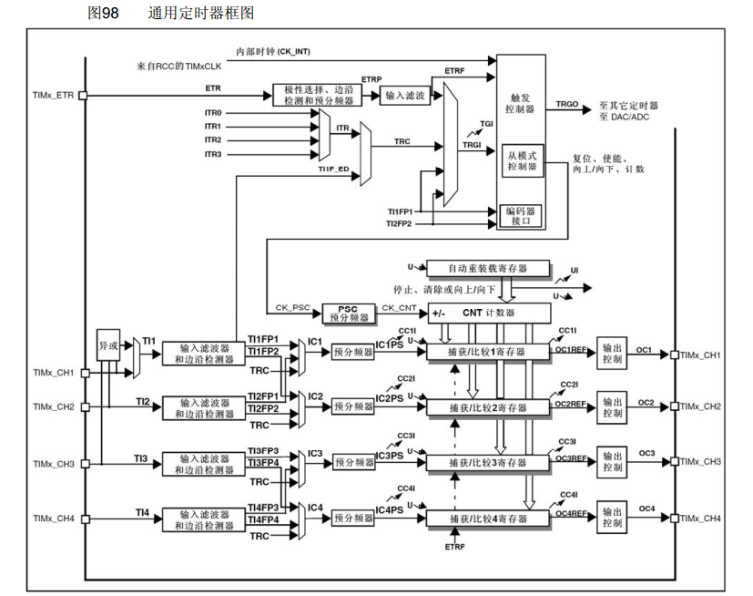

> **图 6-2 通用定时器结构**

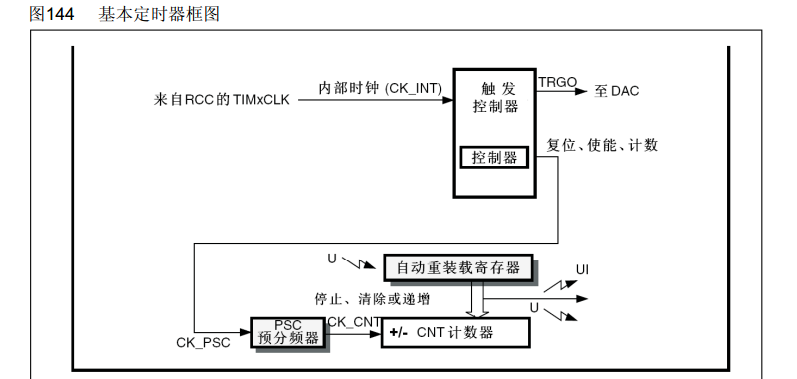

> **图 6-3 基本定时器结构**

## 6.4 时基单元与时钟

定时中断的基本结构围绕**时基单元**展开：由预分频器（PSC）、计数器（CNT）、自动重装器（ARR）组成，时钟可来自内部时钟（RCC）、外部时钟（ETR）、其他定时器（ITRx）或捕获通道（TIx），并支持编码器模式与内外时钟模式。

计数器计数频率：`CK_CNT = CK_PSC / (PSC + 1)`

## 6.5 预分频器与计数器时序

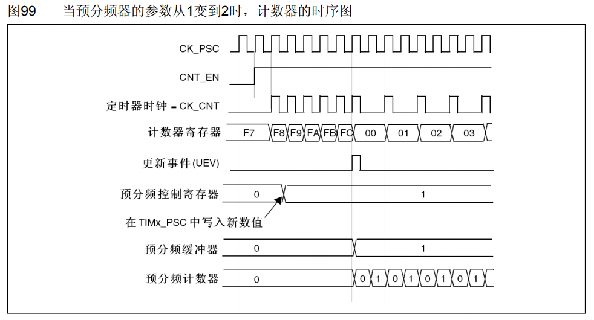

> **图 6-4 预分频器时序**

计数器计数频率：`CK_CNT = CK_PSC / (PSC + 1)`

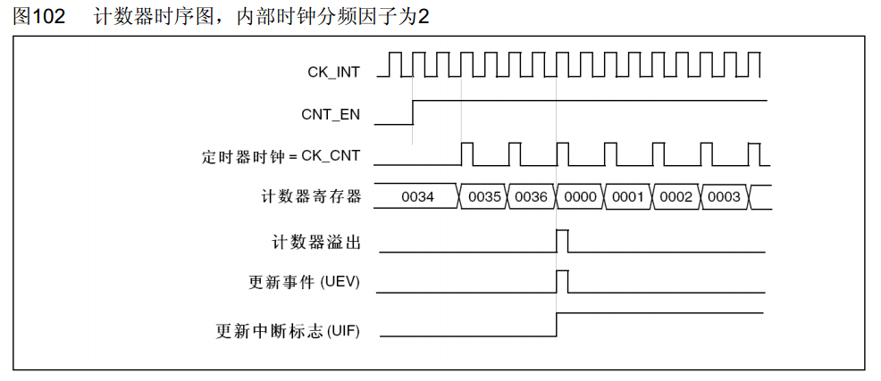

> **图 6-5 计数器时序**

计数器溢出频率：`CK_CNT_OV = CK_CNT / (ARR + 1) = CK_PSC / (PSC + 1) / (ARR + 1)`

下图分别展示计数器在无预装与有预装情况下的时序差异。

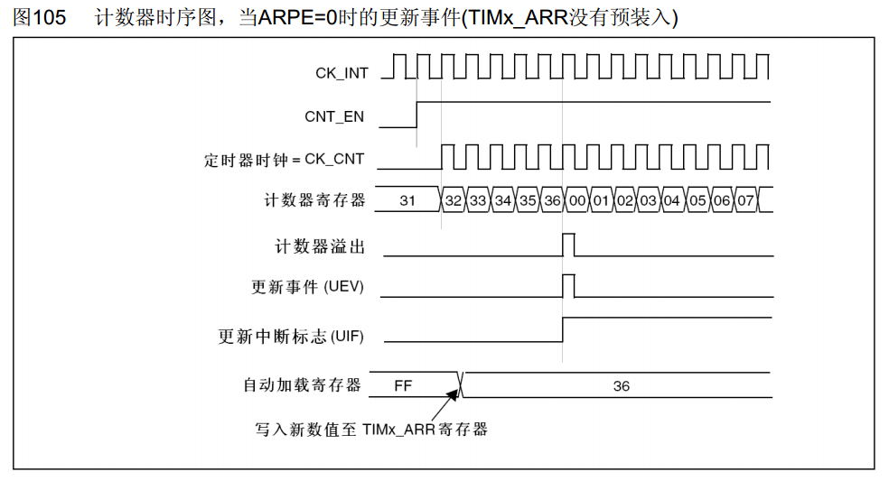

> **图 6-6 计数器无预装时序**

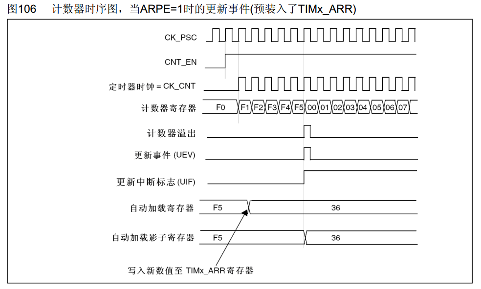

> **图 6-7 计数器有预装时序**

## 6.6 RCC 时钟树

定时器的时钟来源于 RCC 时钟树，理解时钟树有助于正确配置定时器时钟。

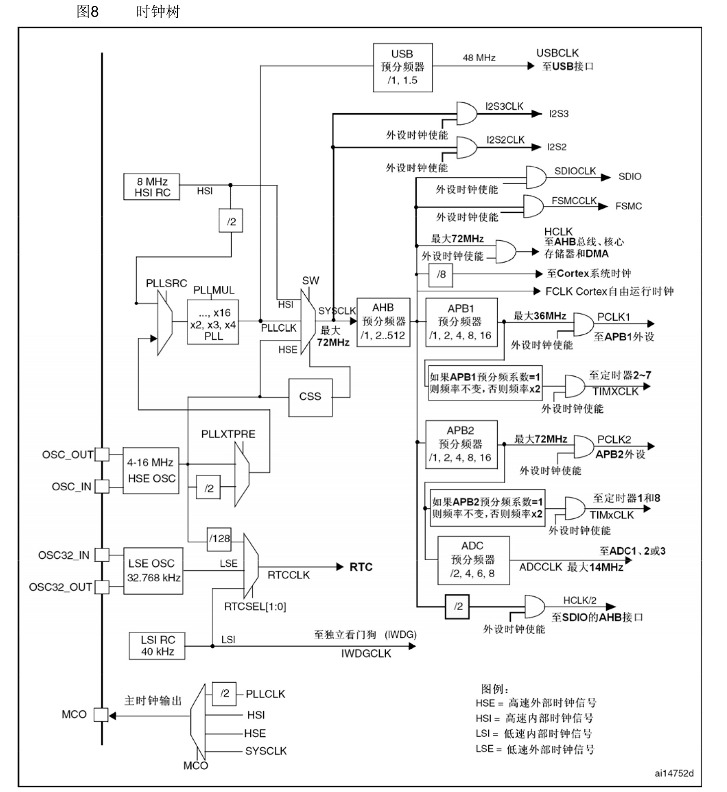

> **图 6-8 RCC时钟树**

## 6.7 输出比较与 PWM

**OC**（Output Compare，输出比较）可以通过比较 CNT 与 CCR 寄存器值的关系，来对输出电平进行置 1、置 0 或翻转的操作，用于输出一定频率和占空比的 PWM 波形。每个高级定时器和通用定时器都拥有 4 个输出比较通道；高级定时器的前 3 个通道额外拥有死区生成和互补输出的功能。

**PWM**（Pulse Width Modulation，脉冲宽度调制）：在具有惯性的系统中，可以通过对一系列脉冲的宽度进行调制，来等效地获得所需要的模拟参量，常应用于电机控速等领域。

PWM 参数：

- 频率 = 1 / TS；
- 占空比 = TON / TS；
- 分辨率 = 占空比变化步距。

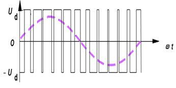

> **图 6-9 PWM波形示意图**

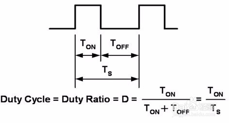

> **图 6-10 PWM等效模拟量**

## 6.8 输出比较通道与模式

下图给出高级定时器与通用定时器的输出比较通道结构。

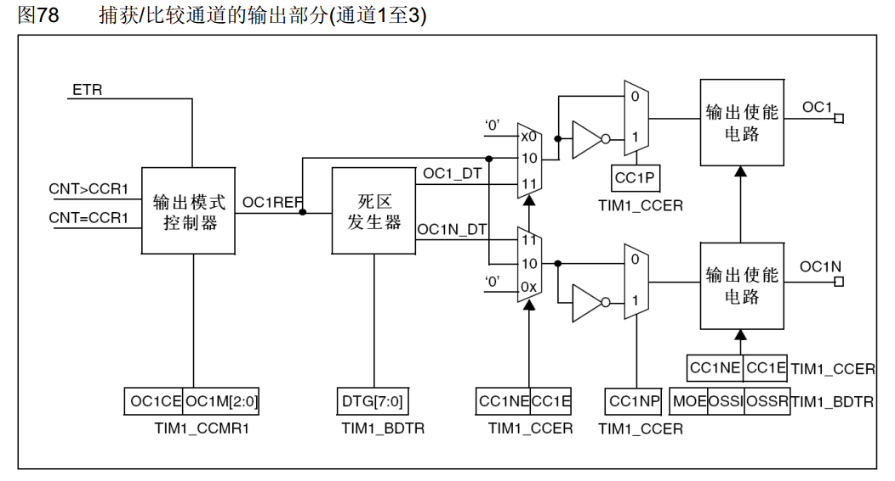

> **图 6-11 高级定时器输出比较通道**

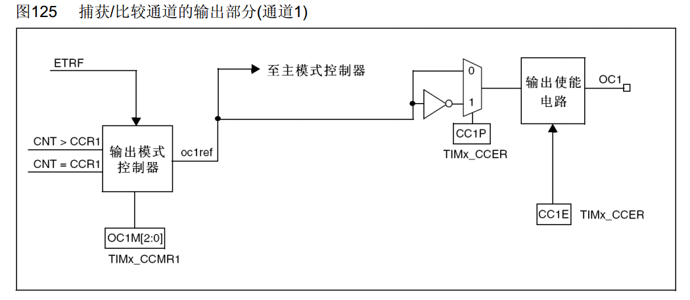

> **图 6-12 通用定时器输出比较通道**

输出比较模式如下：

| 模式 | 描述 |
| --- | --- |
| 冻结 | CNT=CCR 时，REF 保持为原状态 |
| 匹配时置有效电平 | CNT=CCR 时，REF 置有效电平 |
| 匹配时置无效电平 | CNT=CCR 时，REF 置无效电平 |
| 匹配时电平翻转 | CNT=CCR 时，REF 电平翻转 |
| 强制为无效电平 | CNT 与 CCR 无效，REF 强制为无效电平 |
| 强制为有效电平 | CNT 与 CCR 无效，REF 强制为有效电平 |
| PWM 模式1 | 向上计数：CNT<CCR 时 REF 置有效电平，CNT≥CCR 时 REF 置无效电平；向下计数：CNT>CCR 时 REF 置无效电平，CNT≤CCR 时 REF 置有效电平 |
| PWM 模式2 | 向上计数：CNT<CCR 时 REF 置无效电平，CNT≥CCR 时 REF 置有效电平；向下计数：CNT>CCR 时 REF 置有效电平，CNT≤CCR 时 REF 置无效电平 |

PWM 的基本结构：时基单元（ARR、CNT、PSC）驱动 4 个输出比较单元（CCR、REF、极性选择、输出使能），最终通过 GPIO 输出。

## 6.9 PWM 参数计算

基于时基单元与输出比较单元，PWM 参数计算如下：

- PWM 频率：`Freq = CK_PSC / (PSC + 1) / (ARR + 1)`；
- PWM 占空比：`Duty = CCR / (ARR + 1)`；
- PWM 分辨率：`Reso = 1 / (ARR + 1)`。

## 6.10 舵机控制

**舵机**是一种根据输入 PWM 信号占空比来控制输出角度的装置。输入 PWM 信号要求：周期为 20 ms，高电平宽度为 0.5 ms ~ 2.5 ms。

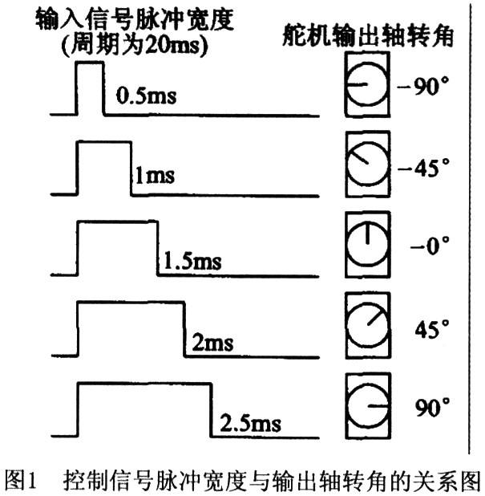

> **图 6-13 舵机PWM控制原理**

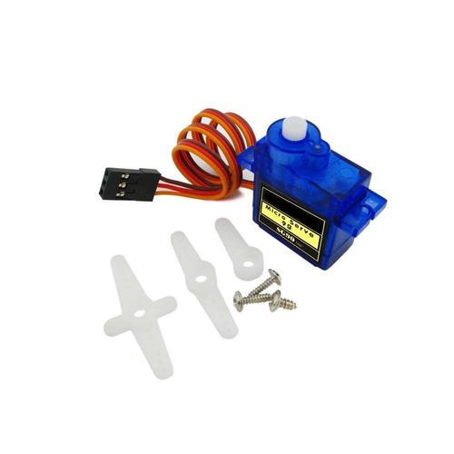

> **图 6-14 SG90舵机**

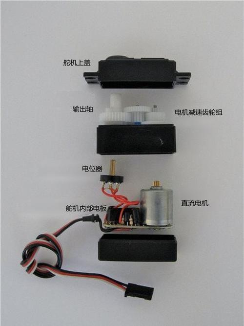

> **图 6-15 舵机内部结构**

舵机的硬件接线示意图与接线电路如下。

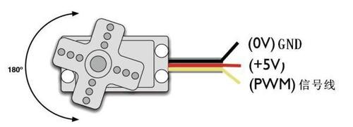

> **图 6-16 舵机接线示意图**

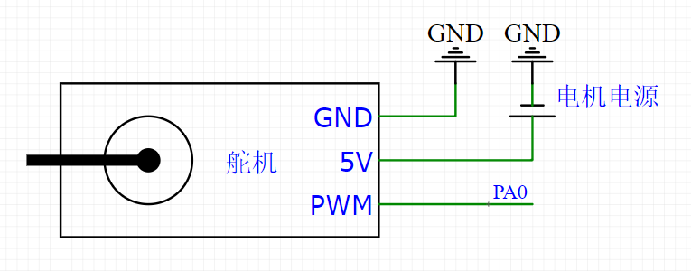

> **图 6-17 舵机接线电路**

## 6.11 直流电机与 TB6612 驱动

**直流电机**是一种将电能转换为机械能的装置，有两个电极，当电极正接时电机正转，反接时电机反转。直流电机属于大功率器件，GPIO 口无法直接驱动，需要配合电机驱动电路来操作。**TB6612** 是一款双路 H 桥型的直流电机驱动芯片，可以驱动两个直流电机并控制其转速和方向。

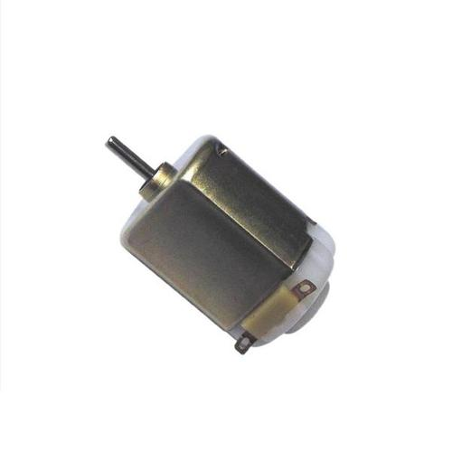

> **图 6-18 直流电机实物**

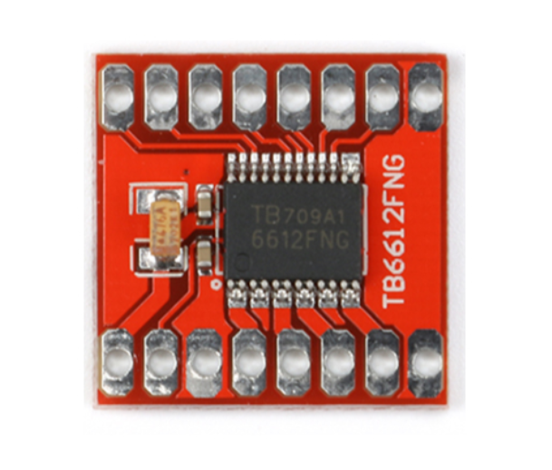

> **图 6-19 TB6612模块实物**

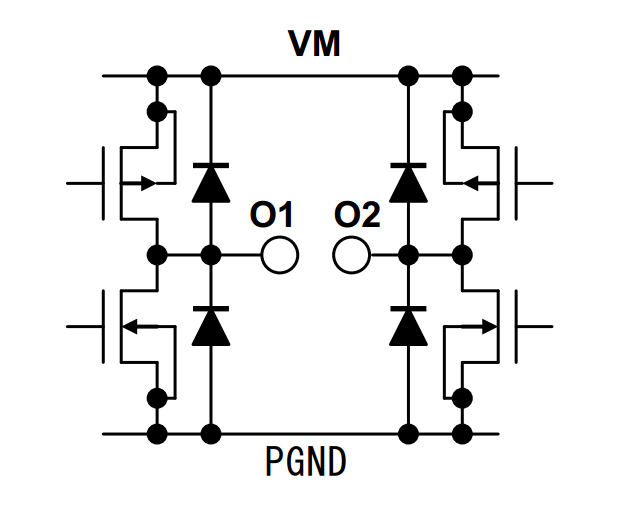

> **图 6-20 TB6612H桥电路**

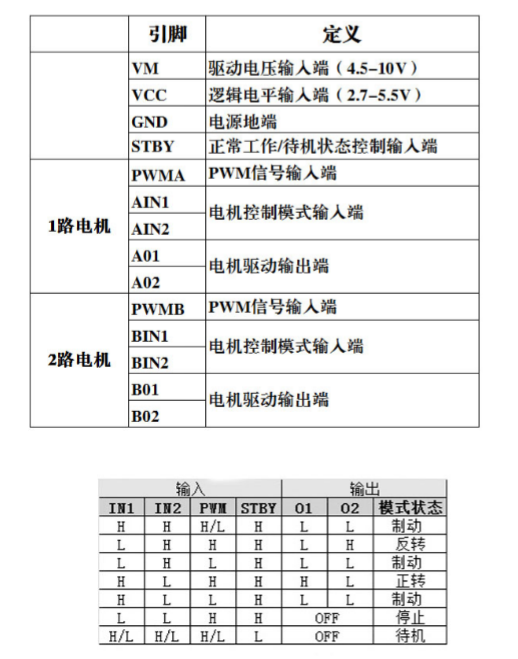

> **图 6-21 TB6612引脚定义与真值表**

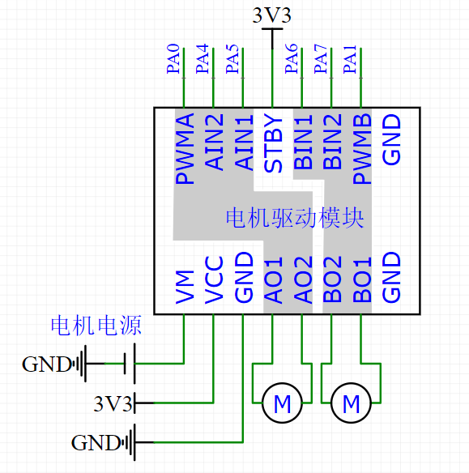

> **图 6-22 电机驱动模块接线图**

## 6.12 输入捕获

**IC**（Input Capture，输入捕获）：在输入捕获模式下，当通道输入引脚出现指定电平跳变时，当前 CNT 的值将被锁存到 CCR 中，可用于测量 PWM 波形的频率、占空比、脉冲间隔、电平持续时间等参数。每个高级定时器和通用定时器都拥有 4 个输入捕获通道。可配置为 PWMI 模式，同时测量频率和占空比；可配合主从触发模式，实现硬件全自动测量。

在频率测量中，通过闸门时间 T 与标准频率 fc，计次 N，可求得被测频率。


> **图 6-23 频率测量波形**


> **图 6-24 频率测量波形二**

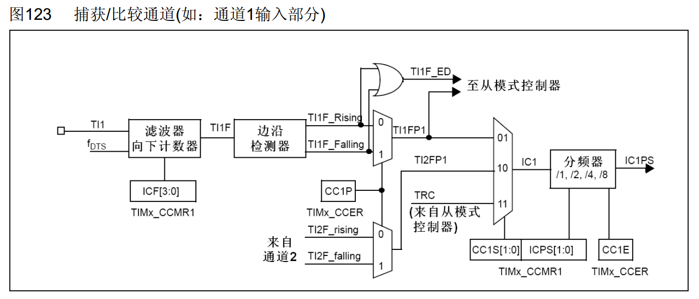

> **图 6-25 输入捕获通道**

## 6.13 主从触发模式

定时器支持主模式（TRGO 输出触发信号：Reset、Enable、Update、OC1REF 等）与从模式（触发源选择：ITR0~3、TI1F_ED、TI1FP1、TI2FP2、ETRF 等；从模式动作包括 Reset、Gated、Trigger、External1、Encoder1~3 等），可实现定时器之间的硬件联动。

输入捕获基本结构与 PWMI 基本结构：均围绕时基单元（ARR、CNT、PSC）与输入捕获单元（CCR、滤波器、边沿检测、极性选择、分频器）展开，并借助从模式 Reset 实现自动清零计数。

## 6.14 编码器接口

**Encoder Interface（编码器接口）**可接收增量（正交）编码器的信号，根据编码器旋转产生的正交信号脉冲，自动控制 CNT 自增或自减，从而指示编码器的位置、旋转方向和旋转速度。每个高级定时器和通用定时器都拥有 1 个编码器接口，两个输入引脚借用了输入捕获的通道 1 和通道 2。

正交编码器正转 / 反转时 A 相、B 相的相位关系如下。

| 边沿 | 另一相状态（正转） |
| --- | --- |
| A相↑ | B相低电平 |
| A相↓ | B相高电平 |
| B相↑ | A相高电平 |
| B相↓ | A相低电平 |

| 边沿 | 另一相状态（反转） |
| --- | --- |
| A相↑ | B相高电平 |
| A相↓ | B相低电平 |
| B相↑ | A相低电平 |
| B相↓ | A相高电平 |

编码器接口基本结构：时基单元（ARR、CNT、PSC）配合 GPIO 输入，经滤波器、边沿检测、极性选择接入 TI1FP1、TI2FP2。

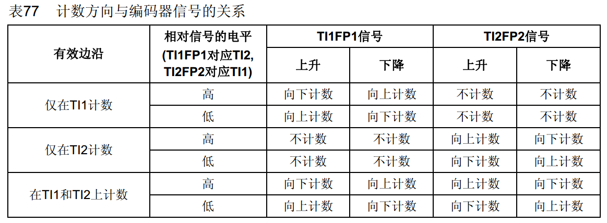

> **图 6-26 编码器计数方向与信号关系表**

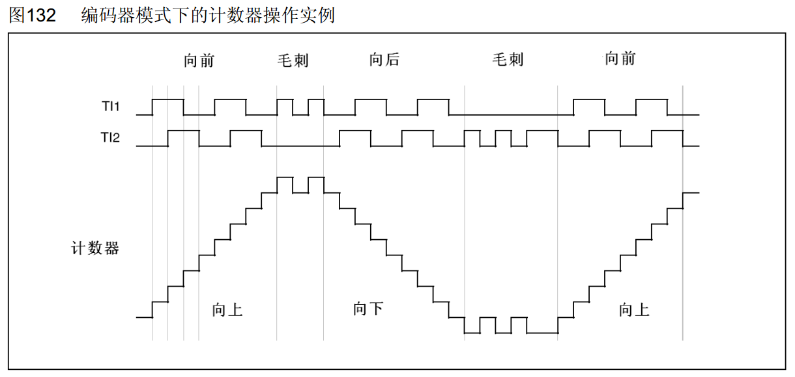

> **图 6-27 编码器计数实例**

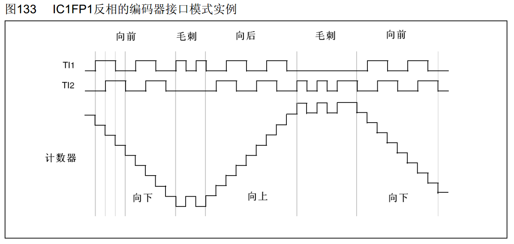

> **图 6-28 编码器TI1反相计数实例**

# 第7章 ADC 模数转换器

## 7.1 ADC 简介

**ADC**（Analog-Digital Converter，模拟 - 数字转换器）可以将引脚上连续变化的模拟电压转换为内存中存储的数字变量，建立模拟电路到数字电路的桥梁。

- 12 位逐次逼近型 ADC，1 μs 转换时间；
- 输入电压范围：0 ~ 3.3 V，转换结果范围：0 ~ 4095；
- 18 个输入通道，可测量 16 个外部和 2 个内部信号源；
- 规则组和注入组两个转换单元；
- 模拟看门狗自动监测输入电压范围。

STM32F103C8T6 的 ADC 资源：ADC1、ADC2，10 个外部输入通道。

## 7.2 逐次逼近型 ADC 与 ADC 框图

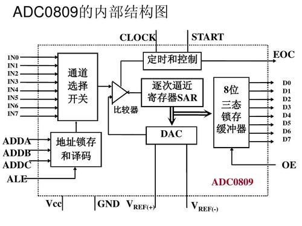

> **图 7-1 逐次逼近型ADC结构**

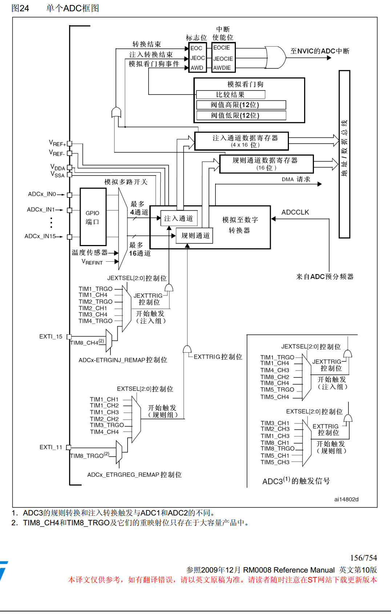

> **图 7-2 ADC框图**

## 7.3 ADC 基本结构

ADC 的基本结构：GPIO 输入经开关控制进入 AD 转换器，触发控制可由 RCC 时钟或外部触发提供；转换结果分别送入规则组（结果 ×1）与注入组（结果 ×4）的 AD 数据寄存器；模拟看门狗监测输入电压范围；转换完成（EOC）经中断输出控制向 NVIC 申请中断。内部信号源还包括温度、VREFINT 等。

## 7.4 输入通道

ADC 各通道与外部引脚的对应关系如下（以 ADC1 / ADC2 / ADC3 为例）。

| 通道 | ADC1 | ADC2 | ADC3 |
| --- | --- | --- | --- |
| 通道0 | PA0 | PA0 | PA0 |
| 通道1 | PA1 | PA1 | PA1 |
| 通道2 | PA2 | PA2 | PA2 |
| 通道3 | PA3 | PA3 | PA3 |
| 通道4 | PA4 | PA4 | PF6 |
| 通道5 | PA5 | PA5 | PF7 |
| 通道6 | PA6 | PA6 | PF8 |
| 通道7 | PA7 | PA7 | PF9 |
| 通道8 | PB0 | PB0 | PF10 |
| 通道9 | PB1 | PB1 |  |
| 通道10 | PC0 | PC0 | PC0 |
| 通道11 | PC1 | PC1 | PC1 |
| 通道12 | PC2 | PC2 | PC2 |
| 通道13 | PC3 | PC3 | PC3 |
| 通道14 | PC4 | PC4 |  |
| 通道15 | PC5 | PC5 |  |
| 通道16 | 温度传感器 |  |  |
| 通道17 | 内部参考电压 |  |  |

## 7.5 转换模式

ADC 的转换模式由两个维度组合而成：**单次 / 连续**转换，以及**非扫描 / 扫描**模式。

- **单次转换，非扫描模式**：每次触发只转换序列中的 1 个通道（如通道 2），转换完成后停止，产生 EOC；
- **连续转换，非扫描模式**：在单次非扫描基础上，转换完成后自动重新开始，不断产生 EOC；
- **单次转换，扫描模式**：每次触发按序列（如通道 2、5、4、1、0、3、6，共 7 个通道）依次转换一遍后停止，产生 EOC；
- **连续转换，扫描模式**：在单次扫描基础上，转换完成后自动重复整个序列。

扫描模式下，规则组序列寄存器（序列 1 ~ 16）决定各通道的转换顺序，通道数目寄存器决定实际转换的通道个数。

## 7.6 触发控制

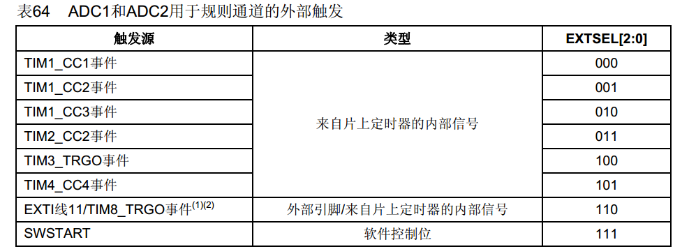

> **图 7-3 ADC触发控制**

## 7.7 数据对齐

ADC 转换结果在数据寄存器中可配置为**数据右对齐**或**数据左对齐**。

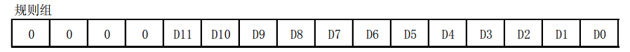

> **图 7-4 ADC数据右对齐**

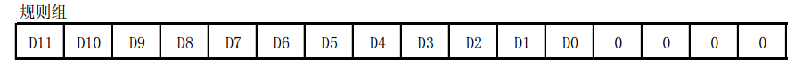

> **图 7-5 ADC数据左对齐**

## 7.8 转换时间与校准

AD 转换的步骤：采样，保持，量化，编码。

STM32 ADC 的总转换时间为：`TCONV = 采样时间 + 12.5 个 ADC 周期`。

例如：当 ADCCLK = 14 MHz，采样时间为 1.5 个 ADC 周期时，`TCONV = 1.5 + 12.5 = 14 个 ADC 周期 = 1 μs`。

ADC 有一个内置自校准模式，校准可大幅减小因内部电容器组的变化而造成的准精度误差。建议在每次上电后执行一次校准；启动校准前，ADC 必须处于关电状态超过至少两个 ADC 时钟周期。

## 7.9 硬件电路

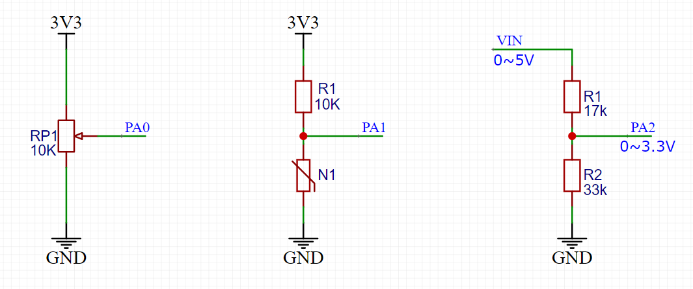

> **图 7-6 ADC输入电路**

# 第8章 DMA 直接存储器存取

## 8.1 DMA 简介

**DMA**（Direct Memory Access，直接存储器存取）可以提供外设和存储器或者存储器和存储器之间的高速数据传输，无须 CPU 干预，节省了 CPU 的资源。共有 12 个独立可配置的通道：DMA1（7 个通道）、DMA2（5 个通道），每个通道都支持软件触发和特定的硬件触发。

STM32F103C8T6 的 DMA 资源：DMA1（7 个通道）。

## 8.2 存储器映像

| 类型 | 起始地址 | 存储器 | 用途 |
| --- | --- | --- | --- |
| ROM | 0x0800 0000 | 程序存储器 Flash | 存储 C 语言编译后的程序代码 |
|  | 0x1FFF F000 | 系统存储器 | 存储 BootLoader，用于串口下载 |
|  | 0x1FFF F800 | 选项字节 | 存储一些独立于程序代码的配置参数 |
| RAM | 0x2000 0000 | 运行内存 SRAM | 存储运行过程中的临时变量 |
|  | 0x4000 0000 | 外设寄存器 | 存储各个外设的配置参数 |
|  | 0xE000 0000 | 内核外设寄存器 | 存储内核各个外设的配置参数 |

## 8.3 DMA 框图与基本结构

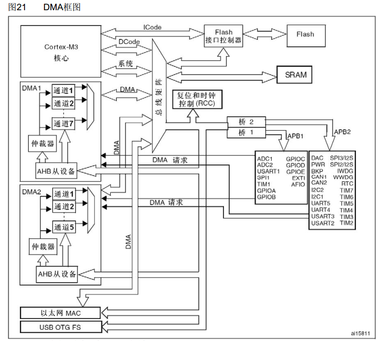

> **图 8-1 DMA框图**

DMA 的基本结构：外设寄存器与存储器（SRAM、Flash）两侧各包含起始地址、数据宽度、地址是否自增三个参数，中间由方向（外设→存储器 / 存储器→外设 / 存储器→存储器）、M2M、传输计数器、自动重装器、开关控制等逻辑组成，触发方式分为硬件触发与软件触发。

## 8.4 DMA 请求

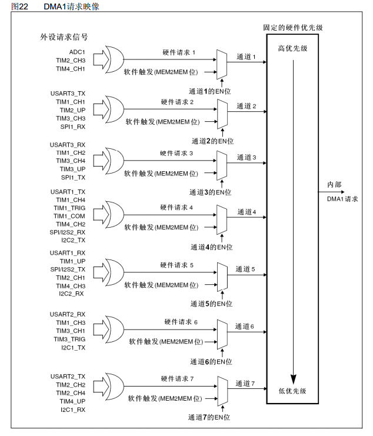

> **图 8-2 DMA请求**

## 8.5 数据宽度与对齐

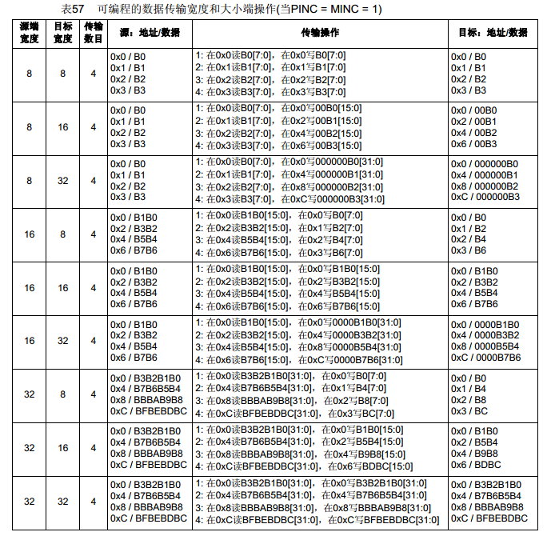

> **图 8-3 DMA数据宽度与对齐**

## 8.6 数据转运与 ADC 扫描模式

**数据转运 + DMA**：可将一个 SRAM 数组（如 `uint8_t DataA[7]`）的数据通过 DMA 转运到另一个 SRAM 数组（`uint8_t DataB[7]`），由软件触发，无需 CPU 逐字节搬运。

**ADC 扫描模式 + DMA**：在 ADC 扫描多个通道（如通道 2、5、4、1、0、3、6，共 7 个）时，每次转换完成的结果（ADC_DR）由 DMA 自动搬运到 SRAM 数组 `uint16_t ADValue[7]`，避免 CPU 频繁读取，实现高效连续采集。

# 第9章 通信接口总览与串口通信

## 9.1 通信接口总览

通信的目的：将一个设备的数据传送到另一个设备，扩展硬件系统。通信协议：制定通信的规则，通信双方按照协议规则进行数据收发。

| 名称 | 引脚 | 双工 | 时钟 | 电平 | 设备 |
| --- | --- | --- | --- | --- | --- |
| USART | TX、RX | 全双工 | 异步 | 单端 | 点对点 |
| I2C | SCL、SDA | 半双工 | 同步 | 单端 | 多设备 |
| SPI | SCLK、MOSI、MISO、CS | 全双工 | 同步 | 单端 | 多设备 |
| CAN | CAN_H、CAN_L | 半双工 | 异步 | 差分 | 多设备 |
| USB | DP、DM | 半双工 | 异步 | 差分 | 点对点 |

## 9.2 串口通信

串口是一种应用十分广泛的通讯接口，串口成本低、容易使用、通信线路简单，可实现两个设备的互相通信。单片机的串口可以使单片机与单片机、单片机与电脑、单片机与各式各样的模块互相通信，极大地扩展了单片机的应用范围，增强了单片机系统的硬件实力。

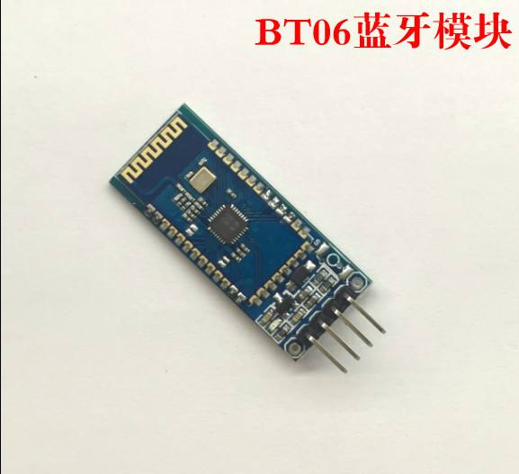

> **图 9-1 BT06蓝牙模块**

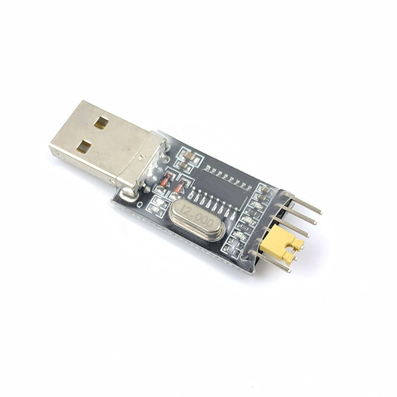

> **图 9-2 USB转串口模块**

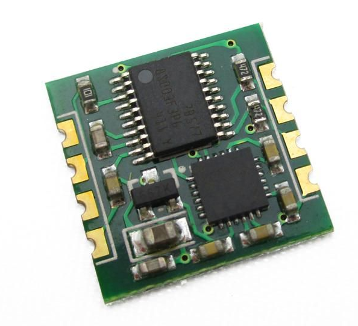

> **图 9-3 串口设备模块**

## 9.3 硬件电路与电平标准

简单双向串口通信有两根通信线（发送端 TX 和接收端 RX）：

- TX 与 RX 要交叉连接；
- 当只需单向的数据传输时，可以只接一根通信线；
- 当电平标准不一致时，需要加电平转换芯片。

电平标准是数据 1 和数据 0 的表达方式，是传输线缆中人为规定的电压与数据的对应关系，串口常用的电平标准有三种：

- **TTL 电平**：+3.3 V 或 +5 V 表示 1，0 V 表示 0；
- **RS232 电平**：-3 ~ -15 V 表示 1，+3 ~ +15 V 表示 0；
- **RS485 电平**：两线压差 +2 ~ +6 V 表示 1，-2 ~ -6 V 表示 0（差分信号）。

## 9.4 串口参数及时序

波特率：串口通信的速率。

- 起始位：标志一个数据帧的开始，固定为低电平；
- 数据位：数据帧的有效载荷，1 为高电平，0 为低电平，低位先行；
- 校验位：用于数据验证，根据数据位计算得来；
- 停止位：用于数据帧间隔，固定为高电平。

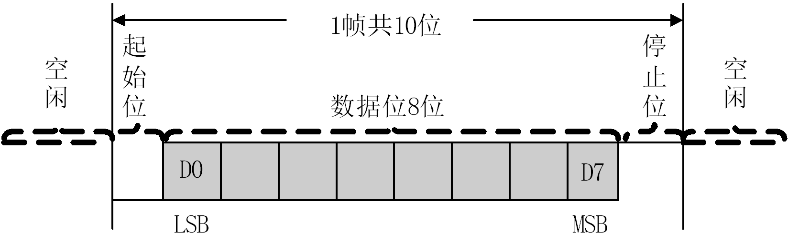

> **图 9-4 串口数据帧时序一**

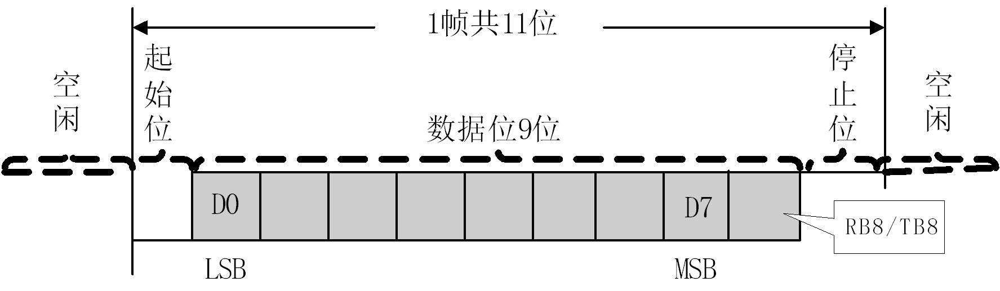

> **图 9-5 串口数据帧时序二**

串口时序波形示例如下，展示了不同波特率、数据位、停止位、校验位配置下的波形（如 0x55 / 0xFF / 0x00 / 0xAA 等数据，9600 或 4800 波特率，8 位数据，1 或 2 位停止，无校验或偶校验）。

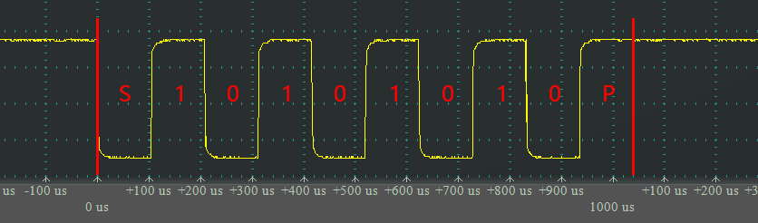

> **图 9-6 串口时序波形一**

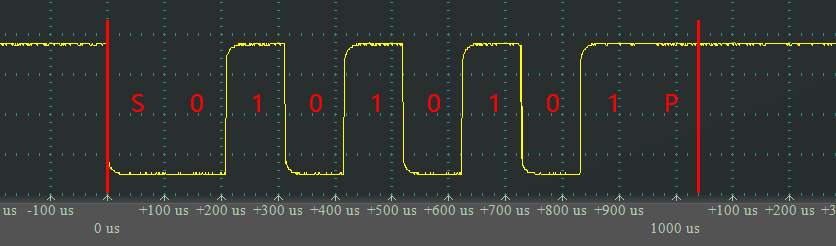

> **图 9-7 串口时序波形二**

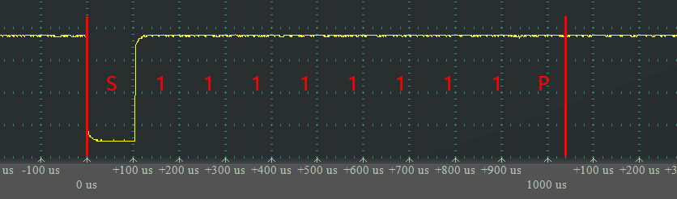

> **图 9-8 串口时序波形三**

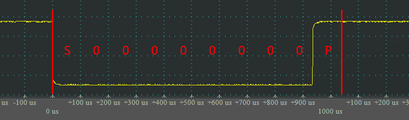

> **图 9-9 串口时序波形四**

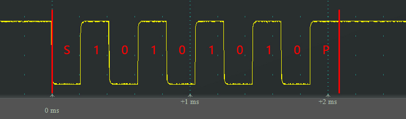

> **图 9-10 串口时序波形五**

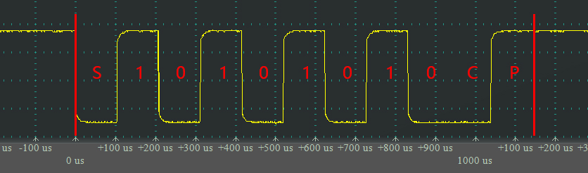

> **图 9-11 串口时序波形六**

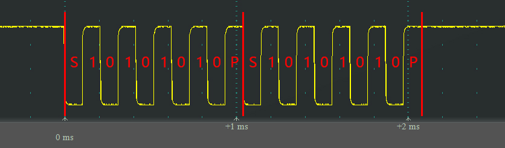

> **图 9-12 串口时序波形七**

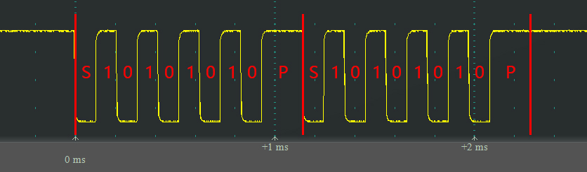

> **图 9-13 串口时序波形八**

## 9.5 USART 简介

**USART**（Universal Synchronous / Asynchronous Receiver / Transmitter，通用同步 / 异步收发器）是 STM32 内部集成的硬件外设，可根据数据寄存器的一个字节数据自动生成数据帧时序，从 TX 引脚发送出去，也可自动接收 RX 引脚的数据帧时序，拼接为一个字节数据，存放在数据寄存器里。自带波特率发生器，最高达 4.5 Mbits/s。

- 可配置数据位长度（8 / 9）、停止位长度（0.5 / 1 / 1.5 / 2）；
- 可选校验位（无校验 / 奇校验 / 偶校验）；
- 支持同步模式、硬件流控制、DMA、智能卡、IrDA、LIN。

STM32F103C8T6 的 USART 资源：USART1、USART2、USART3。

## 9.6 USART 框图与基本结构

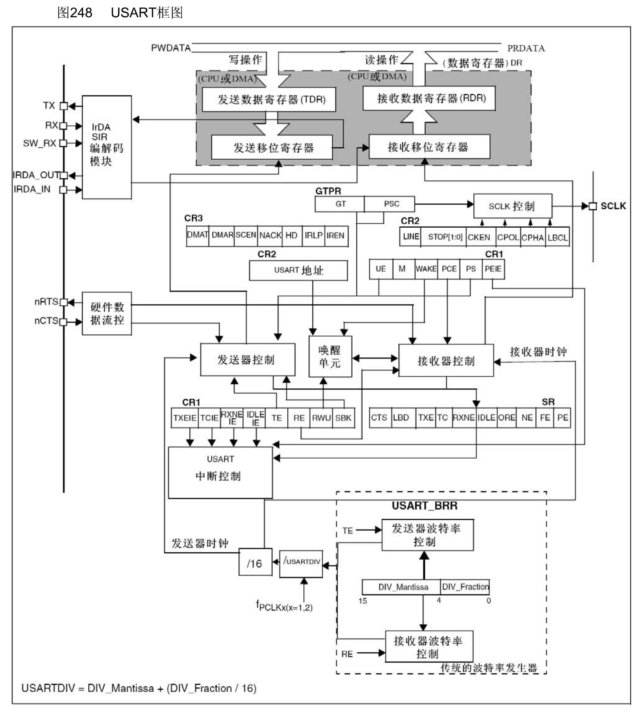

> **图 9-14 USART框图**

USART 的基本结构：发送数据寄存器 TDR → 发送移位寄存器 → GPIO（TX）；接收方向为 GPIO（RX）→ 接收移位寄存器 → 接收数据寄存器 RDR。开关控制与 PCLK2/1、波特率发生器共同决定发送 / 接收时序。

## 9.7 数据帧、起始位侦测与数据采样

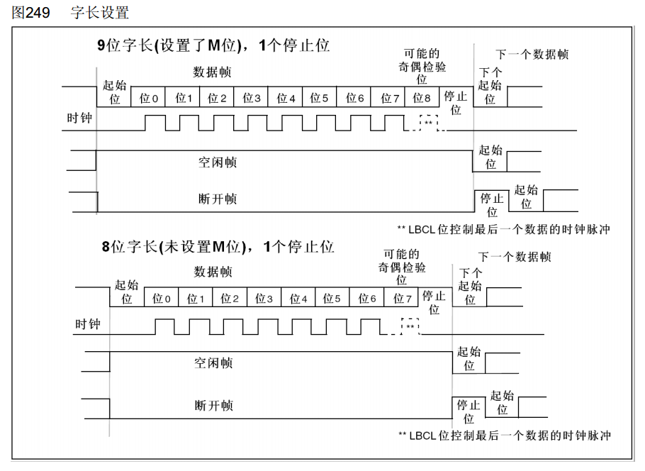

> **图 9-15 USART数据帧**

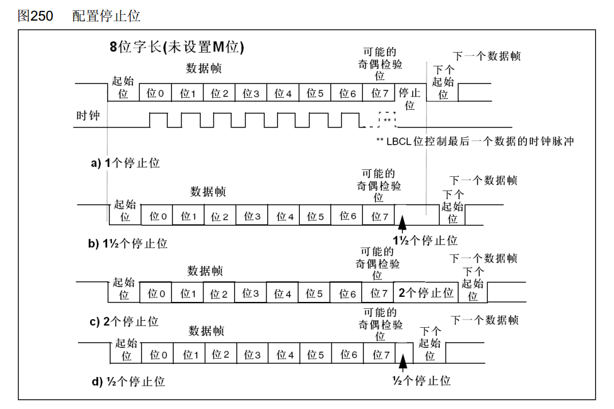

> **图 9-16 USART数据帧校验位**

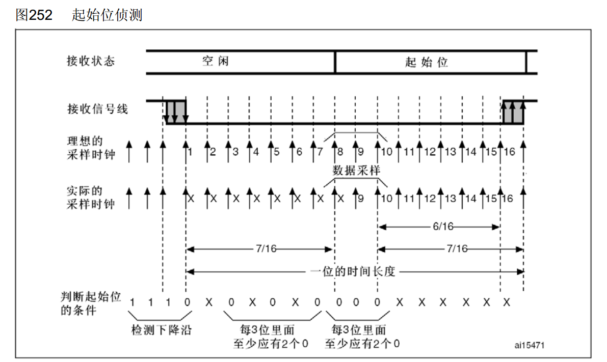

> **图 9-17 起始位侦测**

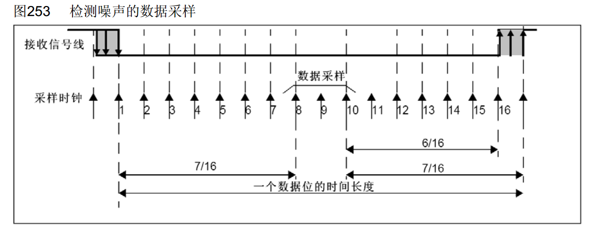

> **图 9-18 数据采样**

## 9.8 波特率发生器

发送器和接收器的波特率由波特率寄存器 BRR 里的 DIV 确定，计算公式：`波特率 = fPCLK2/1 / (16 × DIV)`。

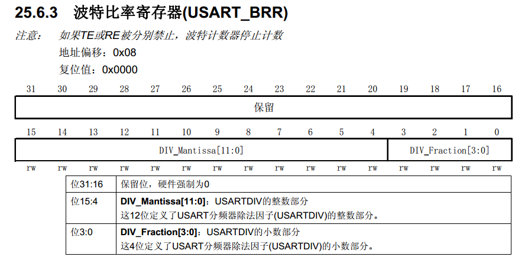

> **图 9-19 波特率发生器**

## 9.9 数据模式与数据包

**数据模式**：

- HEX 模式 / 十六进制模式 / 二进制模式：以原始数据的形式显示；
- 文本模式 / 字符模式：以原始数据编码后的形式显示。

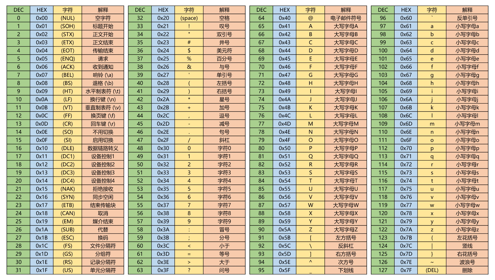

> **图 9-20 ASCII码表**

**HEX 数据包**：可分为固定包长（含包头包尾）与可变包长（含包头包尾）两种组织方式。

**文本数据包**：同样可分为固定包长（含包头包尾）与可变包长（含包头包尾）两种组织方式。

HEX / 文本数据包的接收流程遵循“等待包头 → 接收数据 → 等待包尾”的状态机逻辑。

# 第10章 I2C 通信与 MPU6050

## 10.1 I2C 通信

**I2C**（Inter IC Bus）是由 Philips 公司开发的一种通用数据总线。两根通信线：SCL（Serial Clock）、SDA（Serial Data）。同步，半双工；带数据应答；支持总线挂载多设备（一主多从、多主多从）。

下图为 OLED 模块的 I2C 接口（已在第 4 章介绍），以及常用于 I2C 通信的 DS3231 时钟模块与 AT24C02 存储器模块。


> **图 10-1 OLED模块I2C接口**

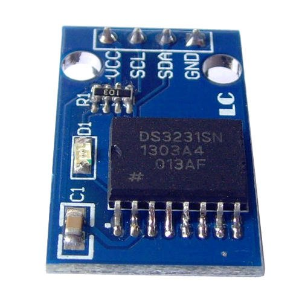

> **图 10-2 DS3231时钟模块**

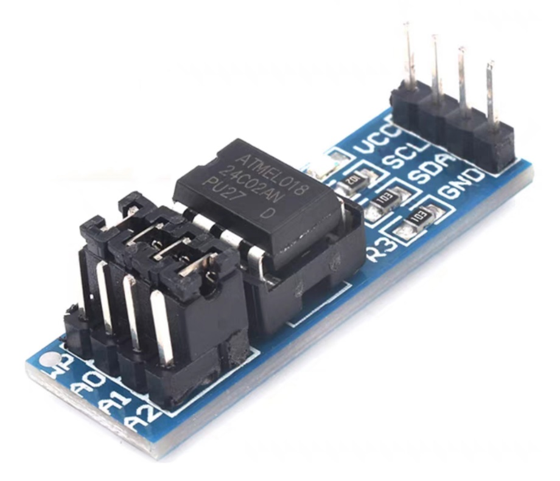

> **图 10-3 AT24C02存储器模块**

I2C 采用开漏输出结构，SCL 与 SDA 均需外接上拉电阻。

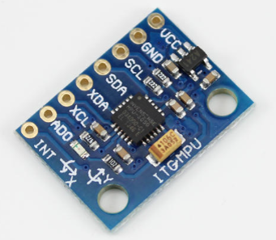

> **图 10-4 I2C开漏输出结构**

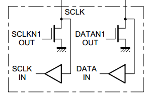

> **图 10-5 I2C总线多设备连接**

## 10.2 I2C 硬件电路

所有 I2C 设备的 SCL 连在一起，SDA 连在一起；设备的 SCL 和 SDA 均要配置成开漏输出模式；SCL 和 SDA 各添加一个上拉电阻，阻值一般为 4.7 KΩ 左右。

MPU6050 的坐标系定义如下。

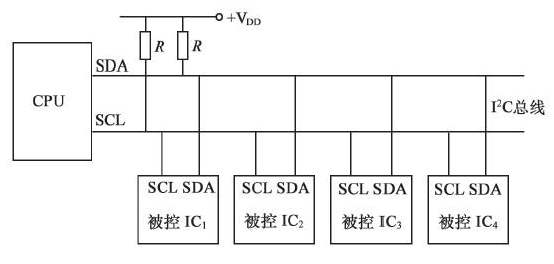

> **图 10-6 MPU6050坐标系**

## 10.3 I2C 时序基本单元

**起始条件**：SCL 高电平期间，SDA 从高电平切换到低电平。

**终止条件**：SCL 高电平期间，SDA 从低电平切换到高电平。

**发送一个字节**：SCL 低电平期间，主机将数据位依次放到 SDA 线上（高位先行），然后释放 SCL，从机将在 SCL 高电平期间读取数据位，所以 SCL 高电平期间 SDA 不允许有数据变化，依次循环上述过程 8 次，即可发送一个字节。

**接收一个字节**：SCL 低电平期间，从机将数据位依次放到 SDA 线上（高位先行），然后释放 SCL，主机将在 SCL 高电平期间读取数据位；依次循环 8 次即可接收一个字节（主机在接收之前，需要释放 SDA）。

**发送应答**：主机在接收完一个字节之后，在下一个时钟发送一位数据，数据 0 表示应答，数据 1 表示非应答。

**接收应答**：主机在发送完一个字节之后，在下一个时钟接收一位数据，判断从机是否应答，数据 0 表示应答，数据 1 表示非应答（主机在接收之前，需要释放 SDA）。

## 10.4 I2C 指定地址读写时序

**指定地址写**：对于指定设备（Slave Address），在指定地址（Reg Address）下，写入指定数据（Data）。

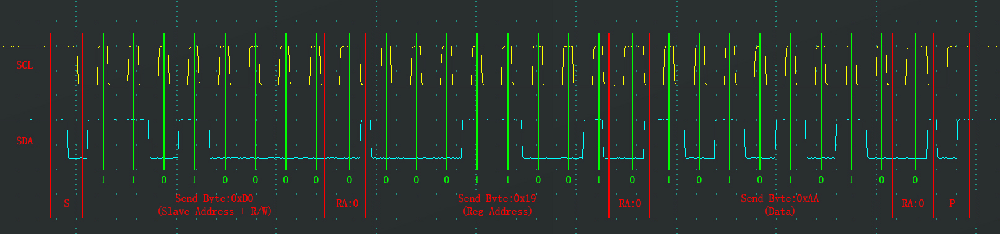

> **图 10-7 I2C指定地址写时序**

**当前地址读**：对于指定设备（Slave Address），在当前地址指针指示的地址下，读取从机数据（Data）。

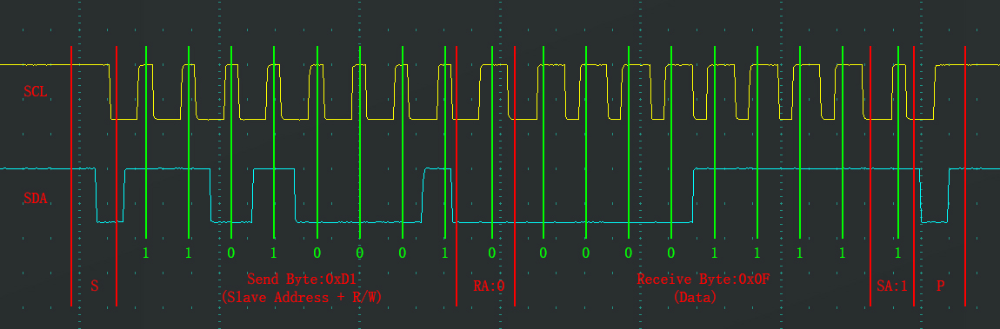

> **图 10-8 I2C当前地址读时序**

**指定地址读**：对于指定设备（Slave Address），在指定地址（Reg Address）下，读取从机数据（Data）。

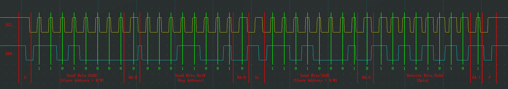

> **图 10-9 I2C指定地址读时序**

## 10.5 MPU6050 姿态传感器

**MPU6050** 是一个 6 轴姿态传感器，可以测量芯片自身 X、Y、Z 轴的加速度、角速度参数，通过数据融合，可进一步得到姿态角，常应用于平衡车、飞行器等需要检测自身姿态的场景。

- 3 轴加速度计（Accelerometer）：测量 X、Y、Z 轴的加速度；
- 3 轴陀螺仪传感器（Gyroscope）：测量 X、Y、Z 轴的角速度。

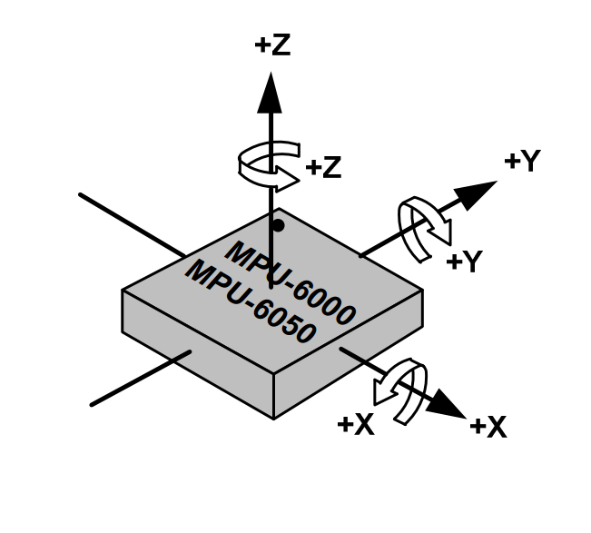

> **图 10-10 MPU6050模块实物**

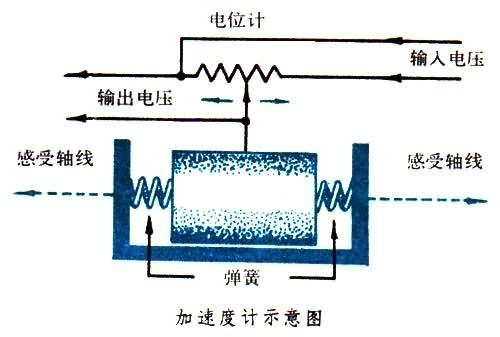

> **图 10-11 加速度计原理示意图**

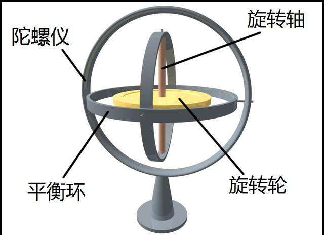

> **图 10-12 陀螺仪原理示意图**

MPU6050 主要参数：

- 16 位 ADC 采集传感器的模拟信号，量化范围：-32768 ~ 32767；
- 加速度计满量程选择：±2、±4、±8、±16（g）；
- 陀螺仪满量程选择：±250、±500、±1000、±2000（°/sec）；
- 可配置的数字低通滤波器、时钟源、采样分频；
- I2C 从机地址：1101000（AD0=0）/ 1101001（AD0=1）。

## 10.6 MPU6050 硬件电路与框图

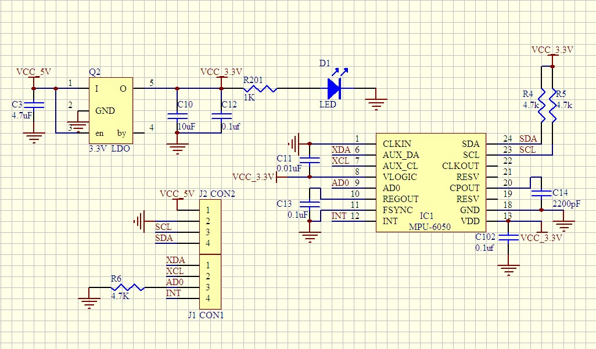

> **图 10-13 MPU6050模块电路**

MPU6050 引脚功能：

| 引脚 | 功能 |
| --- | --- |
| VCC、GND | 电源 |
| SCL、SDA | I2C 通信引脚 |
| XCL、XDA | 主机 I2C 通信引脚 |
| AD0 | 从机地址最低位 |
| INT | 中断信号输出 |

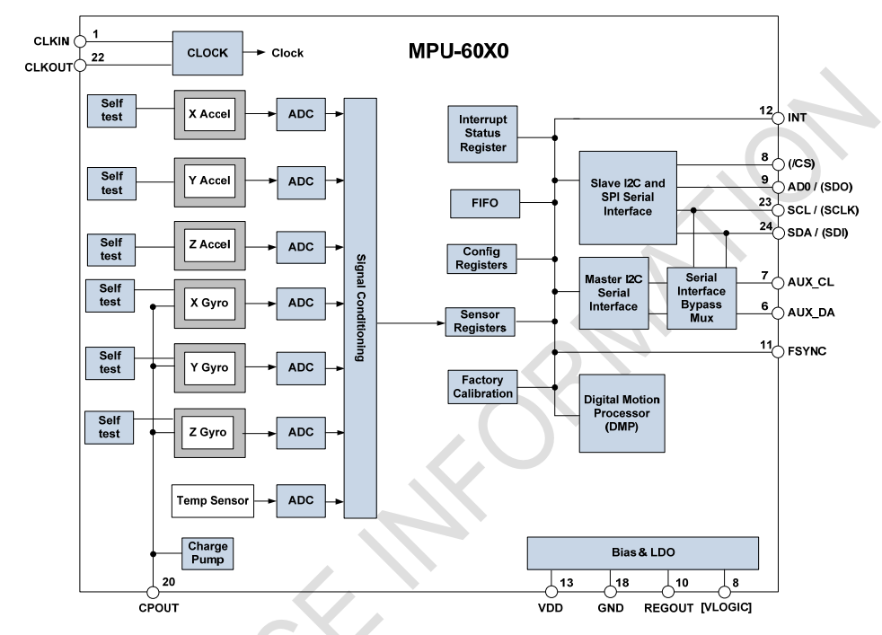

> **图 10-14 MPU6050框图**

## 10.7 I2C 外设与框图

STM32 内部集成了硬件 I2C 收发电路，可以由硬件自动执行时钟生成、起始终止条件生成、应答位收发、数据收发等功能，减轻 CPU 的负担。支持多主机模型；支持 7 位 / 10 位地址模式；支持不同的通讯速度（标准速度高达 100 kHz，快速高达 400 kHz）；支持 DMA；兼容 SMBus 协议。

STM32F103C8T6 的硬件 I2C 资源：I2C1、I2C2。

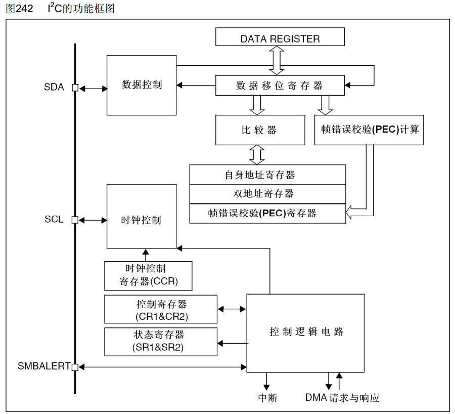

> **图 10-15 I2C框图**

I2C 的基本结构：时钟控制器与数据控制器围绕数据寄存器 DR、移位寄存器展开，经 GPIO（SCL、SDA）输出，由开关控制使能。

## 10.8 I2C 主机收发时序

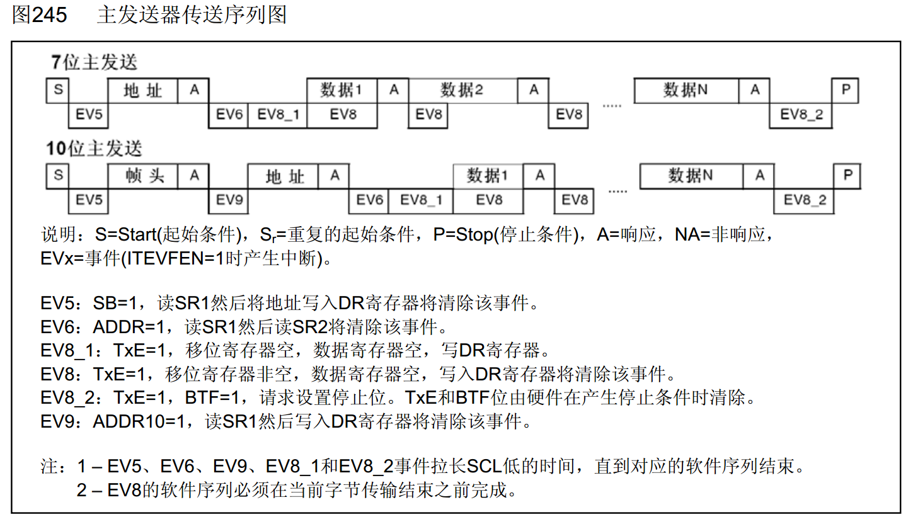

> **图 10-16 I2C主机发送时序**

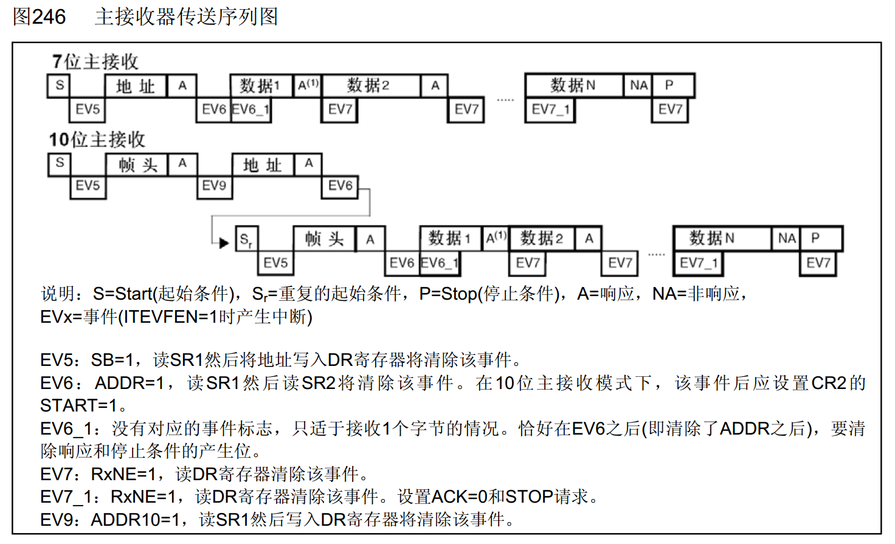

> **图 10-17 I2C主机接收时序**

## 10.9 软件 / 硬件波形对比

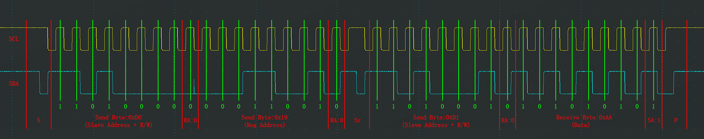

> **图 10-18 I2C软件硬件波形对比**

# 第11章 SPI 通信与 W25Q64

## 11.1 SPI 通信

**SPI**（Serial Peripheral Interface）是由 Motorola 公司开发的一种通用数据总线。四根通信线：SCK（Serial Clock）、MOSI（Master Output Slave Input）、MISO（Master Input Slave Output）、SS（Slave Select）。同步，全双工；支持总线挂载多设备（一主多从）。

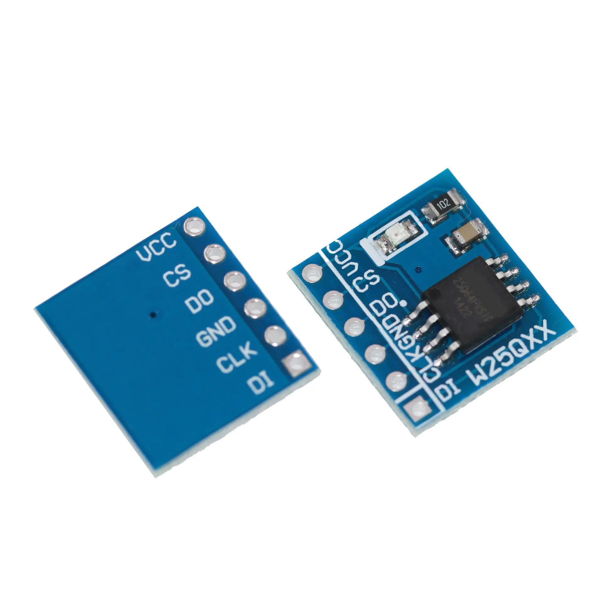

> **图 11-1 W25Q64模块**

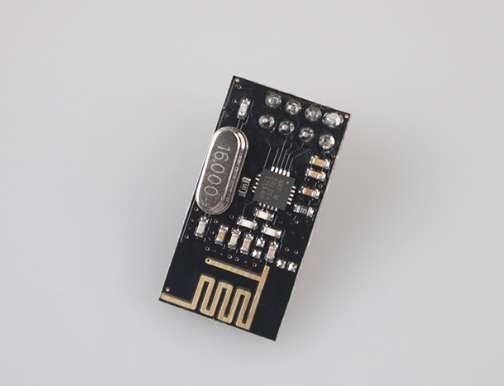

> **图 11-2 无线通信模块**

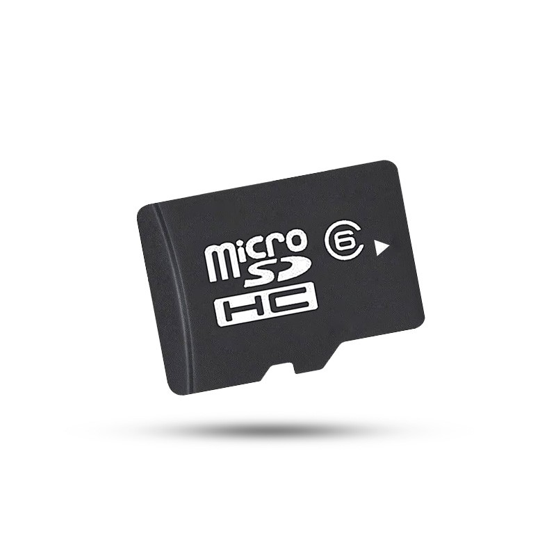

> **图 11-3 TF卡**

下图为 OLED 模块的 SPI 接口（已在第 4 章介绍）。


> **图 11-4 OLED模块SPI接口**

## 11.2 SPI 硬件电路

所有 SPI 设备的 SCK、MOSI、MISO 分别连在一起；主机另外引出多条 SS 控制线，分别接到各从机的 SS 引脚；输出引脚配置为推挽输出，输入引脚配置为浮空或上拉输入。

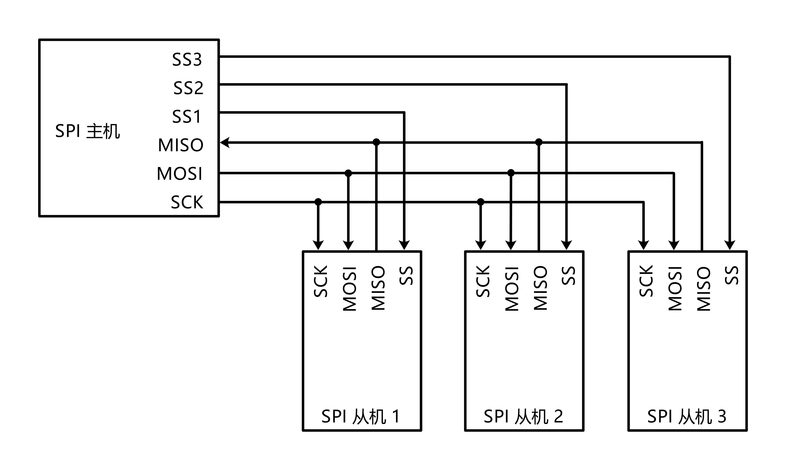

> **图 11-5 SPI多从机连接图**

## 11.3 SPI 移位与基本时序

SPI 的数据收发基于移位寄存器：主机与从机各有一个移位寄存器，在 SCK 驱动下逐位交换数据。下图给出 SPI 移位示意图，以及移位过程的四步动画帧（原稿中 image139~image142，已归档至 `STM32入门教程.assets/动画素材备份/`，此处按自然顺序展示，便于理解逐位移位过程）。

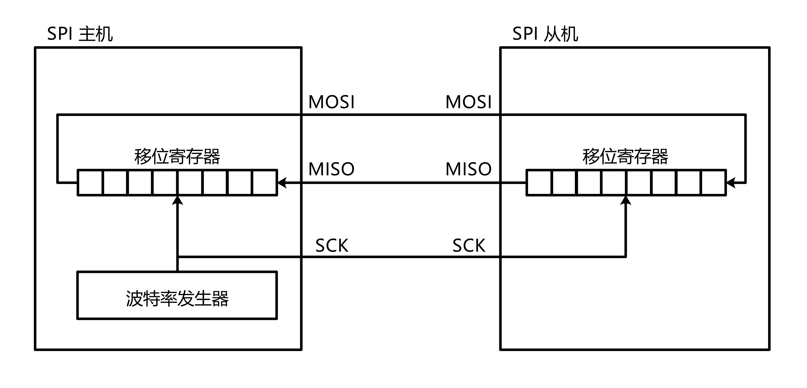

> **图 11-6 SPI移位示意图**


> **图 11-7 SPI移位过程一**


> **图 11-8 SPI移位过程二**


> **图 11-9 SPI移位过程三**


> **图 11-10 SPI移位过程四**

**起始条件**：SS 从高电平切换到低电平。

**终止条件**：SS 从低电平切换到高电平。

**交换一个字节（模式 0）**：CPOL=0，空闲状态时 SCK 为低电平；CPHA=0，SCK 第一个边沿移入数据，第二个边沿移出数据。

**交换一个字节（模式 1）**：CPOL=0，空闲状态时 SCK 为低电平；CPHA=1，SCK 第一个边沿移出数据，第二个边沿移入数据。

**交换一个字节（模式 2）**：CPOL=1，空闲状态时 SCK 为高电平；CPHA=0，SCK 第一个边沿移入数据，第二个边沿移出数据。

**交换一个字节（模式 3）**：CPOL=1，空闲状态时 SCK 为高电平；CPHA=1，SCK 第一个边沿移出数据，第二个边沿移入数据。

## 11.4 SPI 时序

**发送指令**：向 SS 指定的设备，发送指令（0x06）。

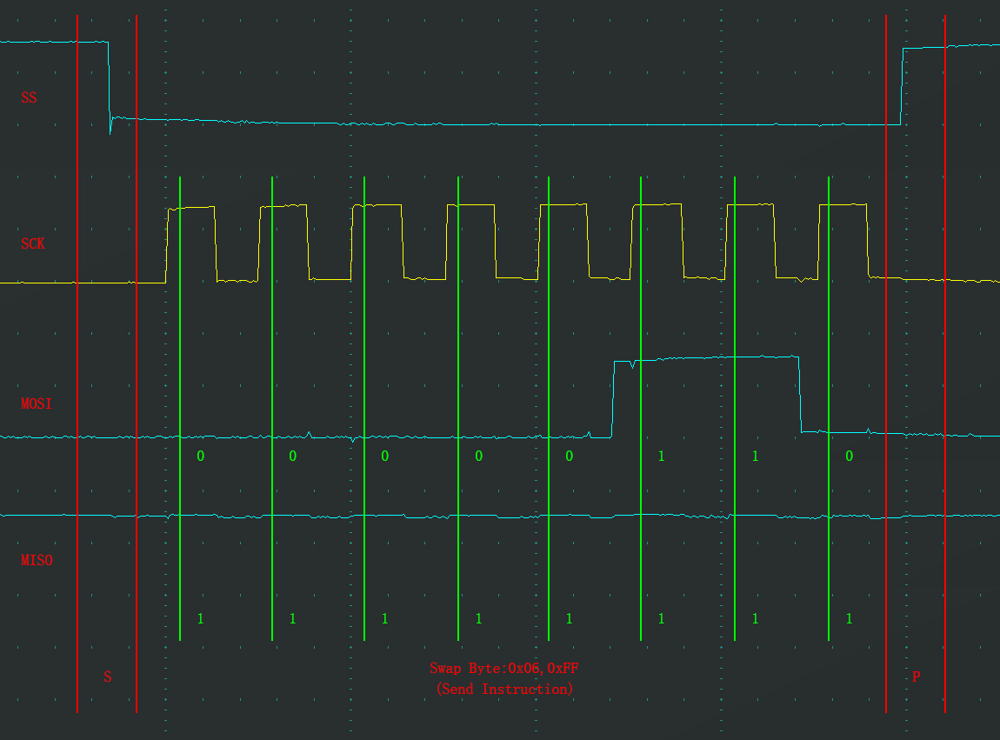

> **图 11-11 SPI发送指令时序**

**指定地址写**：向 SS 指定的设备，发送写指令（0x02），随后在指定地址（Address[23:0]）下，写入指定数据（Data）。

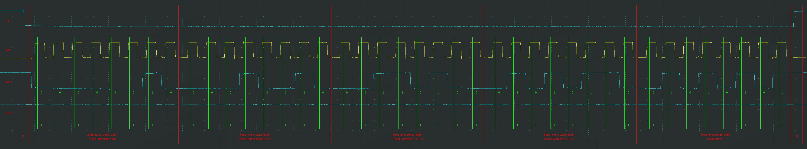

> **图 11-12 SPI指定地址写时序**

**指定地址读**：向 SS 指定的设备，发送读指令（0x03），随后在指定地址（Address[23:0]）下，读取从机数据（Data）。

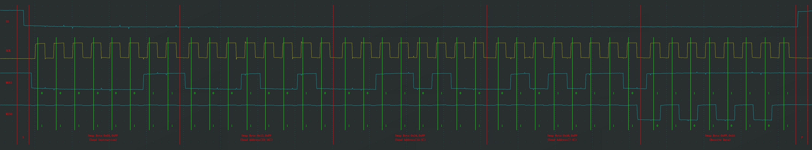

> **图 11-13 SPI指定地址读时序**

## 11.5 W25Q64 存储器

**W25Qxx** 系列是一种低成本、小型化、使用简单的非易失性存储器，常应用于数据存储、字库存储、固件程序存储等场景。

- 存储介质：Nor Flash（闪存）；
- 时钟频率：80 MHz / 160 MHz（Dual SPI）/ 320 MHz（Quad SPI）；
- 存储容量（24 位地址）：W25Q40 为 4 Mbit / 512 KByte，W25Q80 为 8 Mbit / 1 MByte，W25Q16 为 16 Mbit / 2 MByte，W25Q32 为 32 Mbit / 4 MByte，W25Q64 为 64 Mbit / 8 MByte，W25Q128 为 128 Mbit / 16 MByte，W25Q256 为 256 Mbit / 32 MByte。

## 11.6 W25Q64 硬件电路与框图

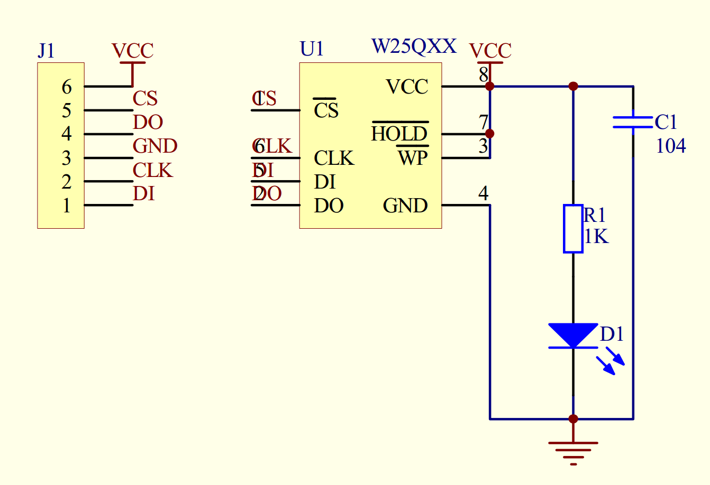

> **图 11-14 W25Q64硬件电路**

W25Q64 引脚功能：

| 引脚 | 功能 |
| --- | --- |
| VCC、GND | 电源（2.7~3.6 V） |
| CS（SS） | SPI 片选 |
| CLK（SCK） | SPI 时钟 |
| DI（MOSI） | SPI 主机输出从机输入 |
| DO（MISO） | SPI 主机输入从机输出 |
| WP | 写保护 |
| HOLD | 数据保持 |

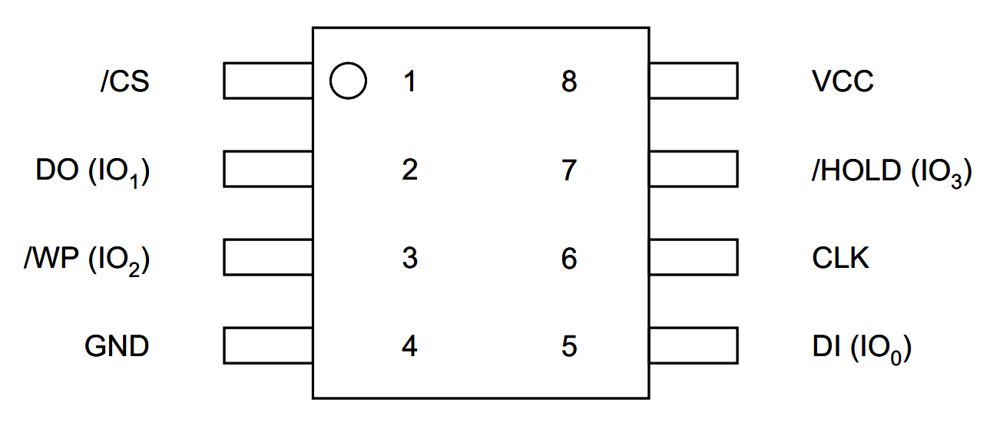

> **图 11-15 W25Q64引脚图**

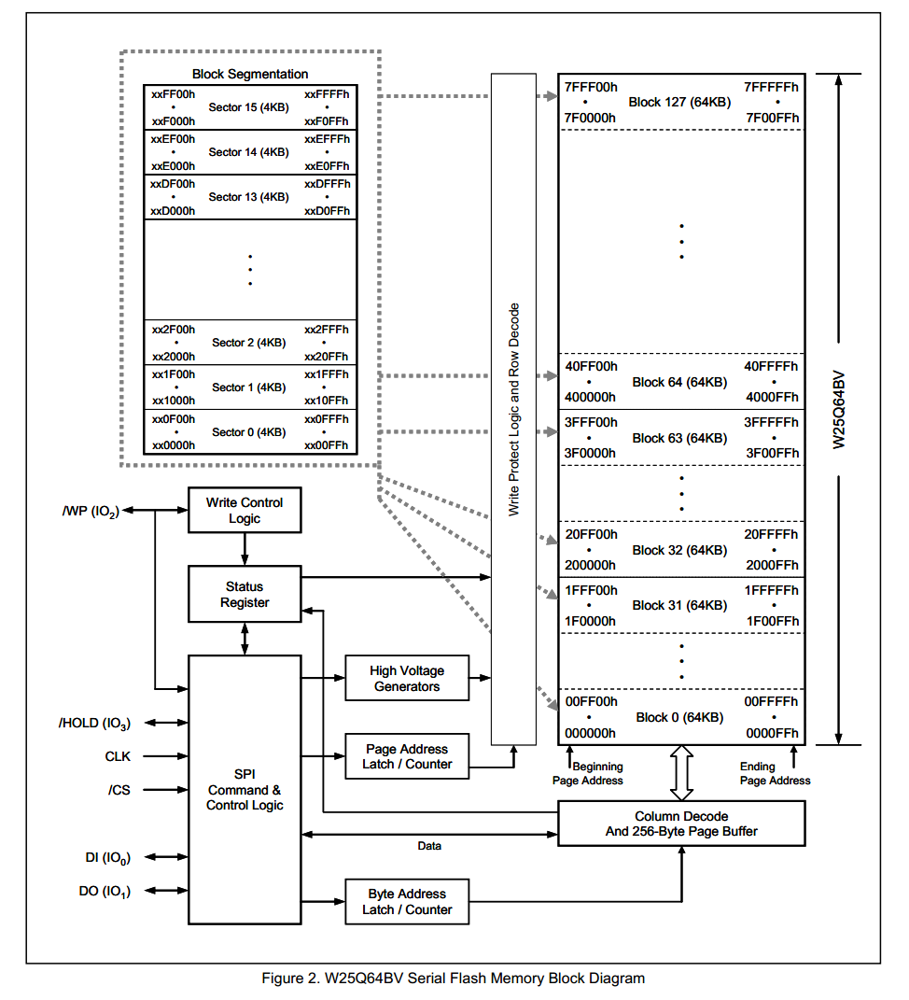

> **图 11-16 W25Q64框图**

## 11.7 Flash 操作注意事项

**写入操作时**：

1. 写入操作前，必须先进行写使能；
2. 每个数据位只能由 1 改写为 0，不能由 0 改写为 1；
3. 写入数据前必须先擦除，擦除后所有数据位变为 1；
4. 擦除必须按最小擦除单元进行；
5. 连续写入多字节时，最多写入一页的数据，超过页尾位置的数据会回到页首覆盖写入；
6. 写入操作结束后，芯片进入忙状态，不响应新的读写操作。

**读取操作时**：直接调用读取时序，无需使能，无需额外操作，没有页的限制；读取操作结束后不会进入忙状态，但不能在忙状态时读取。

## 11.8 SPI 外设与框图

STM32 内部集成了硬件 SPI 收发电路，可以由硬件自动执行时钟生成、数据收发等功能，减轻 CPU 的负担。可配置 8 位 / 16 位数据帧、高位先行 / 低位先行；时钟频率：`fPCLK / (2, 4, 8, 16, 32, 64, 128, 256)`；支持多主机模型、主或从操作；可精简为半双工 / 单工通信；支持 DMA；兼容 I2S 协议。

STM32F103C8T6 的硬件 SPI 资源：SPI1、SPI2。

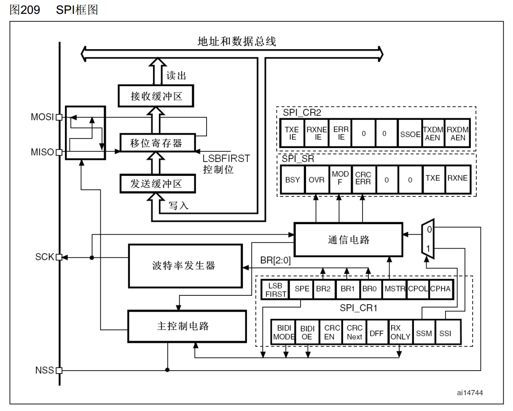

> **图 11-17 SPI框图**

SPI 的基本结构：波特率发生器、数据控制器、发送数据寄存器 TDR、移位寄存器、接收数据寄存器 RDR，经 GPIO（SCK、MOSI、MISO）收发，由开关控制使能。

## 11.9 SPI 主模式传输

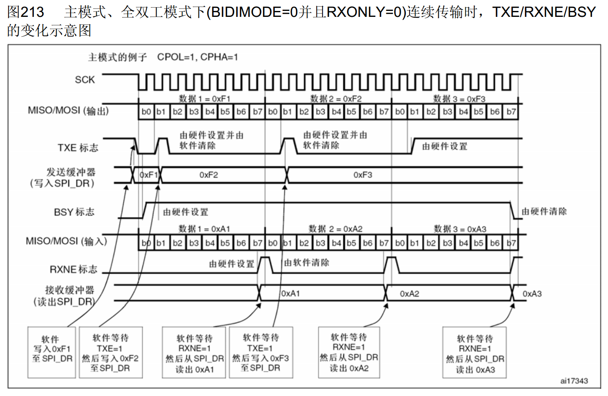

> **图 11-18 SPI主模式全双工连续传输**

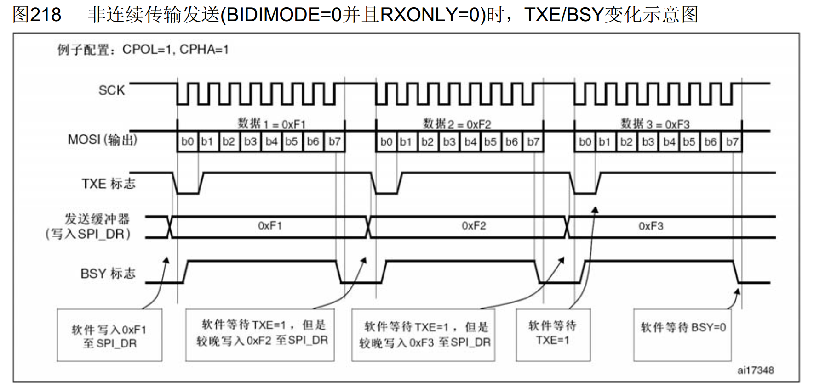

> **图 11-19 SPI非连续传输**

## 11.10 软件 / 硬件波形对比

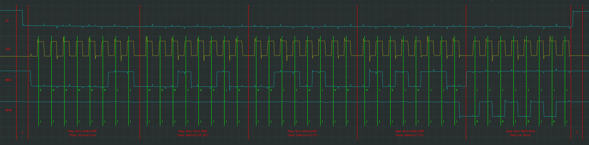

> **图 11-20 SPI软件硬件波形对比**

# 第12章 时间戳、BKP 与 RTC

## 12.1 Unix 时间戳

**Unix 时间戳**（Unix Timestamp）定义为从 UTC / GMT 的 1970 年 1 月 1 日 0 时 0 分 0 秒开始所经过的秒数，不考虑闰秒。时间戳存储在一个秒计数器中，秒计数器为 32 位 / 64 位的整型变量。世界上所有时区的秒计数器相同，不同时区通过添加偏移来得到当地时间。

## 12.2 UTC / GMT

**GMT**（Greenwich Mean Time，格林尼治标准时间）是一种以地球自转为基础的时间计量系统，将地球自转一周的时间间隔等分为 24 小时，以此确定计时标准。

**UTC**（Universal Time Coordinated，协调世界时）是一种以原子钟为基础的时间计量系统，规定铯 133 原子基态的两个超精细能级间在零磁场下跃迁辐射 9,192,631,770 周所持续的时间为 1 秒；当原子钟计时一天的时间与地球自转一周的时间相差超过 0.9 秒时，UTC 会执行闰秒来保证其计时与地球自转的协调一致。

## 12.3 时间戳转换

C 语言的 `time.h` 模块提供了时间获取和时间戳转换的相关函数，可以方便地进行秒计数器、日期时间和字符串之间的转换。

| 函数 | 作用 |
| --- | --- |
| `time_t time(time_t*);` | 获取系统时钟 |
| `struct tm* gmtime(const time_t*);` | 秒计数器转换为日期时间（格林尼治时间） |
| `struct tm* localtime(const time_t*);` | 秒计数器转换为日期时间（当地时间） |
| `time_t mktime(struct tm*);` | 日期时间转换为秒计数器（当地时间） |
| `char* ctime(const time_t*);` | 秒计数器转换为字符串（默认格式） |
| `char* asctime(const struct tm*);` | 日期时间转换为字符串（默认格式） |
| `size_t strftime(char*, size_t, const char*, const struct tm*);` | 日期时间转换为字符串（自定义格式） |

## 12.4 BKP 备份寄存器

**BKP**（Backup Registers，备份寄存器）可用于存储用户应用程序数据。当 VDD（2.0~3.6 V）电源被切断，它们仍然由 VBAT（1.8~3.6 V）维持供电；当系统在待机模式下被唤醒，或系统复位或电源复位时，它们也不会被复位。

- TAMPER 引脚产生的侵入事件将所有备份寄存器内容清除；
- RTC 引脚输出 RTC 校准时钟、RTC 闹钟脉冲或者秒脉冲；
- 存储 RTC 时钟校准寄存器；
- 用户数据存储容量：20 字节（中容量和小容量）/ 84 字节（大容量和互联型）。

BKP 的基本结构：数据寄存器（DR1~DR10 等）、控制寄存器、状态寄存器、RTC 时钟校准寄存器，由 VBAT 电池供电，并可与 RTC 时钟输出相连。

## 12.5 RTC 实时时钟

**RTC**（Real Time Clock，实时时钟）是一个独立的定时器，可为系统提供时钟和日历的功能。RTC 和时钟配置系统处于后备区域，系统复位时数据不清零，VDD（2.0~3.6 V）断电后可借助 VBAT（1.8~3.6 V）供电继续走时。

- 32 位的可编程计数器，可对应 Unix 时间戳的秒计数器；
- 20 位的可编程预分频器，可适配不同频率的输入时钟；
- 可选择三种 RTC 时钟源：HSE 时钟除以 128（通常为 8 MHz / 128）、LSE 振荡器时钟（通常为 32.768 KHz）、LSI 振荡器时钟（40 KHz）。

## 12.6 RTC 框图与基本结构

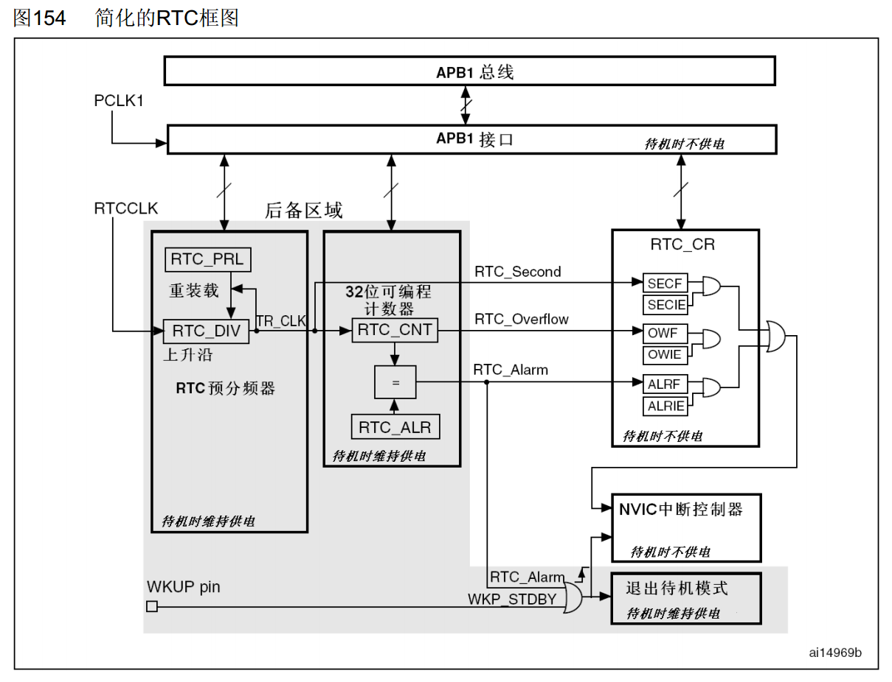

> **图 12-1 RTC框图**

RTC 的基本结构：32 位计数器 CNT、32 位闹钟值 ALR、重装寄存器 PRL、余数寄存器 DIV 组成计时核心；时钟源可选 HSE/128、LSE、LSI，经 RTCCLK 后由预分频器、计数器工作，产生 Second / Alarm / Overflow 中断输出至 NVIC。

## 12.7 RTC 硬件电路

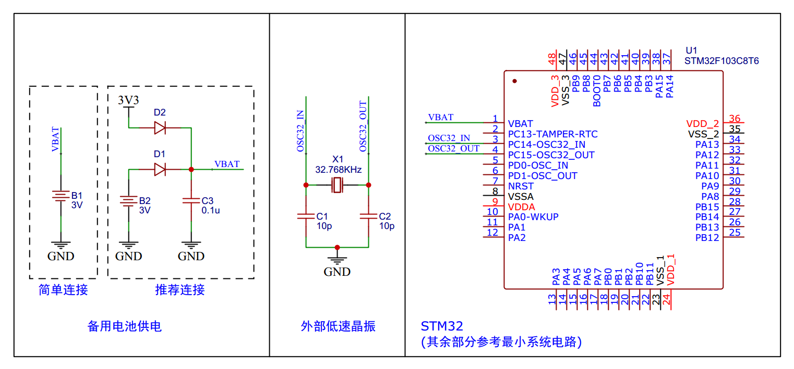

> **图 12-2 RTC外围电路一**

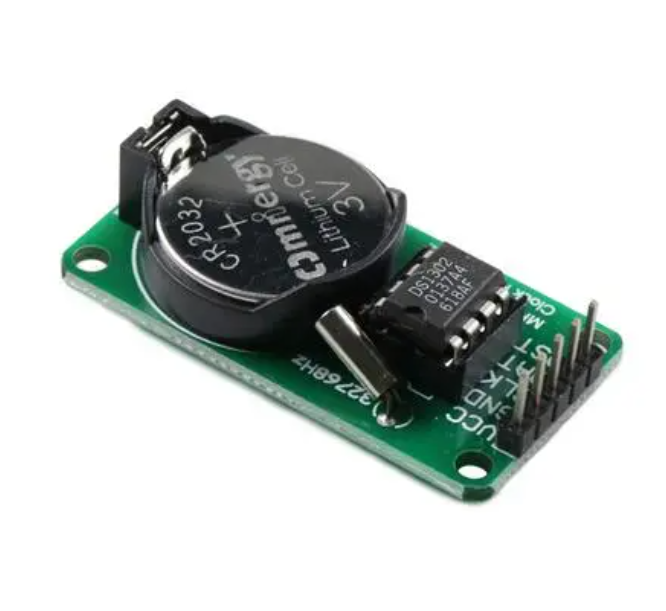

> **图 12-3 RTC外围电路二**

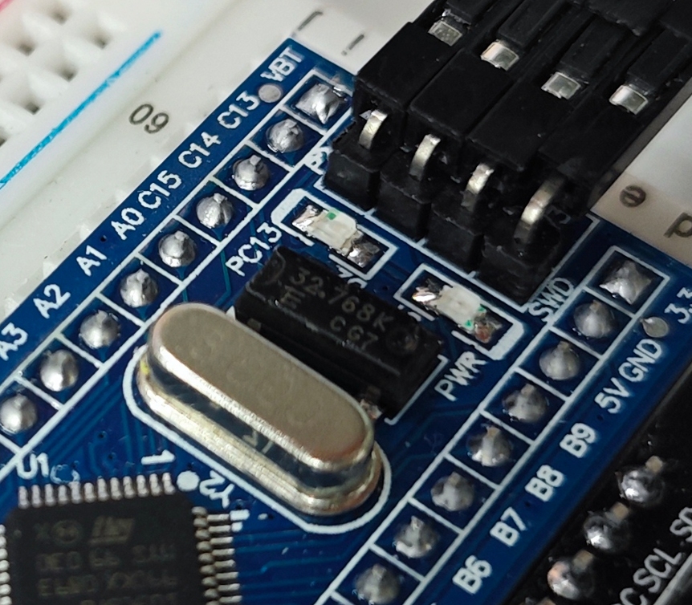

> **图 12-4 RTC外围电路三**

## 12.8 RTC 操作注意事项

执行以下操作将使能对 BKP 和 RTC 的访问：

1. 设置 `RCC_APB1ENR` 的 PWREN 和 BKPEN，使能 PWR 和 BKP 时钟；
2. 设置 `PWR_CR` 的 DBP，使能对 BKP 和 RTC 的访问。

若在读取 RTC 寄存器时，RTC 的 APB1 接口曾经处于禁止状态，则软件首先必须等待 `RTC_CRL` 寄存器中的 RSF 位（寄存器同步标志）被硬件置 1。

必须设置 `RTC_CRL` 寄存器中的 CNF 位，使 RTC 进入配置模式后，才能写入 `RTC_PRL`、`RTC_CNT`、`RTC_ALR` 寄存器。

对 RTC 任何寄存器的写操作，都必须在前一次写操作结束后进行。可以通过查询 `RTC_CR` 寄存器中的 RTOFF 状态位，判断 RTC 寄存器是否处于更新中；仅当 RTOFF 状态位是 1 时，才可以写入 RTC 寄存器。

# 第13章 PWR 电源控制与看门狗 WDG

## 13.1 PWR 电源控制

**PWR**（Power Control，电源控制）负责管理 STM32 内部的电源供电部分，可以实现可编程电压监测器和低功耗模式的功能。

- **可编程电压监测器（PVD）**：可以监控 VDD 电源电压，当 VDD 下降到 PVD 阀值以下或上升到 PVD 阀值之上时，PVD 会触发中断，用于执行紧急关闭任务；
- **低功耗模式**：包括睡眠模式（Sleep）、停机模式（Stop）和待机模式（Standby），可在系统空闲时降低 STM32 的功耗，延长设备使用时间。

## 13.2 电源框图

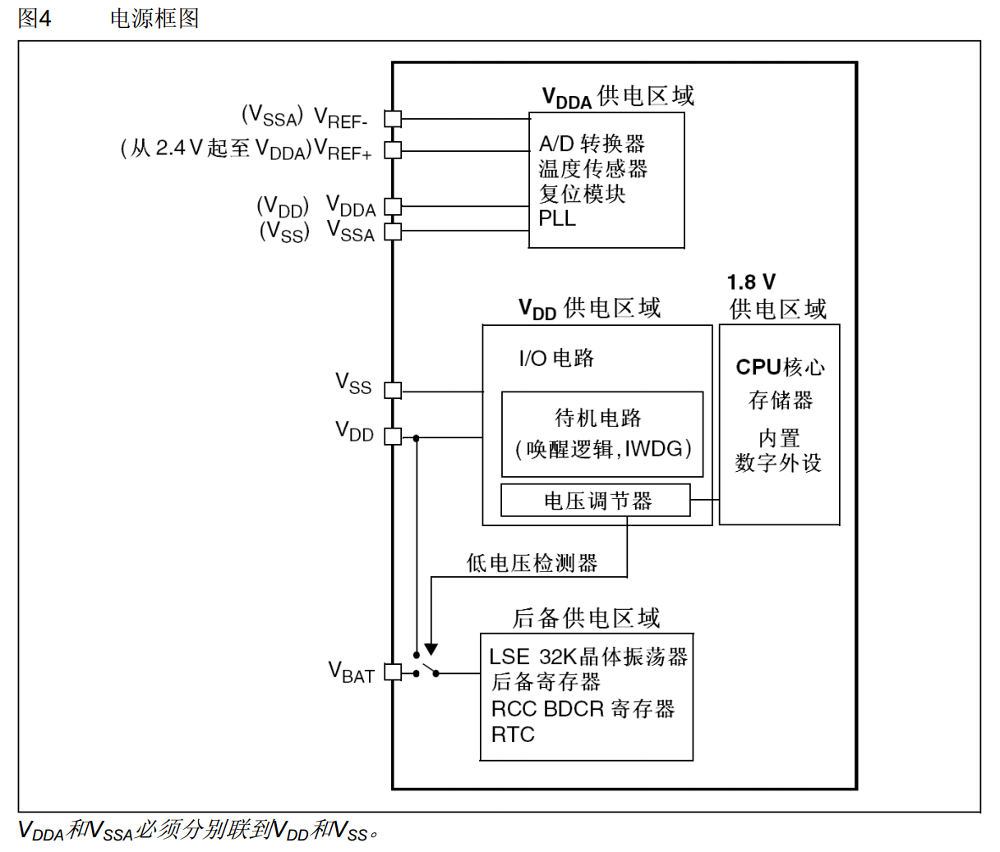

> **图 13-1 电源框图**

## 13.3 上电 / 掉电复位

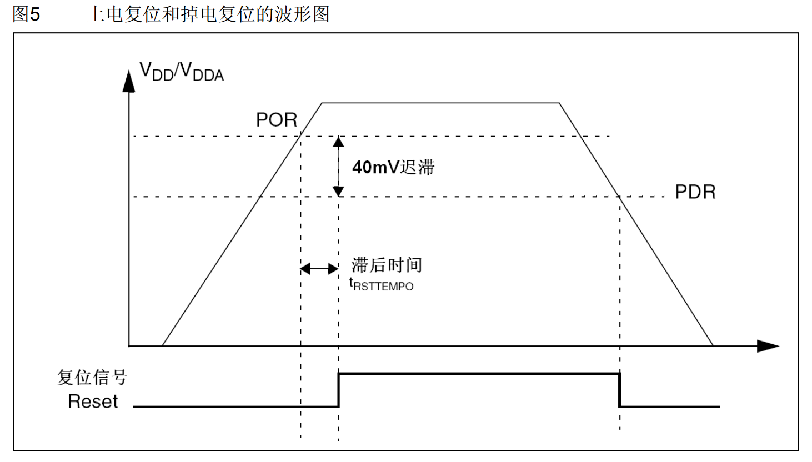

> **图 13-2 上电复位和掉电复位**

## 13.4 可编程电压监测器

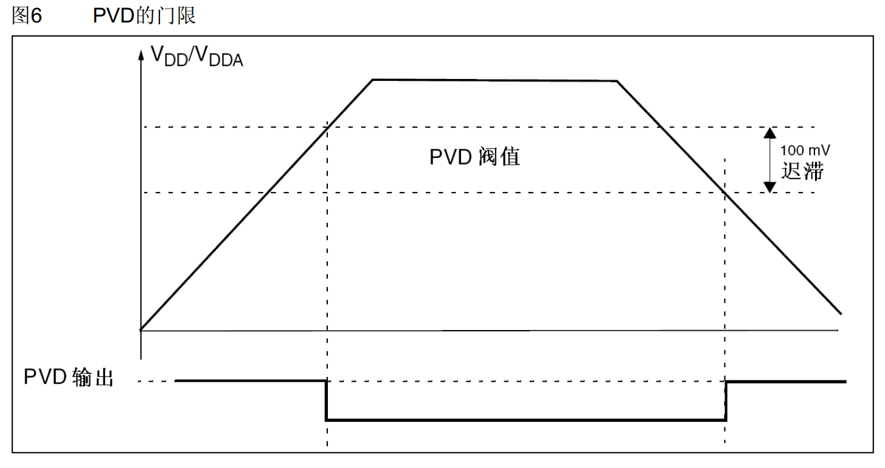

> **图 13-3 可编程电压监测器**

## 13.5 低功耗模式

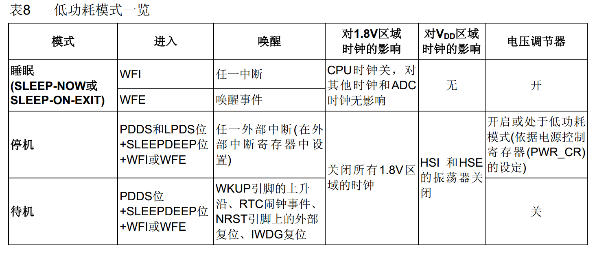

> **图 13-4 低功耗模式**

## 13.6 模式选择

执行 **WFI**（Wait For Interrupt）或者 **WFE**（Wait For Event）指令后，STM32 进入低功耗模式。

模式选择逻辑（由 SLEEPDEEP、SLEEPONEXIT、PDDS、LPDS 等位决定）：

- 睡眠模式（立刻睡眠 / 等待中断退出）：SLEEPDEEP=0；
- 停机 / 待机（深度睡眠）：SLEEPDEEP=1；
- 停机模式（电压调节器开启 / 低功耗）：PDDS=0，LPDS=0 / 1；
- 待机模式：PDDS=1。

## 13.7 WDG 看门狗

**WDG**（Watchdog，看门狗）可以监控程序的运行状态，当程序因为设计漏洞、硬件故障、电磁干扰等原因出现卡死或跑飞现象时，看门狗能及时复位程序，避免程序陷入长时间的罢工状态，保证系统的可靠性和安全性。

看门狗本质上是一个定时器，当指定时间范围内程序没有执行喂狗（重置计数器）操作时，看门狗硬件电路就自动产生复位信号。STM32 内置两个看门狗：

- **独立看门狗（IWDG）**：独立工作，对时间精度要求较低；
- **窗口看门狗（WWDG）**：要求看门狗在精确计时窗口起作用。

## 13.8 IWDG 独立看门狗

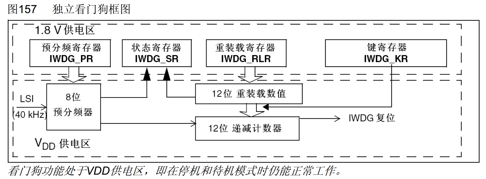

> **图 13-5 IWDG框图**

**键寄存器**本质上是控制寄存器，用于控制硬件电路的工作。在可能存在干扰的情况下，一般通过在整个键寄存器写入特定值来代替控制寄存器写入一位的功能，以降低硬件电路受到干扰的概率。

| 写入键寄存器的值 | 作用 |
| --- | --- |
| 0xCCCC | 启用独立看门狗 |
| 0xAAAA | IWDG_RLR 中的值重新加载到计数器（喂狗） |
| 0x5555 | 解除 IWDG_PR 和 IWDG_RLR 的写保护 |
| 0x5555 之外的其他值 | 启用 IWDG_PR 和 IWDG_RLR 的写保护 |

**超时时间**：`TIWDG = TLSI × PR 预分频系数 × (RL + 1)`，其中 `TLSI = 1 / FLSI`。

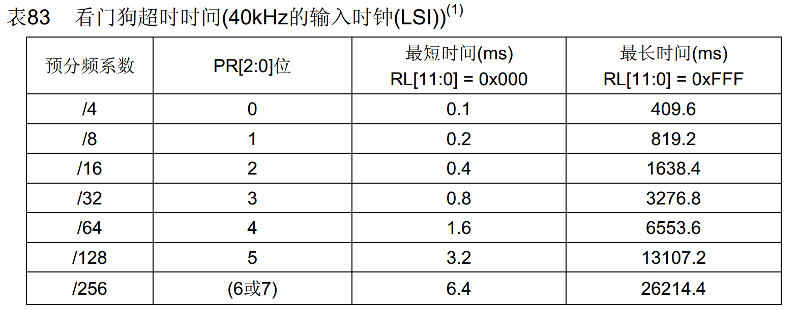

> **图 13-6 IWDG超时时间**

## 13.9 WWDG 窗口看门狗

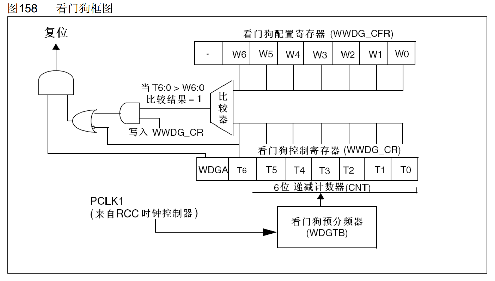

> **图 13-7 WWDG框图**

WWDG 工作特性：

- 递减计数器 T[6:0] 的值小于 0x40 时，WWDG 产生复位；
- 递减计数器 T[6:0] 在窗口 W[6:0] 外被重新装载时，WWDG 产生复位；
- 递减计数器 T[6:0] 等于 0x40 时可以产生早期唤醒中断（EWI），用于重装载计数器以避免 WWDG 复位；
- 定期写入 `WWDG_CR` 寄存器（喂狗）以避免 WWDG 复位。

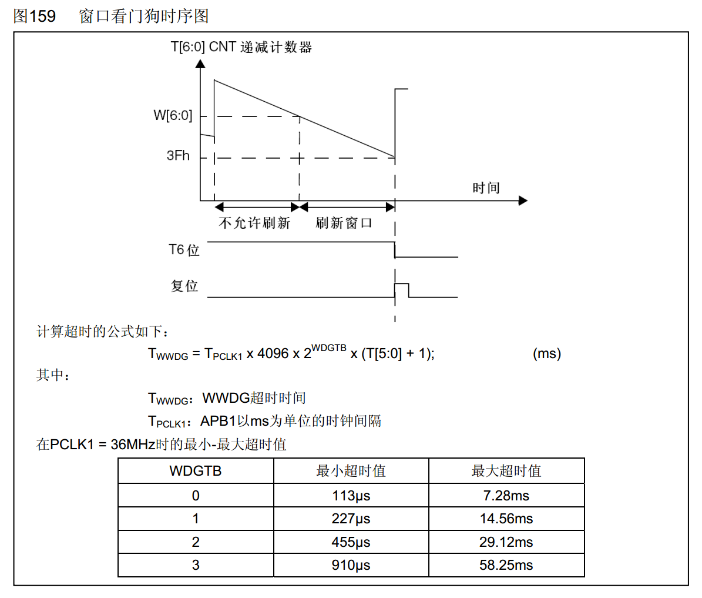

> **图 13-8 WWDG工作特性**

WWDG 超时时间：

- `TWWDG = TPCLK1 × 4096 × WDGTB 预分频系数 × (T[5:0] + 1)`；
- `TWIN = TPCLK1 × 4096 × WDGTB 预分频系数 × (T[5:0] - W[5:0])`；
- 其中 `TPCLK1 = 1 / FPCLK1`。

## 13.10 IWDG 与 WWDG 对比

|  | IWDG 独立看门狗 | WWDG 窗口看门狗 |
| --- | --- | --- |
| 复位 | 计数器减到 0 后 | 计数器 T[5:0] 减到 0 后、过早重装计数器 |
| 中断 | 无 | 早期唤醒中断 |
| 时钟源 | LSI（40 KHz） | PCLK1（36 MHz） |
| 预分频系数 | 4、8、32、64、128、256 | 1、2、4、8 |
| 计数器 | 12 位 | 6 位（有效计数） |
| 超时时间 | 0.1 ms ~ 26214.4 ms | 113 us ~ 58.25 ms |
| 喂狗方式 | 写入键寄存器，重装固定值 RLR | 直接写入计数器，写多少重装多少 |
| 防误操作 | 键寄存器和写保护 | 无 |
| 用途 | 独立工作，对时间精度要求较低 | 要求看门狗在精确计时窗口起作用 |

# 第14章 FLASH 闪存编程

## 14.1 FLASH 简介

STM32F1 系列的 FLASH 包含程序存储器、系统存储器和选项字节三个部分，通过闪存存储器接口（外设）可以对程序存储器和选项字节进行擦除和编程。

读写 FLASH 的用途：

- 利用程序存储器的剩余空间来保存掉电不丢失的用户数据；
- 通过在程序中编程（IAP），实现程序的自我更新。

在线编程（In-Circuit Programming – ICP）用于更新程序存储器的全部内容，它通过 JTAG、SWD 协议或系统加载程序（Bootloader）下载程序；在程序中编程（In-Application Programming – IAP）可以使用微控制器支持的任一种通信接口下载程序。

## 14.2 闪存模块组织

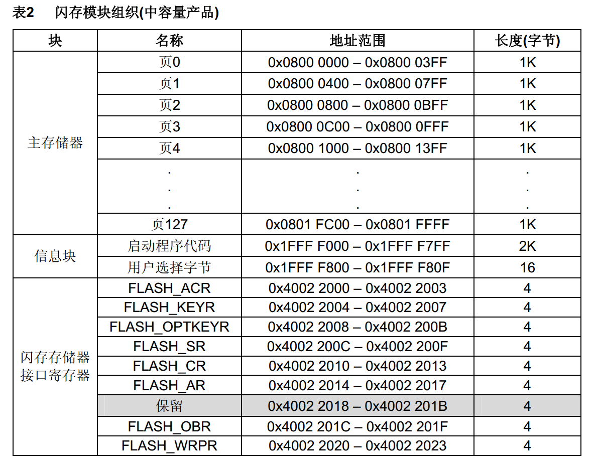

> **图 14-1 闪存模块组织**

## 14.3 FLASH 基本结构

STM32F103C8T6（64 K Flash）的程序存储器按页组织，每页 1 K（共 64 页，地址从 0x0800 0000 到 0x0800 FC00）；系统存储器（Bootloader，2 K）位于 0x1FFF F000，选项字节（16）位于 0x1FFF F800。闪存存储器接口（FPEC）负责程序存储器的擦除和编程、选项字节的擦除和编程，并配置读写保护。

## 14.4 FLASH 解锁

FPEC 共有三个键值：

- RDPRT 键 = 0x000000A5；
- KEY1 = 0x45670123；
- KEY2 = 0xCDEF89AB。

**解锁**：复位后，FPEC 被保护，不能写入 `FLASH_CR`；在 `FLASH_KEYR` 先写入 KEY1，再写入 KEY2，即可解锁；错误的操作序列会在下次复位前锁死 FPEC 和 `FLASH_CR`。

**加锁**：设置 `FLASH_CR` 中的 LOCK 位锁住 FPEC 和 `FLASH_CR`。

## 14.5 使用指针访问存储器

使用指针读指定地址下的存储器：

```c
uint16_t Data = *((__IO uint16_t *)(0x08000000));
```
使用指针写指定地址下的存储器：

```c
*((__IO uint16_t *)(0x08000000)) = 0x1234;
```
其中：`#define __IO volatile`。

## 14.6 程序存储器编程与擦除

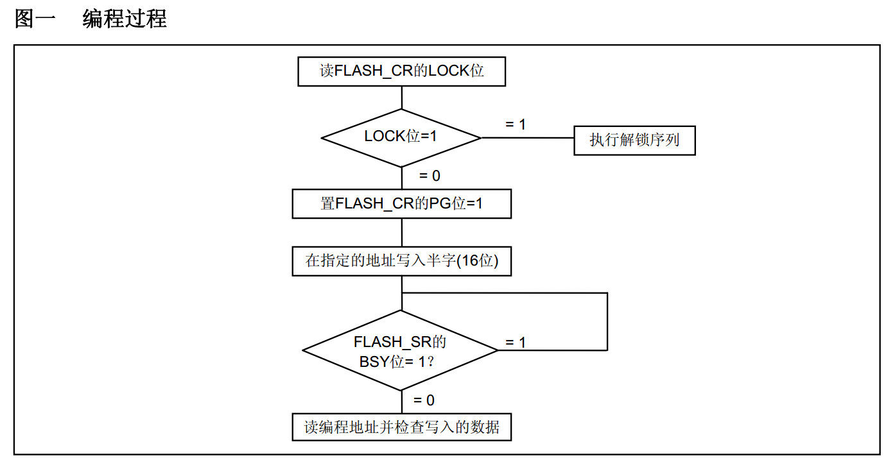

> **图 14-2 程序存储器编程**

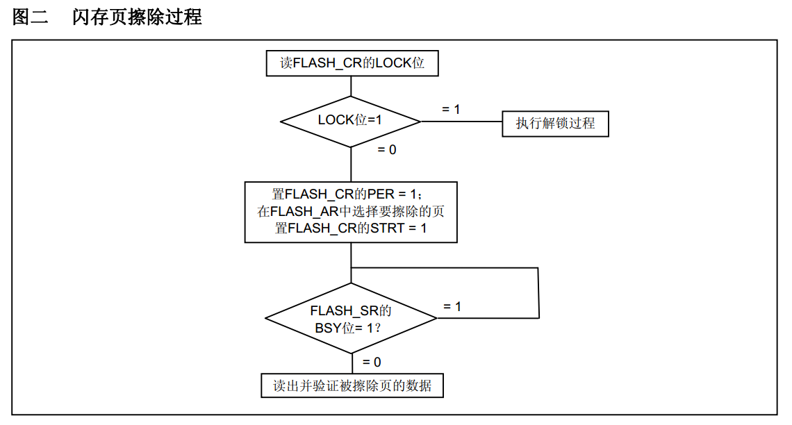

> **图 14-3 程序存储器页擦除**

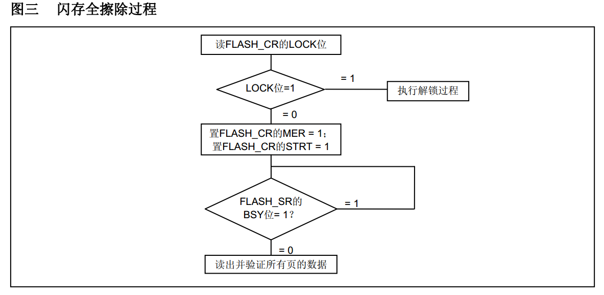

> **图 14-4 程序存储器全擦除**

## 14.7 选项字节

- **RDP**：写入 RDPRT 键（0x000000A5）后解除读保护；
- **USER**：配置硬件看门狗和进入停机 / 待机模式是否产生复位；
- **Data0 / 1**：用户可自定义使用；
- **WRP0 / 1 / 2 / 3**：配置写保护，每一个位对应保护 4 个存储页（中容量）。

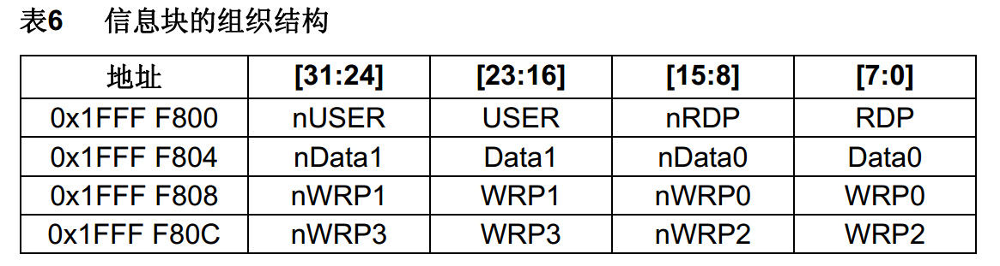

> **图 14-5 选项字节**

## 14.8 选项字节编程与擦除

**选项字节编程**：

1. 检查 `FLASH_SR` 的 BSY 位，以确认没有其他正在进行的编程操作；
2. 解锁 `FLASH_CR` 的 OPTWRE 位；
3. 设置 `FLASH_CR` 的 OPTPG 位为 1；
4. 写入要编程的半字到指定的地址；
5. 等待 BSY 位变为 0；
6. 读出写入的地址并验证数据。

**选项字节擦除**：

1. 检查 `FLASH_SR` 的 BSY 位，以确认没有其他正在进行的闪存操作；
2. 解锁 `FLASH_CR` 的 OPTWRE 位；
3. 设置 `FLASH_CR` 的 OPTER 位为 1；
4. 设置 `FLASH_CR` 的 STRT 位为 1；
5. 等待 BSY 位变为 0；
6. 读出被擦除的选择字节并做验证。

## 14.9 器件电子签名

电子签名存放在闪存存储器模块的系统存储区域，包含的芯片识别信息在出厂时编写，不可更改，使用指针读指定地址下的存储器可获取电子签名。

- 闪存容量寄存器：基地址 0x1FFF F7E0，大小 16 位；
- 产品唯一身份标识寄存器：基地址 0x1FFF F7E8，大小 96 位。


---

## 附录：图片资源处理说明

1. 原稿中的 169 张图片已按“首次出现顺序”统一重命名为 `NNN_短标签.ext`（三位数字编号，因图片总数超过 99 张，采用三位以满足编号连续且不重复）；
2. 两张 `.emf` 矢量图（原 image100、image101，串口数据帧时序）已转换为 `.png` 并保留，原 `.emf` 已删除；
3. SPI 移位过程的四步动画帧（原 image139~image142）作为 PPT 动画道具，已归档至 `STM32入门教程.assets/动画素材备份/`，并在正文第 11.3 节按自然顺序（图 11-7 ~ 图 11-10）展示移位过程的四步细节；
4. 其余图片均按章节引用，且 assets 目录按文件名排序的顺序与正文首次出现顺序一致。

