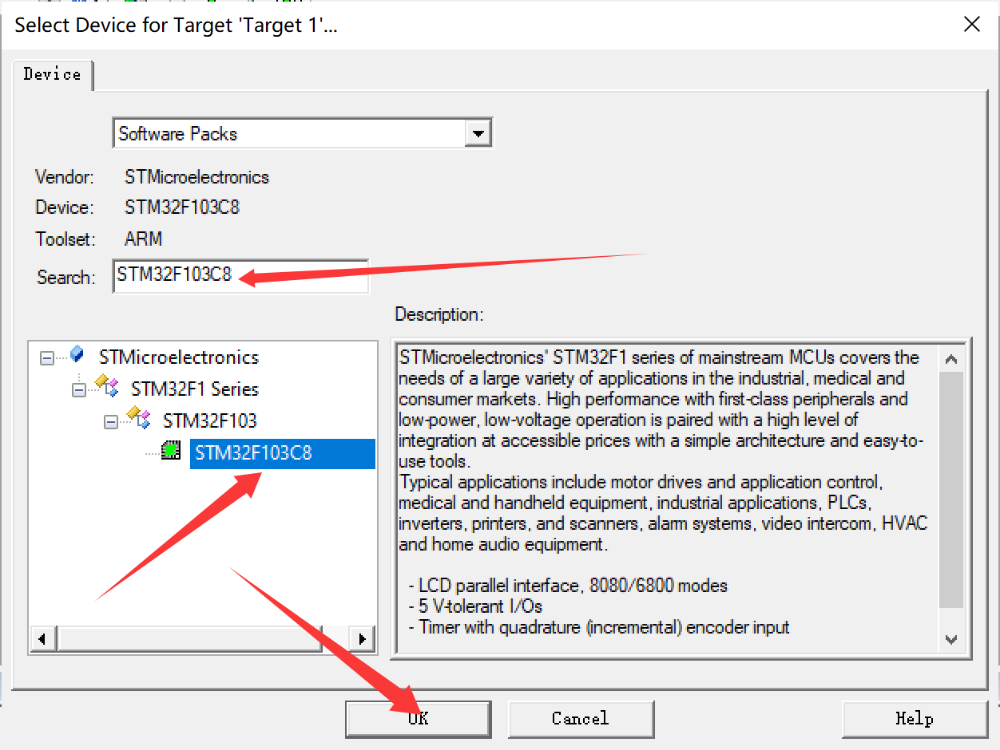
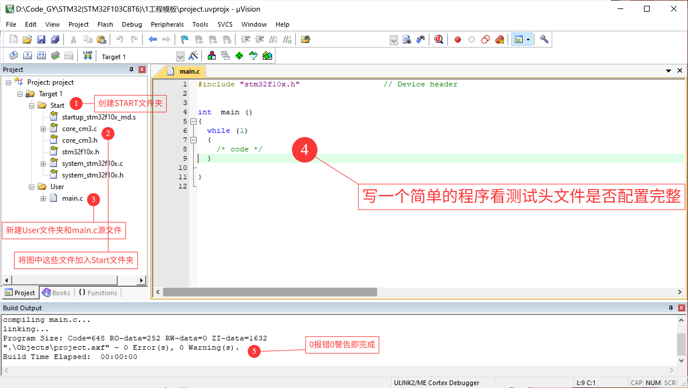
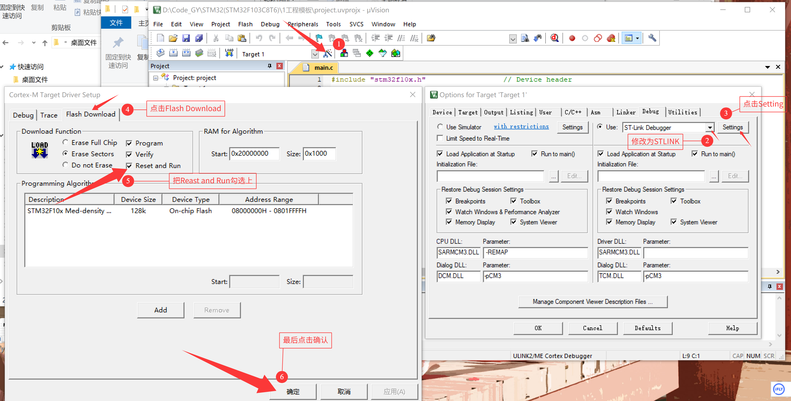
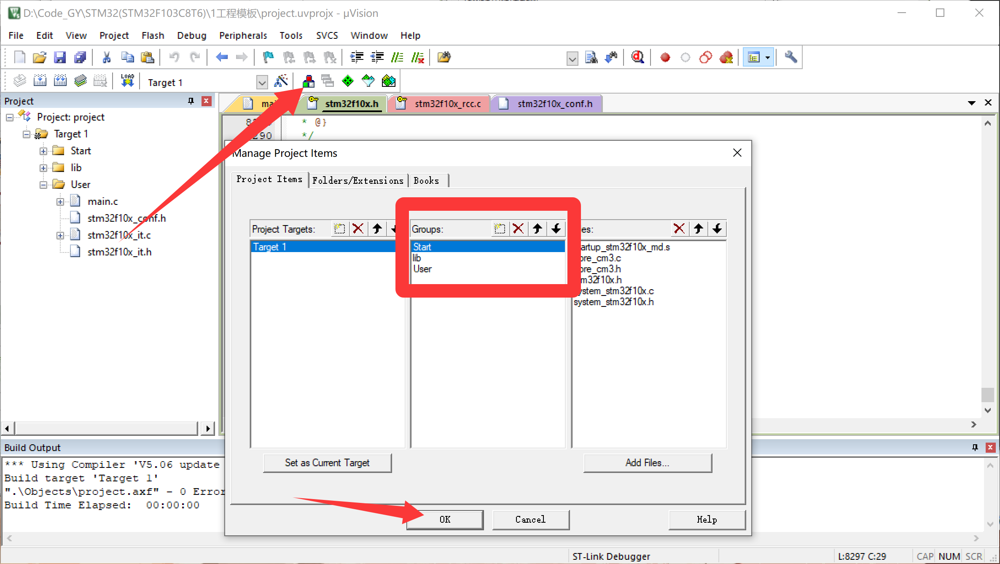
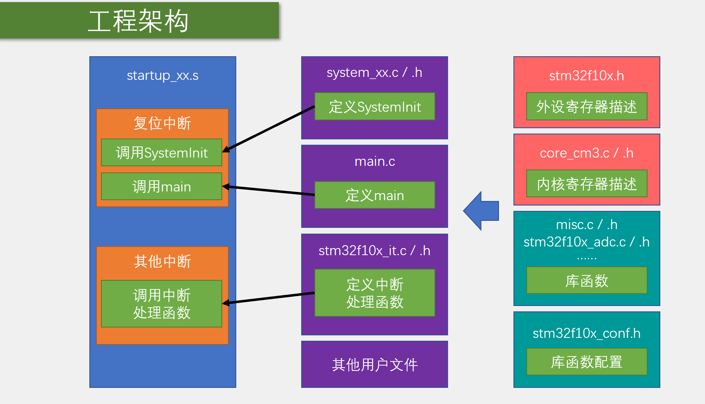

# 创建工程

> 本篇目标：从零搭出一个**可反复复用的 Keil 工程模板**。模板搭好、点灯验证通过后，之后每个实验只需复制 `01工程模板/` 目录、改名、换 `main.c`，不必再走一遍全部流程（复制模板的步骤见文末第 7 节）。
>
> 全文两条线：先搭**寄存器版**模板并点灯（第 1~4 节），再升级成**库函数版**模板并点灯（第 5 节），最终以库函数版作为后续实验的模板。动手时跟着各节截图走即可。

## 0. 新建工程步骤总览

| 步骤 | 做什么 | 对应章节 |
|------|--------|----------|
| 1 | Keil 新建工程，选型号 STM32F103C8 | §1 |
| 2 | 建 `Start` 文件夹，复制启动/内核/设备文件 | §2 |
| 3 | 工程里建同名分组，把文件加入分组，编译验证 0 错误 0 警告 | §3 |
| 4 | 接 ST-LINK，配置调试器与 Flash Download | §4.1、§4.2 |
| 5 | 寄存器方式点灯，验证下载与运行 | §4.3 |
| 6 | 复制 lib / User 库文件，Define 加 `USE_STDPERIPH_DRIVER` | §5.2、§5.3 |
| 7 | 库函数方式点灯，验证模板最终形态 | §5.4 |

## 1. 打开 Keil5，先创建一个工程



> 图 01：`Select Device for Target 'Target 1'` 对话框。在 Search 框直接敲 `STM32F103C8` 定位，左侧树按 STMicroelectronics → STM32F1 Series → STM32F103 → STM32F103C8 选中后点 OK。右侧 Description 是厂商给的器件摘要（STM32F1 系列定位、LCD 并行接口、5V 容忍 I/O、正交编码输入等）。
>
> 若下拉列表里搜不到 `STM32F103C8`，说明器件支持包（DFP）没装好，先回《00stm32介绍和环境配置》把 `Keil.STM32F1xx.pack` 装上再来。

## 2. 复制库文件

在工程目录创建 `Start` 文件夹，将以下路径的库文件复制进去：

- **启动文件**：`STM32入门教程资料\固件库\STM32F10x_StdPeriph_Lib_V3.5.0\Libraries\CMSIS\CM3\DeviceSupport\ST\STM32F10x\startup\arm` 路径下的全部文件（8 个 `.s`）
- **设备文件**：`...\CMSIS\CM3\DeviceSupport\ST\STM32F10x` 路径下的寄存器描述文件 `stm32f10x.h`、两个配置时钟文件 `system_stm32f10x.c` 和 `system_stm32f10x.h`
- **内核文件**：`...\CMSIS\CM3\CoreSupport` 路径下的内核寄存器描述文件 `core_cm3.c` 和 `core_cm3.h`

这几个文件各管一段，初学先混个脸熟：

| 文件 | 作用 |
|------|------|
| `startup_stm32f10x_md.s` | 启动文件。`md` = Medium Density 中密度（C8T6 属于这类）。复位后最先运行的代码：初始化堆栈、放中断向量表，最后调用 `SystemInit` 和 `main`。其余 7 个 `.s` 是其他容量/型号用的，本工程只用 md 这一个，但按课件要求全部复制 |
| `stm32f10x.h` | 设备头文件。所有外设寄存器的地址定义都在这里，我们写的 `RCC->APB2ENR` 就出自它 |
| `system_stm32f10x.c/.h` | 系统时钟初始化（`SystemInit`），上电把主频配到 72 MHz |
| `core_cm3.c/.h` | Cortex-M3 **内核**外设（SysTick、NVIC 等）的寄存器描述 |

## 3. 配置工程分组并验证编译

文件复制好了，还要在工程里建立同名**分组**并把文件加进去。注意：**分组**是 µVision 侧栏里的逻辑结构，**文件夹**是磁盘上的物理结构，两者同名只是为了对照方便。

1. `Project → Manage Project Items`（工具栏三色块图标）新建分组 `Start`、`User`
2. 选中 `Start` 组 → `Add Files...`，把 `Start` 文件夹里的启动文件、内核文件、设备文件全部加入；`User` 组先只放新建的 `main.c`
3. 编译（F7），Build Output 显示 0 Error 0 Warning 即模板骨架成立



> 图 02：模板工程搭好后的 µVision 界面，红色标号 1~5 即五步操作。左侧 `Target 1` 下 `Start` 组收了 `startup_stm32f10x_md.s`、`core_cm3.c/.h`、`stm32f10x.h`、`system_stm32f10x.c/.h`，`User` 组只有 `main.c`；中间 `main.c` 仍是空 `while(1)`——这一步只验证头文件与启动文件能编过，还没写 GPIO 代码。底部 Build Output：`Program Size: Code=648 RO-data=252 RW-data=0 ZI-data=1632`，`0 Error(s), 0 Warning(s)`。
>
> 注：截图标题栏里的工程路径是改名前的 `1工程模板`。

最后第五步 0 报错 0 警告，即寄存器开发 STM32 工程模板建立完成。

## 4. 寄存器点灯测试

从本节开始写第一批功能代码。验证目标贯穿整个学习过程：**控制开发板上 PC13 引脚连接的 LED**。

### 4.1 用 ST-LINK 连接调试

按图 03、图 04 把 ST-LINK 和最小系统板的排针对应连接。


> 图 03：SWD 四线接法示意——只接 `GND`、`SWCLK`、`SWDIO`、`3.3V` 四根，不接 5.0V。左侧给出不同批次的引脚别名对照（同一行即同一引脚）：`3.3V = 3.3 = 3V3`、`SWCLK = DCLK`、`SWDIO = DIO = SWIO`、`GND = G`。中间 ST-LINK 双排针按壳上标号 1~10 排列。图上三条注意分别是：最小系统板丝印缩写会因批次不同；ST-LINK 引脚排序也要以壳上标号为准、不能按位置猜；两排针脚定义并不相同，要接**远离缺口**的那一排。

实际连接如下：


> 图 04：实物连接。C8T6 最小系统板横插在面包板上，左端是 micro-USB 口、绿色 BOOT 跳线帽和 RESET 轻触键，中间 LQFP48 主控与 `8.000` 晶振，右端丝印 `PC13` 旁就是板载 LED；排针插在靠 `VB` 一侧，用杜邦线连到紫色外壳的 ST-LINK V2（USB 端用手捏着）。
>
> 两个和示意图不同的地方值得注意：这块 ST-LINK V2 壳上标号是左列 `RST/SWIM/GND/3.3V/5.0V`、右列 `SWCLK/SWDIO/GND/3.3V/5.0V`，与图 03 的左右列顺序不一样；实物线是灰/紫/黑/白四色，也对不上示意图的红黄绿蓝。所以**认标号，不认位置和颜色**。

### 4.2 配置为 ST-LINK 调试，并设置为下载后立即复位运行



> 图 05：左右两张截图，红色标号 1~6 是操作顺序。①点工具栏魔法棒打开 `Options for Target`；②`Debug` 页把 `Use` 从 `ULINK2/ME Cortex Debugger` 改成 `ST-Link Debugger`；③点 `Settings`；④在弹出的 `Cortex-M Target Driver Setup` 里切到 `Flash Download` 页；⑤勾选 `Reset and Run`（`Program`、`Verify` 保持勾选）；⑥确定。下方 `Programming Algorithm` 显示 `STM32F10x Med-density` / `On-chip Flash` / `08000000H - 0801FFFFH`，即中密度器件的片内 Flash 算法，C8T6 属于这一档。勾了 `Reset and Run` 之后，下载完自动复位运行，不用再手动按板子上的 RESET。

### 4.3 测试代码及现象

`main.c`：

```
#include "stm32f10x.h"

int  main ()
{
	RCC->APB2ENR = 0x00000010; // 使能 GPIOC 时钟
	GPIOC->CRH = 0x00300000; // 配置 PC13 为推挽输出模式
	//GPIOC->ODR |= 0x00002000; // 配置 PC13 高电平，熄灭 LED
	GPIOC->ODR |= 0x00000000; // 配置 PC13 高电平，熄灭 LED


	// 主循环
	while (1)
	{
		/* code */
	}

}
//注意！最后一行为空，否则会出现报错

```

直接写寄存器初看像天书，逐行拆开其实就三件事：

- `RCC->APB2ENR = 0x00000010;` — APB2 外设时钟使能寄存器的 **bit4（IOPCEN）置 1**，打开 GPIOC 的时钟。STM32 上电默认关着外设时钟以省电，**不开时钟，之后对 GPIOC 的任何操作都无效**——这是新手最常踩的坑。
- `GPIOC->CRH = 0x00300000;` — CRH 管高 8 位引脚（PIN8~15），每 4 位管一个脚。PC13 占第 20~23 位，`0011` 即 CNF=00（推挽输出）、MODE=11（50MHz）。
- `GPIOC->ODR |= ...` — ODR 的 **bit13 对应 PC13**。板载 LED 接在 PC13 与 VDD 之间，所以 **PC13 输出低电平点亮、高电平熄灭**：写 `0x00002000`（bit13=1）灭，写 `0x00000000` 亮。

#### 现象描述

- 下载程序到开发板并运行后，PC13 引脚连接的 LED 将以大约 1 秒为周期闪烁（亮 0.5 秒、灭 0.5 秒）。
- 若使用静态测试代码：
  - 点亮：LED 常亮。
  - 熄灭：LED 常灭。
- 若无反应，请检查：
  - ST-LINK 连接是否正确（SWDIO、SWCLK、GND、3.3V）。
  - 开发板电源是否正常。
  - 是否选择了正确的调试器并下载到芯片。

> 注意区分：上面贴出的代码只对 ODR 做了一次静态赋值，对应"常亮 / 常灭"两种现象；要看到"1 秒周期闪烁"，得把翻转代码放进 `while(1)` 循环里周期执行（库函数版的循环写法见 §5.4，寄存器版等价做法是周期性取反 ODR 的 bit13）。

## 5. 配置库函数点灯测试

### 5.1 为什么要配置库函数？跟寄存器的区别是什么？

当前工程模板采用的是**寄存器直接编程**方式（基于 CMSIS 核心和设备头文件，直接操作寄存器地址）。虽然可以完成所有功能，但实际项目中更常用**标准外设库（STM32F10x_StdPeriph_Lib）**，即"库函数"方式。

#### 5.1.1 寄存器方式与标准外设库（StdPeriph）的主要区别

| 项目               | 寄存器方式                                      | 标准外设库方式（StdPeriph）                          |
|--------------------|-------------------------------------------------|-----------------------------------------------------|
| 操作方式           | 直接读写寄存器地址和位字段（如 `RCC->APB2ENR |= (1 << 4)`） | 调用封装好的API函数（如 `RCC_APB2PeriphClockCmd(RCC_APB2Periph_GPIOC, ENABLE)`） |
| 代码可读性         | 较差，需要熟悉每个寄存器的位定义和手册描述      | 优秀，函数名和参数明确表达功能意图                  |
| 开发效率           | 较低，每次配置都需要手动计算和设置位字段        | 较高，初始化使用结构体，代码量少且标准化            |
| 出错概率           | 较高，位操作容易出现偏移或掩码错误              | 较低，库函数已内部处理复杂的位操作和时序逻辑        |
| 代码体积与执行效率 | 体积小、执行效率高（无函数调用开销）            | 体积稍大、效率略低（存在函数调用和参数检查开销）    |
| 移植性             | 较差，不同MCU系列寄存器地址和位定义差异大       | 较好，同一系列（如F1）基本兼容，接口统一            |
| 适用场景           | 学习底层原理、极致优化、资源极度受限的场合      | 大多数实际项目开发、快速原型、团队协作               |

#### 5.1.2 为什么要配置和使用库函数？

1. **大幅提高开发效率**：初学者无需深入记忆数百个寄存器的位定义，库函数提供了标准化接口。
2. **代码更易维护和阅读**：团队协作时，GPIO_Init()比一长串位操作更直观。
3. **减少低级错误**：库内部已正确处理位域、时钟树等复杂逻辑。
4. **官方推荐路径**：ST官方早期推荐StdPeriph库，后续逐步过渡到HAL库。寄存器方式更适合学习底层原理或极致优化场景。

### 5.2 复制库函数

首先在项目根目录创建一个 `lib` 和 `User` 文件夹：

- 将 `STM32入门教程资料\固件库\STM32F10x_StdPeriph_Lib_V3.5.0\Libraries\STM32F10x_StdPeriph_Driver\src` 路径下的 23 个**源**文件复制到刚刚创建的 `lib` 文件夹
- 将 `STM32入门教程资料\固件库\STM32F10x_StdPeriph_Lib_V3.5.0\Libraries\STM32F10x_StdPeriph_Driver\inc` 路径下的 23 个**头**文件复制到刚刚创建的 `lib` 文件夹
- 将 `STM32入门教程资料\固件库\STM32F10x_StdPeriph_Lib_V3.5.0\Project\STM32F10x_StdPeriph_Template` 路径下的 `stm32f10x_conf.h`、`stm32f10x_it.c`、`stm32f10x_it.h` 三个文件复制到 `User` 文件夹

三个新成员的分工：

| 文件 | 作用 |
|------|------|
| `lib/`（46 个文件） | 标准外设库本体：23 对 `.c/.h`，每个外设一对（GPIO、RCC、TIM……）。我们只管调用，不改动它们 |
| `stm32f10x_conf.h` | 库的"总开关"：里面的 `#include <stm32f10x_gpio.h>` 等默认全注释着/按需生效，决定哪些外设库参与编译 |
| `stm32f10x_it.c/.h` | 中断服务函数的集中放置处 |

### 5.3 宏定义

- 右键头文件 `stm32f10x.h` 打开文件，在第 `8296` 行复制字符串 `USE_STDPERIPH_DRIVER` 复制到如下图中的工程选项，使得外设库 `stm32f10x_conf.h` 文件生效！

  

  > 图 06：`Options for Target 'Target 1'` 的 `C/C++` 页。`Preprocessor Symbols → Define` 里填 `USE_STDPERIPH_DRIVER`——这个宏名从 `stm32f10x.h` 里复制，别手打；宏一开，`stm32f10x_conf.h` 中那批 `#include <stm32f10x_xxx.h>` 才会被编译进来。`Include Paths` 为 `.\Start;.\User;.\lib`，下方 Compiler control string 同步出现 `-I ./Start -I ./User -I ./lib`。左侧树此时已有 Start / lib / User 三组。状态栏 `L:8297 C:29` 表示光标正停在 `stm32f10x.h` 取宏名的位置。

- 然后调整组的位置即可完成库函数的配置

  

  > 图 07：`Project → Manage Project Items`。红框是 `Groups` 列表（Start / lib / User）和它的上移、下移按钮，右侧 `Files` 显示当前选中组（Start）里的文件。组顺序只影响侧栏阅读顺序，不影响编译结果。

### 5.4 测试代码及现象

```
#include "stm32f10x.h"                  // Device header

/**
 * @brief 主函数 - 初始化GPIO并控制LED闪烁
 *
 * 该函数初始化STM32的GPIOC端口，配置PC13引脚为推挽输出模式，
 * 用于控制连接到该引脚的LED灯。
 *
 * @return int 返回程序执行状态，正常情况下不会返回
 */
int  main ()
{
	// 使能GPIOC端口时钟
	RCC_APB2PeriphClockCmd(RCC_APB2Periph_GPIOC,ENABLE);

	// 配置GPIO初始化结构体
	GPIO_InitTypeDef GPIO_InitStructure;
	GPIO_InitStructure.GPIO_Pin = GPIO_Pin_13;
	GPIO_InitStructure.GPIO_Mode = GPIO_Mode_Out_PP;
	GPIO_InitStructure.GPIO_Speed = GPIO_Speed_50MHz;

	// 初始化GPIOC的第13号引脚
	GPIO_Init(GPIOC,&GPIO_InitStructure);

	// 设置PC13引脚为高电平（熄灭LED）
	//GPIO_SetBits(GPIOC,GPIO_Pin_13);

	// 设置PC13引脚为低电平（点亮LED）
	GPIO_ResetBits(GPIOC,GPIO_Pin_13);

	// 主循环
	while (1)
	{
		/* code */
	}

}

```

对照寄存器版看，三行"天书"换成了三步"人话"：

| 寄存器版 | 库函数版 |
|----------|----------|
| `RCC->APB2ENR = 0x00000010;` | `RCC_APB2PeriphClockCmd(RCC_APB2Periph_GPIOC, ENABLE);` |
| `GPIOC->CRH = 0x00300000;` | `GPIO_InitStructure` 结构体三个成员 + `GPIO_Init()` |
| `GPIOC->ODR \|= 0x00002000;` | `GPIO_SetBits()` / `GPIO_ResetBits()` |

#### 现象

交替注释/放开 `GPIO_SetBits(GPIOC,GPIO_Pin_13)` 与 `GPIO_ResetBits(GPIOC,GPIO_Pin_13)` 这两行（原笔记记为第 26/29 行），观察 STM32 的灯常亮和长灭状态。

## 6. 工程架构



> 图 08：模板工程的骨架关系。左列 `startup_xx.s` 是启动文件，里面分「复位中断」（调用 `SystemInit`、调用 `main`）和「其他中断」（调用中断处理函数）两块；中列是这些被调用者的**定义处**——`system_xx.c/.h` 定义 `SystemInit`、`main.c` 定义 `main`、`stm32f10x_it.c/.h` 定义中断服务函数，再加上其他用户文件；右列是库函数层（`misc.c`、`stm32f10x_adc.c` 等）及其依赖的 `stm32f10x.h`（外设寄存器描述）、`core_cm3.c/.h`（内核寄存器描述）和 `stm32f10x_conf.h`（库函数配置）。黑色箭头从"定义"指向"调用"，右侧蓝色箭头表示库函数建立在寄存器/内核描述之上。看懂这张图，就知道新增一个外设驱动该往哪一格放。

## 7. 模板最终目录结构与复用方法

模板搭完后的完整目录结构如下（`Objects/`、`Listings/` 等编译产物是编译时自动生成的，不入 git，可用 `批处理中间文件脚本/keilkill.bat` 一键清理）：

```text
01工程模板/
├── 01新建工程.md                ← 本篇笔记（图文记录）
├── 01新建工程.assets/           ← 笔记配图
├── project.uvprojx              ← Keil 工程文件（双击它打开工程）
├── project.uvoptx               ← Keil 调试/下载选项（Reset and Run 等存在这里）
├── Start/                       ← 启动与内核层（第 2 节复制进来）
│   ├── startup_stm32f10x_md.s   ←    启动文件：堆栈、中断向量表（md=中密度，C8T6 用这个）
│   ├── core_cm3.c / core_cm3.h  ←    Cortex-M3 内核寄存器描述
│   ├── stm32f10x.h              ←    外设寄存器定义（USE_STDPERIPH_DRIVER 在第 8296 行附近）
│   └── system_stm32f10x.c/.h    ←    SystemInit：上电时钟初始化
├── lib/                         ← 标准外设库（第 5.2 节复制进来，23 对 .c/.h）
│   ├── misc.c / misc.h          ←    NVIC 等辅助库
│   ├── stm32f10x_gpio.c/.h      ←    GPIO 外设库
│   └── stm32f10x_rcc.c/.h …     ←    其余外设库（RCC/USART/TIM/SPI……）
├── System/                      ← 自建工具层
│   └── Delay.c / Delay.h        ←    毫秒/微秒阻塞延时函数
├── User/                        ← 用户代码层（写代码只动这一层）
│   ├── main.c                   ←    程序入口
│   ├── stm32f10x_conf.h         ←    库总开关（选择参与编译的外设库）
│   └── stm32f10x_it.c/.h        ←    中断服务函数集中地
├── 批处理中间文件脚本/
│   └── keilkill.bat             ← 一键清理编译中间文件
├── .eide/ .vscode/ 等           ← VSCode + Embedded IDE 接入配置（可选，见 CLAUDE.md）
└── Objects/ Listings/ DebugConfig/  ← 编译输出（自动生成，不入库，keilkill 清理）
```

**之后每个新实验的用法**（详细规则见仓库根目录 `CLAUDE.md` 第 4 节）：

1. 复制整个 `01工程模板/`，重命名为 `NN<实验名>`（如 `03LED闪烁&流水灯&蜂鸣器`）
2. 删掉复制过来的 `Objects/`、`Listings/`、`DebugConfig/` 等编译产物
3. 打开 `project.uvprojx` 确认器件、Target、输出路径没被复制带偏；VSCode 侧用 Embedded IDE 重新"打开 Keil 工程"导入一次
4. 之后每个实验只改 `User/main.c`（需要新外设时从 `lib/` 启用对应库），笔记 md 与图片放在工程目录里
