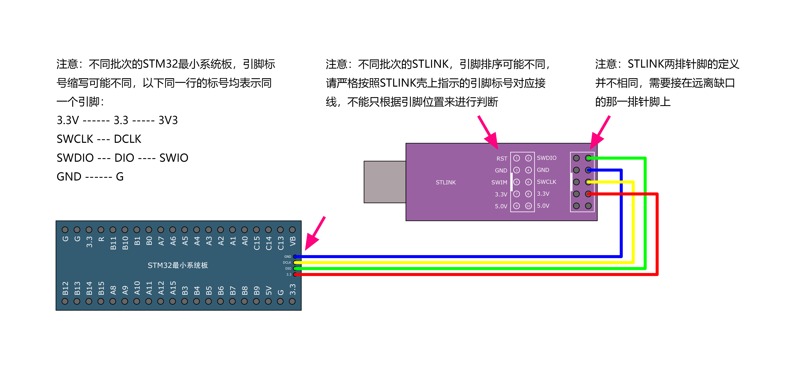
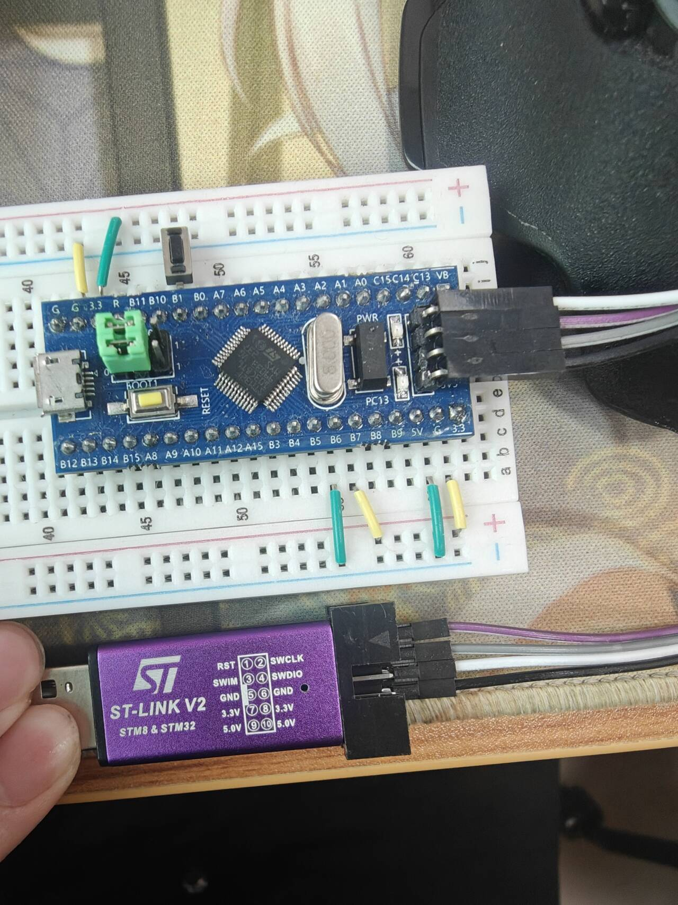
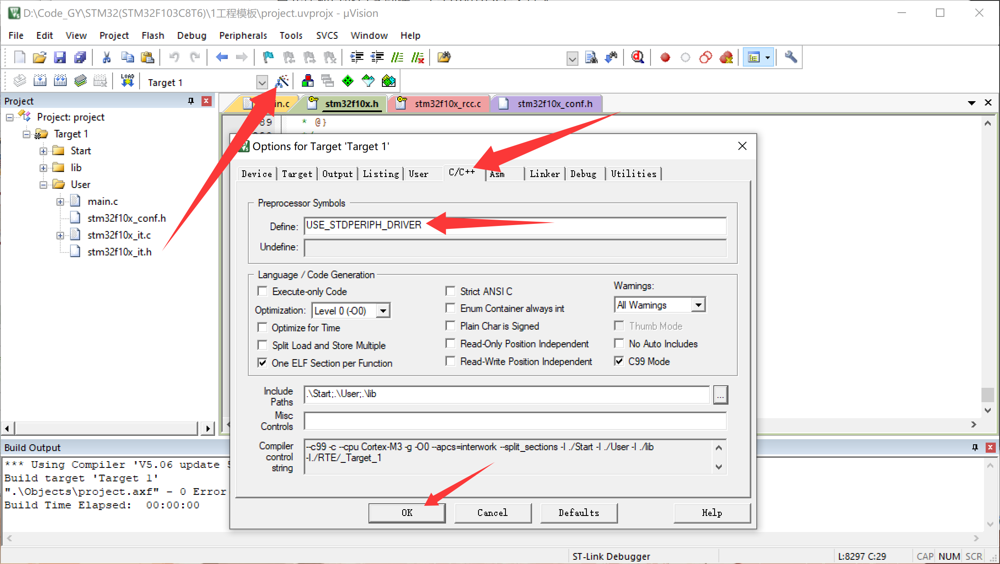

# 创建工程

## 0.新建工程步骤

- 建立工程文件夹，Keil中新建工程，选择型号

- 工程文件夹里建立Start、Library、User等文件夹，复制固件库里面的文件到工程文件夹

- 工程里对应建立Start、Library、User等同名称的分组，然后将文件夹内的文件添加到工程分组里

- 工程选项，C/C++，Include Paths内声明所有包含头文件的文件夹

- 工程选项，C/C++，Define内定义USE_STDPERIPH_DRIVER

- 工程选项，Debug，下拉列表选择对应调试器，Settings，Flash Download里勾选Reset and Run

## 1.打开keil5,先创建一个工程


## 2.复制库文件

然后在工程目录创建`Start`文件夹，将一下路径的库文件复制到创建好的`Start`文件夹下

- STM32的启动文件：`STM32入门教程资料\固件库\STM32F10x_StdPeriph_Lib_V3.5.0\Libraries\CMSIS\CM3\DeviceSupport\ST\STM32F10x\startup\arm`路径下的全部文件(8个)
- `STM32入门教程资料\固件库\STM32F10x_StdPeriph_Lib_V3.5.0\Libraries\CMSIS\CM3\DeviceSupport\ST\STM32F10x`路径下的寄存器描述文件`stm32f10x.h`、两个配置时钟文件`system_stm32f10x.c`和`system_stm32f10x.c`
- `STM32入门教程资料\固件库\STM32F10x_StdPeriph_Lib_V3.5.0\Libraries\CMSIS\CM3\CoreSupport`路径下的内核寄存器描述文件`core_cm3.c`和`core_cm3.h`

## 3.配置库文件

配置完启动文件和系统文件后，编写代码测试GPIO输出功能。目标：控制开发板上PC13引脚连接的LED实现闪烁。


最后第五步0报错0警告，即寄存器开发stm32工程模板建立完成

## 4.寄存器点灯测试

### 1.用STLINK链接调试

根据图片讲STLINK和最小开发版的插针对应图中连接



实际连接如下：




### 2.配置为STLINK调试并设置为下载程序后立马复位并执行


### 3.测试代码及现象

配置完库文件后，开始写代码测试运行

`main.c`

```
#include "stm32f10x.h"

int  main ()
{
	RCC->APB2ENR = 0x00000010; // 使能 GPIOC 时钟
	GPIOC->CRH = 0x00300000; // 配置 PC13 为推挽输出模式
	//GPIOC->ODR |= 0x00002000; // 配置 PC13 高电平，熄灭 LED
	GPIOC->ODR |= 0x00000000; // 配置 PC13 高电平，熄灭 LED


	// 主循环
	while (1)
	{
		/* code */
	}
	
}
//注意！最后一行为空，否则会出现报错

```

#### 现象描述

- 下载程序到开发板并运行后，PC13引脚连接的LED将以大约1秒为周期闪烁（亮0.5秒、灭0.5秒）。
- 若使用静态测试代码：
  - 点亮：LED常亮。
  - 熄灭：LED常灭。
- 若无反应，请检查：
  - ST-LINK连接是否正确（SWDIO、SWCLK、GND、3.3V）。
  - 开发板电源是否正常。
  - 是否选择了正确的调试器并下载到芯片。

## 5.配置库函数点灯测试

### 5.1为什么要配置库函数，跟寄存器的区别是什么？

当前工程模板采用的是**寄存器直接编程**方式（基于CMSIS核心和设备头文件，直接操作寄存器地址）。虽然可以完成所有功能，但实际项目中更常用**标准外设库（STM32F10x_StdPeriph_Lib）**，即“库函数”方式。

#### 5.1.1寄存器方式与标准外设库（StdPeriph）的主要区别

| 项目               | 寄存器方式                                      | 标准外设库方式（StdPeriph）                          |
|--------------------|-------------------------------------------------|-----------------------------------------------------|
| 操作方式           | 直接读写寄存器地址和位字段（如 `RCC->APB2ENR |= (1 << 4)`） | 调用封装好的API函数（如 `RCC_APB2PeriphClockCmd(RCC_APB2Periph_GPIOC, ENABLE)`） |
| 代码可读性         | 较差，需要熟悉每个寄存器的位定义和手册描述      | 优秀，函数名和参数明确表达功能意图                  |
| 开发效率           | 较低，每次配置都需要手动计算和设置位字段        | 较高，初始化使用结构体，代码量少且标准化            |
| 出错概率           | 较高，位操作容易出现偏移或掩码错误              | 较低，库函数已内部处理复杂的位操作和时序逻辑        |
| 代码体积与执行效率 | 体积小、执行效率高（无函数调用开销）            | 体积稍大、效率略低（存在函数调用和参数检查开销）    |
| 移植性             | 较差，不同MCU系列寄存器地址和位定义差异大       | 较好，同一系列（如F1）基本兼容，接口统一            |
| 适用场景           | 学习底层原理、极致优化、资源极度受限的场合      | 大多数实际项目开发、快速原型、团队协作               |

#### 5.1.2为什么要配置和使用库函数？

1. **大幅提高开发效率**：初学者无需深入记忆数百个寄存器的位定义，库函数提供了标准化接口。
2. **代码更易维护和阅读**：团队协作时，GPIO_Init()比一长串位操作更直观。
3. **减少低级错误**：库内部已正确处理位域、时钟树等复杂逻辑。
4. **官方推荐路径**：ST官方早期推荐StdPeriph库，后续逐步过渡到HAL库。寄存器方式更适合学习底层原理或极致优化场景。

### 5.2复制库函数

首先在项目根目录创建一个`lib`和`User`文件夹：

- 将`STM32入门教程资料\固件库\STM32F10x_StdPeriph_Lib_V3.5.0\Libraries\STM32F10x_StdPeriph_Driver\src`路径下的23个**源**文件复制到刚刚创建的`lib`文件夹
- 将`STM32入门教程资料\固件库\STM32F10x_StdPeriph_Lib_V3.5.0\Libraries\STM32F10x_StdPeriph_Driver\inc`路径下的23个**头**文件复制到刚刚创建的`lib`文件夹
- 将`STM32入门教程资料\固件库\STM32F10x_StdPeriph_Lib_V3.5.0\Project\STM32F10x_StdPeriph_Template`路径下的`stm32f10x_conf.h`、`stm32f10x_it.c`、`stm32f10x_it.h`三个文件复制到`User`文件夹

### 5.3宏定义

- 右键头文件`stm32f10x.h`打开文件，在第`8296`行复制字符串`USE_STDPERIPH_DRIVER`复制到如下图中的工程选项，使得外设库`stm32f10x_conf.h`文件生效！
- 
- 然后调整组的位置即可完成库函数的配置
- 

### 5.4测试代码及现象

```
#include "stm32f10x.h"                  // Device header

/**
 * @brief 主函数 - 初始化GPIO并控制LED闪烁
 * 
 * 该函数初始化STM32的GPIOC端口，配置PC13引脚为推挽输出模式，
 * 用于控制连接到该引脚的LED灯。
 * 
 * @return int 返回程序执行状态，正常情况下不会返回
 */
int  main ()
{
	// 使能GPIOC端口时钟
	RCC_APB2PeriphClockCmd(RCC_APB2Periph_GPIOC,ENABLE);
	
	// 配置GPIO初始化结构体
	GPIO_InitTypeDef GPIO_InitStructure;
	GPIO_InitStructure.GPIO_Pin = GPIO_Pin_13;
	GPIO_InitStructure.GPIO_Mode = GPIO_Mode_Out_PP;
	GPIO_InitStructure.GPIO_Speed = GPIO_Speed_50MHz;
	
	// 初始化GPIOC的第13号引脚
	GPIO_Init(GPIOC,&GPIO_InitStructure);
	
	// 设置PC13引脚为高电平（熄灭LED）
	//GPIO_SetBits(GPIOC,GPIO_Pin_13);
	
	// 设置PC13引脚为低电平（点亮LED）
	GPIO_ResetBits(GPIOC,GPIO_Pin_13);
	
	// 主循环
	while (1)
	{
		/* code */
	}
	
}

```

#### 现象，交替分别注释26/29行的代码，观察stm32的灯常量和长灭状态

## 6.工程架构


