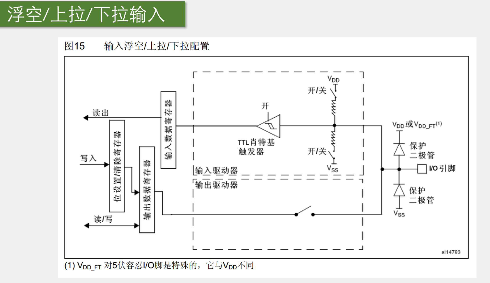
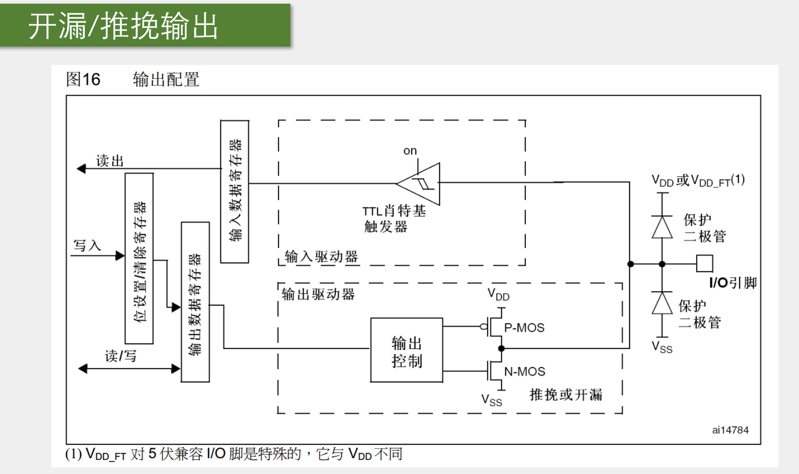
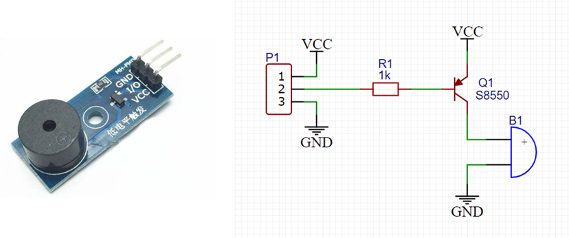
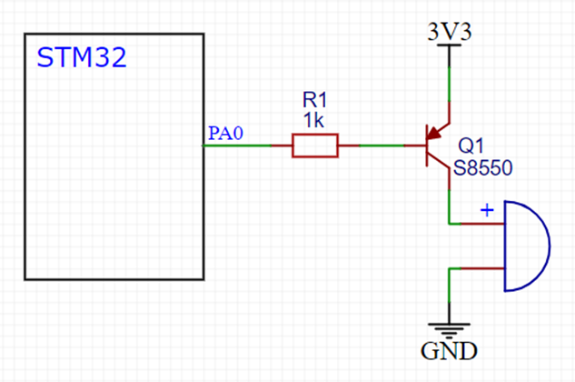
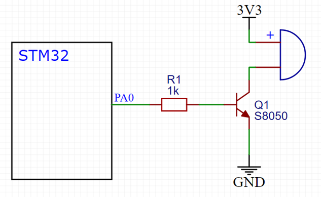
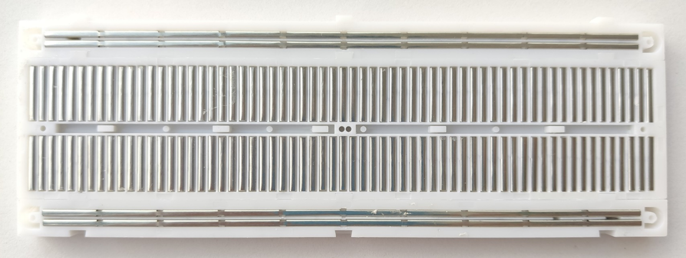

# GPIO 章节笔记

## 1. GPIO 简介

- **GPIO（General Purpose Input Output）**：通用输入输出口，是微控制器中最基础的外设接口，用于实现数字信号的输入与输出。
- 可配置为**8种输入输出模式**。
- **引脚电平**：0V～3.3V，部分引脚可容忍5V输入。
- **输出模式功能**：可控制端口输出高低电平，用于驱动LED、控制蜂鸣器、模拟通信协议输出时序等。
- **输入模式功能**：可读取端口的高低电平或电压，用于读取按键输入、外接模块电平信号输入、ADC电压采集、模拟通信协议接收数据等。

## 2. GPIO 基本结构

GPIO通过**APB2总线**与处理器内核相连，主要包含以下部分：

- **GPIOA、GPIOB**（以及后续的GPIOC等端口组）
- 每个端口组内部包含：
  - **寄存器**（配置、数据、置位/复位等）
  - **驱动器**（输出驱动电路）
- 每组支持**16个引脚**（PA0～PA15、PB0～PB15等）
- 数据流向：
  - 处理器通过APB2总线**写入**寄存器实现输出控制
  - 处理器通过APB2总线**读取**寄存器实现输入采集

（对应PPT结构示意图：蓝色APB2总线双向箭头连接橙色GPIOA/GPIOB模块，绿色寄存器与驱动器模块连接至右侧引脚）

## 3. GPIO 位结构（单引脚内部电路）

I/O端口位的典型硬件结构如下（参考PPT图13）：

- **输入路径**：
  - 引脚 → 保护二极管 → TTL施密特触发器 → 输入数据寄存器 → 处理器读取
  - 支持**模拟输入**与**复用功能输入**直接送至片上外设
- **输出路径**：
  - 输出数据寄存器 → 输出控制逻辑 → P-MOS / N-MOS（推挽或开漏） → 引脚
  - 支持**复用功能输出**（由片上外设直接控制）
- **保护电路**：上下拉保护二极管，防止过压/欠压
- **输出模式**：可配置为**推挽**、**开漏**或**关闭**
- **输入模式**：可配置为**浮空**、**上拉**、**下拉**或**模拟**

## 4. GPIO 模式配置

通过**端口配置寄存器**（GPIOx_CRL / CRH），每个引脚可独立配置为以下**8种模式**：

| 模式名称         | 性质         | 特征说明                                                                 |
|------------------|--------------|--------------------------------------------------------------------------|
| 浮空输入         | 数字输入     | 可读取引脚电平，若引脚悬空，则电平不确定                                 |
| 上拉输入         | 数字输入     | 可读取引脚电平，内部连接上拉电阻，悬空时默认高电平                       |
| 下拉输入         | 数字输入     | 可读取引脚电平，内部连接下拉电阻，悬空时默认低电平                       |
| 模拟输入         | 模拟输入     | GPIO无效，引脚直接接入内部ADC                                            |
| 开漏输出         | 数字输出     | 可输出引脚电平，高电平为高阻态，低电平接VSS                              |
| 推挽输出         | 数字输出     | 可输出引脚电平，高电平接VDD，低电平接VSS                                 |
| 复用开漏输出     | 数字输出     | 由片上外设控制，高电平为高阻态，低电平接VSS                              |
| 复用推挽输出     | 数字输出     | 由片上外设控制，高电平接VDD，低电平接VSS                                 |

## 5. GPIO 工作模式内部电路分析

根据不同的配置模式，GPIO 内部的硬件电路会进行相应的开关和连线切换。以下是四类主要模式的内部电路图解分析：

### 5.1 浮空/上拉/下拉输入配置

- **输出驱动器**：处于**断开**状态（底部的开关打开），即引脚不能向外输出电平。
- **输入驱动器**：TTL 施密特触发器处于**开启**状态。
- **上下拉电阻**：
  - 当配置为**上拉输入**时，连接 $V_{DD}$ 的开关闲合，接入上拉电阻。
  - 当配置为**下拉输入**时，连接 $V_{SS}$ 的开关闲合，接入下拉电阻。
  - 当配置为**浮空输入**时，上下两个开关均断开，引脚电平完全由外部输入决定。
- **数据流向**：外部信号通过触发器后，进入**输入数据寄存器**，CPU 可随时读取。

### 5.2 模拟输入配置

- **输出驱动器**：处于**断开**状态。
- **输入驱动器**：TTL 施密特触发器处于**关闭**状态（图中标注为 0/关）。关闭数字输入通道是为了防止模拟电压在中间电平（非标准的 0 或 1）时导致触发器频繁翻转，从而产生额外的功耗和干扰。
- **上下拉电阻**：均不接入（呈现高阻抗）。
- **数据流向**：引脚上的模拟信号直接通过专用线路**进入片上外设**（如 ADC 模块进行电压采集）。

### 5.3 通用开漏/推挽输出配置

- **输出驱动器**：
  - 数据来源于**输出数据寄存器**。
  - 经过输出控制逻辑后，驱动 P-MOS 和 N-MOS 管。
  - **推挽模式**下，P-MOS 和 N-MOS 交替导通；**开漏模式**下，P-MOS 始终关闭，只有 N-MOS 工作。
- **输入驱动器**：即使配置为输出模式，TTL 施密特触发器依然处于**开启**状态。
- **数据流向**：这意味着在输出高低电平的同时，引脚的实际电平状态依然可以被**输入数据寄存器**采集到，CPU 可以读取当前引脚的实际状态。

### 5.4 复用开漏/推挽输出配置

- **输出驱动器**：与通用输出的最大区别在于，输出控制信号**不再来源于输出数据寄存器**，而是直接**来自片上外设**（即“复用功能输出”的硬件连线，例如串口的 TX 引脚或定时器的 PWM 输出）。
- **输入驱动器**：TTL 施密特触发器处于**开启**状态。
- **数据流向**：引脚的输入信号不仅会送入**输入数据寄存器**供 CPU 读取，还会分出一路作为**复用功能输入**直接送入片上外设（例如串口的 RX 引脚接收到的数据）。

这里为您整理了基于这五张新截图的笔记，内容涵盖了常见基础外设（LED、蜂鸣器、按键、传感器）的原理及其对应的硬件电路。您可以将以下内容继续追加到您的笔记文档中：

------

## 6. LED 与蜂鸣器

### 6.1 基本简介

- **LED（发光二极管）**：具备单向导电性，正向通电点亮，反向通电不亮。

  

- **有源蜂鸣器**：内部**自带振荡源**。只需将正负极接上直流电压即可持续发声，发声频率是固定的。
- **无源蜂鸣器**：内部**不带振荡源**。需要控制器提供一定频率的振荡脉冲（如 PWM 波）才可发声。通过调整提供脉冲的频率，可以使其发出不同音调的声音。

### 6.2 硬件驱动电路

在单片机（如 STM32）控制外设时，常采用以下几种基本的硬件连线方式（参考“硬件电路”图）：

- **LED 驱动电路**：

  

  - **低电平驱动（灌电流）**：LED 阳极接 3.3V，阴极串联限流电阻（如 1kΩ）后接微控制器引脚（PA0）。**当 PA0 输出低电平时，LED 点亮。**

    

  - **高电平驱动（拉电流）**：LED 阳极串联限流电阻接微控制器引脚（PA0），阴极接 GND。**当 PA0 输出高电平时，LED 点亮。**

- **蜂鸣器驱动电路（三极管驱动）**：

  *(由于单片机 GPIO 引脚的驱动能力有限，通常使用三极管来放大电流驱动蜂鸣器等较大功率器件)*

  
  
  - **PNP 型三极管驱动（低电平触发）**：单片机引脚接基极（B），发射极（E）接 3.3V，集电极（C）接蜂鸣器。**引脚输出低电平时，三极管导通，蜂鸣器工作。**
  
    
  
  - **NPN 型三极管驱动（高电平触发）**：单片机引脚接基极（B），发射极（E）接 GND，集电极（C）接蜂鸣器另一端。**引脚输出高电平时，三极管导通，蜂鸣器工作。**

------

## 7. 面包板与按键

### 7.1 面包板内部结构

面包板是用于临时搭建电路的工具，其内部金属弹片连接规律如下：

- **上下供电轨**：标有红蓝线（或 `+` `-`）的行，内部金属条通常是**横向一整排贯通**的，用于集中提供 VCC 和 GND。

  

- **中间元件区**：每一列的 5 个插孔（例如 a, b, c, d, e）在内部是**纵向连通**的。中间的凹槽将左右/上下两部分隔开，方便跨接 DIP 封装的芯片。

### 7.2 按键及其抖动现象

- **基本原理**：常见的输入设备，内部是机械式弹簧片，按下导通，松手断开。

- **按键抖动（Button Bounce）**：

  由于机械触点的弹性作用，在按键按下和松开的瞬间，信号不会立刻稳定，而是会伴随一连串的电平剧烈抖动。

  - **抖动时间**：通常在按下和松开的瞬间，各有 **5~10ms** 的抖动期。
  - **稳定期**：中间的稳定闭合时间通常为 50~200ms（视按压时长而定）。
  - **消除影响**：在编写按键读取程序时，必须加入**按键消抖**逻辑（通常是软件延时 10ms~20ms 跳过抖动区），否则单片机会将一次按压误判为多次触发。

------

## 8. 传感器模块

### 8.1 传感器模块工作原理

常见的传感器模块（如光敏电阻、热敏电阻、红外接收管等）通常包含模拟采集和数字转换两部分：

1. **模拟量采集**：传感器元件自身的电阻会随外界物理量（光照、温度等）的变化而变化。将它与一个定值电阻串联分压，即可将“电阻的变化”转化为“**模拟电压的输出（AO）**”。
2. **二值化输出**：模块上通常带有一个**电压比较器**芯片（如 LM393）。比较器将传感器产生的模拟电压与电位器设定的参考基准电压进行对比，从而输出高电平或低电平的**数字电压信号（DO）**。

### 8.2 原理图关键部分

- **电压比较器（LM393）**：包含 `IN+`、`IN-` 输入端和输出端。当同相输入端电压大于反相输入端时，输出高电平；反之输出低电平。
- **分压网络**：原理图中的 N1（传感器件）与 R1 构成下拉分压网络，其分压点接出作为 AO 信号，并同时送入比较器。电位器 R2 用于调节阈值电压。
- **指示灯**：模块上常配备电源指示灯（通过通电常亮）和状态指示灯（跟随 DO 信号翻转），方便调试。

# GPIO 实战

## 1.面包板接线图

- 注意LED长脚正级接供电孔，短脚负级接PA0端口
- 新建工程参考笔记`01新建工程.md`
